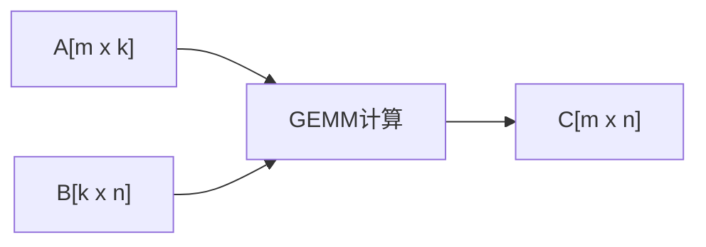
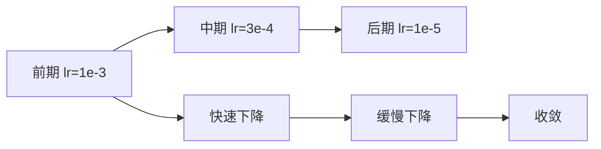

# 深度学习的数学基石


**算力猎场商业丛书 · 第3册 / 共24册**

**作者：** 大圣（Dr. Wu）

**版本：** 初稿 v1.0

**日期：** 2026年4月

---

> **丛书总序**
>
> 这是算力猎场商业丛书的第三本。
>
> 前两本（《算力之源》《算力架构》）讲的是算力的"物理层"——晶体管怎么变成GPU，GPU怎么组成集群。这本书则要回到算力的"逻辑层"——为什么GPU要跑这些计算？
>
> 答案很简单：因为深度学习需要。
>
> 但深度学习不是魔法。它的每一个概念——神经网络、反向传播、卷积、注意力机制——背后都有坚实的数学基础。理解这些数学，你才能理解为什么GPU要做矩阵乘法，为什么HBM带宽如此重要，为什么量化可以加速推理而不损失精度。
>
> 这本书不讲公式推导的细节。我们讲数学的"直觉"——为什么这个公式有效，它在什么情况下失效，它如何指导工程实践。
>
> 数学是猎手的地图。没有地图，你只能在算力森林里盲走。

---


# 目录


**前言：为什么AI工程师必须懂数学**

**第一章 线性代数：AI计算的原子**
- 1.1 向量与矩阵：数据的数学表示
- 1.2 矩阵乘法：AI计算的核心操作
- 1.3 特征值与特征向量：理解矩阵的本质
- 1.4 奇异值分解（SVD）：降维与压缩的利器
- 1.5 张量运算：从二维到高维
- 1.6 🎯 实战案例：为什么GPU的Tensor Core让训练速度提升10倍
- 1.7 🏹 猎手笔记

**第二章 概率论：不确定性的度量**
- 2.1 概率分布：从离散到连续
- 2.2 条件概率与贝叶斯定理：逆向推理的艺术
- 2.3 最大似然估计：从数据中学习参数
- 2.4 高斯分布：为什么它无处不在
- 2.5 采样方法：从分布中生成数据
- 2.6 🎯 实战案例：Diffusion模型的数学原理
- 2.7 🏹 猎手笔记

**第三章 微积分与优化：如何找到最优解**
- 3.1 导数与梯度：变化的方向
- 3.2 梯度下降：最简单的优化算法
- 3.3 随机梯度下降（SGD）：从理论到实践
- 3.4 动量与自适应学习率：Adam的诞生
- 3.5 反向传播：计算图上的链式法则
- 3.6 凸优化与非凸优化：为什么深度学习能收敛
- 3.7 🎯 实战案例：GPT-3的训练为什么不发散
- 3.8 🏹 猎手笔记

**第四章 信息论：不确定性的量化**
- 4.1 熵：不确定性的度量
- 4.2 交叉熵：两个分布的距离
- 4.3 KL散度：信息增益与损失
- 4.4 互信息：变量之间的关联
- 4.5 信息论在深度学习中的应用
- 4.6 🎯 实战案例：交叉熵损失函数为什么有效
- 4.7 🏹 猎手笔记

**第五章 神经网络的数学原理**
- 5.1 感知机：最简单的神经网络
- 5.2 激活函数：为什么需要非线性
- 5.3 万能近似定理：神经网络能学到什么
- 5.4 深度的意义：为什么深比宽更重要
- 5.5 初始化策略：好的开始是成功的一半
- 5.6 🎯 实战案例：Transformer的参数量估算
- 5.7 🏹 猎手笔记

**第六章 卷积的数学本质**
- 6.1 卷积运算：从信号处理到图像识别
- 6.2 二维卷积：图像特征的提取
- 6.3 池化操作：降维与不变性
- 6.4 卷积神经网络的反向传播
- 6.5 感受野与层次特征
- 6.6 🎯 实战案例：ResNet的残差连接为什么有效
- 6.7 🏹 猎手笔记

**第七章 注意力机制的数学原理**
- 7.1 从RNN到注意力：序列建模的演进
- 7.2 自注意力：Transformer的核心
- 7.3 多头注意力：并行处理多个模式
- 7.4 位置编码：注入序列信息
- 7.5 注意力的计算复杂度分析
- 7.6 🎯 实战案例：Flash Attention的数学优化
- 7.7 🏹 猎手笔记

**第八章 正则化与泛化：防止过拟合的艺术**
- 8.1 过拟合：模型的致命伤
- 8.2 L1与L2正则化：参数约束的两种方式
- 8.3 Dropout：随机失活的魔法
- 8.4 批归一化（BatchNorm）：加速训练的利器
- 8.5 数据增强：从数据中创造数据
- 8.6 🎯 实战案例：GPT-4如何防止过拟合
- 8.7 🏹 猎手笔记

**第九章 生成模型的数学原理**
- 9.1 生成模型 vs 判别模型
- 9.2 变分自编码器（VAE）：概率生成的开端
- 9.3 生成对抗网络（GAN）：博弈论的应用
- 9.4 Diffusion模型：从噪声中生成图像
- 9.5 大语言模型的生成机制
- 9.6 🎯 实战案例：Stable Diffusion的数学原理
- 9.7 🏹 猎手笔记

**第十章 深度学习的理论前沿**
- 10.1 神经正切核（NTK）：无限宽网络的理论
- 10.2 泛化误差界：为什么深度学习能泛化
- 10.3 深度学习的双下降现象
- 10.4 过参数化的秘密
- 10.5 可解释性研究的数学基础
- 10.6 🎯 实战案例：LLM缩放定律的数学解释
- 10.7 🏹 猎手笔记

**后记：数学是算力的灵魂**

---


# 前言：为什么AI工程师必须懂数学


**2023年，ChatGPT引爆全球。**

每个人都在问：为什么它这么聪明？为什么它能写代码、写文章、回答问题？

答案是数学。

ChatGPT的背后是Transformer，Transformer的背后是矩阵乘法、注意力机制、反向传播。这些概念看起来很复杂，但它们都有坚实的数学基础。

**问题是：你需要懂数学吗？**

很多人说：不需要。PyTorch、TensorFlow已经把数学封装好了，你只需要调用API。

这话对了一半。如果你只是用预训练模型做推理，确实不需要太懂数学。但如果你想：

- 理解为什么模型会失效
- 优化训练速度和效果
- 设计新的模型架构
- 评估算力需求
- 在有限资源下做取舍

——那你必须懂数学。

**这本书写给谁？**

- AI工程师：你想理解训练过程中发生了什么，而不只是调参
- 算力从业者：你想知道为什么GPU要做矩阵乘法
- 技术决策者：你想评估不同模型的算力需求
- 数学好奇者：你想知道线性代数、概率论、信息论在AI中的实际应用

**这本书怎么读？**

这本书不会教你推导公式。它教你理解公式的"直觉"——为什么这个公式有效，它在什么情况下失效，它如何指导工程实践。

每一章都有：
- 数学概念的解释
- 与深度学习的关联
- 🎯实战案例
- 🏹猎手笔记（热点、风险、行动清单、延伸阅读）

准备好了？我们从最基础的概念开始。

---


# 第一章 线性代数：AI计算的原子


线性代数是深度学习的"语言"。神经网络中的所有计算，本质上都是矩阵运算。

## 1.1 向量与矩阵：数据的数学表示

## 1.1b 从标量到张量：数学对象的层次

### 一、数学对象的维度演进

深度学习中的数据结构遵循清晰的维度层次：

**标量：** 单个数值，0阶张量
- 例：温度、损失值、学习率
- 形状：()
- 运算：加减乘除

**向量：** 一维数组，1阶张量
- 例：词向量、梯度、偏置
- 形状：(n,)
- 运算：点积、外积、范数

**矩阵：** 二维数组，2阶张量
- 例：图像灰度、权重矩阵、协方差
- 形状：(m, n)
- 运算：矩阵乘、转置、逆

**3阶张量：** 三维数组
- 例：RGB图像、文本序列
- 形状：(h, w, c) 或 (seq, batch, dim)

**4阶张量：** 四维数组
- 例：图像批次、视频片段
- 形状：(batch, channel, height, width)

**5阶张量：** 五维数组
- 例：视频批次、3D医学图像
- 形状：(batch, time, channel, height, width)

### 二、张量的运算层次

**逐元素运算：** 对应位置的元素独立运算
- 加法、乘法、激活函数
- 形状不变

**归约运算：** 沿某个维度压缩
- 求和、平均、最大值
- 形状减少

**收缩运算：** 沿匹配维度求和
- 矩阵乘法：向量内积的推广
- Einsum：统一的表达方式

```python
import torch
import einops

# 逐元素
x = torch.randn(2, 3, 4)
y = x * 2 + torch.sin(x)

# 归约
z1 = x.sum(dim=1)      # (2, 4)
z2 = x.mean(dim=(1,2))  # (2,)

# 收缩（矩阵乘）
A = torch.randn(2, 3)
B = torch.randn(3, 4)
C = A @ B  # (2, 4)

# Einsum统一表达
D = torch.einsum("ij,jk->ik", A, B)  # 等价于矩阵乘
E = torch.einsum("ij->j", A)  # 列求和
F = torch.einsum("ij,ij->", A, A)  # Frobenius内积
```

### 三、广播机制

广播允许不同形状的张量进行运算：

```python
# 广播规则
# 1. 从右向左对齐维度
# 2. 维度为1或缺失的可以扩展
# 3. 其他维度必须相等

x = torch.randn(3, 4, 5)
y = torch.randn(5)  # (5,) -> (1, 1, 5) -> (3, 4, 5)
z = x + y  # 广播成功

w = torch.randn(4, 1)  # (1, 1, 4, 1) -> (3, 4, 5)? 不行!
# w的倒数第二维4 != 5
```

### 四、张量的内存布局

**行主序：** PyTorch默认
- 最后一维是连续的
- arr[i,j] 和 arr[i,j+1] 内存相邻

**列主序：** NumPy默认
- 第一维是连续的

**步幅：** 每个维度移动的内存步长

```python
x = torch.randn(3, 4)
print(x.stride())  # (4, 1)：第0维移动4个元素，第1维移动1个

# 转置改变步幅，不复制数据
y = x.T
print(y.stride())  # (1, 4)：步幅互换
print(y.is_contiguous())  # False：内存不再连续

# 连续化会复制数据
z = y.contiguous()
print(z.is_contiguous())  # True
```

### 五、本节小结


**表1-1** 概念 / 形状 / 典型应用
| 概念 | 形状 | 典型应用 |
|-----|------|---------|
| 标量 | () | 损失值、超参数 |
| 向量 | (n,) | 词向量、梯度 |
| 矩阵 | (m,n) | 权重、协方差 |
| 3阶张量 | (h,w,c) | 图像、序列 |
| 4阶张量 | (b,c,h,w) | 图像批次 |
| 5阶张量 | (b,t,c,h,w) | 视频批次 |


### 向量

**向量**（Vector）是一组有序的数。

一个图像可以表示为向量：$x = [x_1, x_2, ..., x_n]$

其中每个$x_i$是一个像素值。一张28×28的灰度图像，可以表示为784维向量。

一段文本可以表示为向量：词嵌入（Word Embedding）。每个词变成一个向量，比如300维的词向量。

**向量的运算**：

- 加法：$[a_1, a_2] + [b_1, b_2] = [a_1+b_1, a_2+b_2]$
- 数乘：$c \cdot [a_1, a_2] = [c \cdot a_1, c \cdot a_2]$
- 点积：$[a_1, a_2] \cdot [b_1, b_2] = a_1 b_1 + a_2 b_2$

点积的几何意义：

$$a \cdot b = |a| |b| \cos\theta$$

其中$\theta$是两个向量的夹角。点积衡量两个向量的"相似度"。

### 矩阵

**矩阵**（Matrix）是二维的数表。

$$A = \begin{bmatrix} a_{11} & a_{12} \\ a_{21} & a_{22} \end{bmatrix}$$

一个彩色图像可以表示为矩阵：$H \times W \times 3$（高×宽×RGB通道）。

神经网络的权重是矩阵：$W \in \mathbb{R}^{m \times n}$，连接n维输入和m维输出。

**矩阵的运算**：

- 加法：对应元素相加
- 数乘：每个元素乘以标量
- 矩阵乘法：$C = AB$，其中$c_{ij} = \sum_k a_{ik} b_{kj}$

矩阵乘法的计算量：$A \in \mathbb{R}^{m \times k}$, $B \in \mathbb{R}^{k \times n}$，计算$AB$需要$2mnk$次浮点运算（m×n个元素，每个需要k次乘法和k-1次加法）。

---

## 1.2 矩阵乘法：AI计算的核心操作

## 1.2b 矩阵运算的并行化与GPU架构

### 一、从CPU到GPU：并行计算的范式转变

CPU设计目标是低延迟，适合串行任务；GPU设计目标是高吞吐，适合并行任务。一个CPU有几十个核心，而GPU有数千个核心。

**GPU核心特点：**
- 每个核心较弱（低主频）
- 但数量众多（A100有6912个CUDA核心）
- 适合执行相同指令的批量数据（SIMD：单指令多数据）

### 二、CUDA编程模型

CUDA将计算任务组织成三个层次：
1. **Grid（网格）：** 所有线程的集合
2. **Block（线程块）：** 线程的子集，可共享内存
3. **Thread（线程）：** 最小执行单元

```python
# CUDA核函数伪代码
__global__ void matmul(float* A, float* B, float* C, int N) {
    int row = blockIdx.y * blockDim.y + threadIdx.y;
    int col = blockIdx.x * blockDim.x + threadIdx.x;
    float sum = 0.0f;
    for (int k = 0; k < N; k++) {
        sum += A[row * N + k] * B[k * N + col];
    }
    C[row * N + col] = sum;
}

// 启动配置：16x16线程块，覆盖NxN矩阵
dim3 threadsPerBlock(16, 16);
dim3 numBlocks((N + 15) / 16, (N + 15) / 16);
matmul<<<numBlocks, threadsPerBlock>>>(d_A, d_B, d_C, N);
```

### 三、GPU内存层次


**表1-2** 内存类型 / 大小 / 带宽
| 内存类型 | 大小 | 带宽 | 延迟 |
|---------|------|------|------|
| 全局内存（HBM） | 40-80GB | 1-3TB/s | 高(~400 cycles) |
| 共享内存（SRAM） | 128KB/SM | ~20TB/s | 低(~20 cycles) |
| 寄存器 | 64K/SM | 最高 | 最低 |
| L2缓存 | 40MB | 中等 | 中等 |

**优化原则：** 减少全局内存访问，最大化数据在共享内存中的重用。

### 四、矩阵乘法的GPU优化策略

**朴素实现的问题：** 每个线程从全局内存读取A的一行和B的一列，共2N次全局内存访问。

**分块优化（Tiling）：** 将矩阵分成小块，每块加载到共享内存后复用：

```python
# 分块矩阵乘法（伪代码）
__global__ void matmul_tiled(float* A, float* B, float* C, int N, int TILE_SIZE) {
    __shared__ float As[TILE_SIZE][TILE_SIZE];
    __shared__ float Bs[TILE_SIZE][TILE_SIZE];
    
    int row = blockIdx.y * TILE_SIZE + threadIdx.y;
    int col = blockIdx.x * TILE_SIZE + threadIdx.x;
    float sum = 0.0f;
    
    for (int t = 0; t < N / TILE_SIZE; t++) {
        // 协作加载到共享内存
        As[threadIdx.y][threadIdx.x] = A[row * N + t * TILE_SIZE + threadIdx.x];
        Bs[threadIdx.y][threadIdx.x] = B[(t * TILE_SIZE + threadIdx.y) * N + col];
        __syncthreads();
        
        // 在共享内存中计算
        for (int k = 0; k < TILE_SIZE; k++) {
            sum += As[threadIdx.y][k] * Bs[k][threadIdx.x];
        }
        __syncthreads();
    }
    C[row * N + col] = sum;
}
```

**性能提升：** 全局内存访问从O(N^3)降到O(N^3/TILE_SIZE)，带宽利用效率大幅提高。

### 五、Tensor Core：矩阵乘法的专用硬件

从Volta架构（V100）开始，NVIDIA引入了Tensor Core，专门加速矩阵乘法运算。

**Tensor Core操作：** D = A × B + C，其中A、B、C、D都是4×4矩阵。

**Hopper架构（H100）Tensor Core规格：**
- FP16峰值：1,979 TFLOPS
- FP8峰值：3,958 TFLOPS
- 支持稀疏化（2:4稀疏模式）

```python
# PyTorch中使用Tensor Core
# 需要满足条件：矩阵维度是8或16的倍数
x = x.half()  # FP16
w = w.half()
# cuBLAS会自动使用Tensor Core
y = torch.matmul(x, w)
```

### 六、本节小结


**表1-3** 核心概念
| 核心概念 | 关键数据 |
|---------|---------|
| GPU vs CPU | 数千核心 vs 数十核心 |
| CUDA层次 | Grid -> Block -> Thread |
| 内存优化 | 分块减少全局内存访问 |
| Tensor Core | H100 FP8: 3,958 TFLOPS |
| 分块大小 | 通常16-128，取决于共享内存 |


**矩阵乘法是AI计算的核心。**

为什么？因为神经网络的本质就是矩阵乘法。

### 全连接层

一个全连接层：

$$y = Wx + b$$

其中$W \in \mathbb{R}^{m \times n}$是权重矩阵，$x \in \mathbb{R}^n$是输入，$y \in \mathbb{R}^m$是输出。

这就是一次矩阵-向量乘法。

### 卷积可以表示为矩阵乘法

卷积操作也可以表示为矩阵乘法：

$$y = Cx$$

其中$C$是由卷积核构造的稀疏矩阵（Toeplitz矩阵）。

### 注意力机制

自注意力的计算：

$$Attention(Q, K, V) = softmax(\frac{QK^T}{\sqrt{d_k}})V$$

核心操作是$QK^T$：两个矩阵的乘法。

### 矩阵乘法的计算量


**表1-4** 操作 / 矩阵维度 / 计算量（FLOPs）
| 操作 | 矩阵维度 | 计算量（FLOPs） |
|------|----------|-----------------|
| 全连接层 | $W \in \mathbb{R}^{4096 \times 4096}$ | $2 \times 4096^2 \approx 33.5M$ |
| 卷积层 | $3 \times 3 \times 256 \times 256$ | $\approx 1.2B$ |
| 自注意力 | $Q, K, V \in \mathbb{R}^{1024 \times 64}$ | $2 \times 1024^2 \times 64 \approx 134M$ |

**关键洞察**：神经网络的大部分计算都是矩阵乘法。GPU之所以适合深度学习，就是因为GPU的矩阵乘法性能远超CPU。

---

## 1.3 特征值与特征向量：理解矩阵的本质

## 1.3b 特征值分解与谱分析

### 一、特征值问题的几何意义

对于方阵A，特征值lambda和特征向量v满足：

A v = lambda v

**几何解释：** 特征向量是被矩阵A"拉伸"的方向，特征值是拉伸倍数。

### 二、对称矩阵的谱定理

**定理：** 实对称矩阵A可以正交对角化：

A = Q Lambda Q^T

其中Q是正交矩阵，Lambda是对角矩阵。

**应用：**
- 主成分分析（PCA）：协方差矩阵的特征向量是主成分方向
- 图拉普拉斯矩阵：特征向量用于谱聚类

```python
def spectral_clustering(W, k):
    """谱聚类"""
    # 度矩阵
    D = np.diag(W.sum(axis=1))
    # 图拉普拉斯
    L = D - W
    # 特征值分解
    eigenvalues, eigenvectors = np.linalg.eigh(L)
    # 取前k个特征向量
    features = eigenvectors[:, :k]
    # K-means聚类
    from sklearn.cluster import KMeans
    labels = KMeans(n_clusters=k).fit_predict(features)
    return labels
```

### 三、幂迭代法

**求最大特征值：**

```python
def power_iteration(A, max_iter=100):
    v = np.random.randn(A.shape[0])
    for _ in range(max_iter):
        v = A @ v
        v = v / np.linalg.norm(v)
    eigenvalue = v.T @ A @ v
    return eigenvalue, v
```

### 四、特征值的条件数

**条件数：** kappa = |lambda_max| / |lambda_min|

条件数大意味着矩阵接近奇异，数值计算不稳定。

### 五、本节小结


**表1-5** 概念
| 概念 | 应用 |
|-----|------|
| 特征值分解 | 谱分析 |
| 谱定理 | PCA、谱聚类 |
| 幂迭代 | PageRank |
| 条件数 | 数值稳定性 |


## 1.4b 张量分解与CP分解

### 一、张量的基本运算

张量是向量和矩阵的高维推广。
- 向量：1阶张量
- 矩阵：2阶张量
- 图像：3阶张量（高x宽x通道）
- 视频：4阶张量（时间x高x宽x通道）

```python
# PyTorch张量运算
x = torch.randn(32, 64, 128)  # 3阶张量：batch x seq x dim
# 张量缩并（Contraction）：沿指定维度求和
contracted = torch.einsum("ijk->ij", x)  # 对最后一维求和
```

### 二、CP分解（Canonical Polyadic）

CP分解将张量表示为R个秩-1张量的和：

X = sum_{r=1}^R a_r  circle_times b_r  circle_times c_r

其中 circle_times 表示外积。

**秩-R近似：** 找到最小的R使得CP分解能近似原张量。

```python
# CP分解的交替最小二乘（ALS）算法
def cp_als(X, R, max_iter=100, tol=1e-6):
    N = X.ndim
    dims = X.shape
    factors = [torch.randn(d, R) for d in dims]
    for _ in range(max_iter):
        for n in range(N):
            # 更新第n个因子
            # X_(n) * (其他因子 Khatri-Rao 积)^+ -> A_n
            pass
    return factors
```

### 三、张量火车（Tensor Train）分解

TT分解将高阶张量分解为一连串3阶张量（火车）的链：

X(i_1, ..., i_d) = G_1[:, :, :] · G_2[:, :, :] · ... · G_d[:, :, :]

**参数压缩：**
原始：prod(d_i) 参数
TT分解后：O(d * r^2 * max_i n_i) 参数（r是TT秩）


## 1.4c 矩阵分解的工程实现

### 一、QR分解

**Gram-Schmidt正交化：**

将矩阵A分解为正交矩阵Q和上三角矩阵R：A = QR

```python
def qr_decomposition(A):
    m, n = A.shape
    Q = np.zeros((m, n))
    R = np.zeros((n, n))
    for j in range(n):
        v = A[:, j].copy()
        for i in range(j):
            R[i, j] = Q[:, i] @ A[:, j]
            v = v - R[i, j] * Q[:, i]
        R[j, j] = np.linalg.norm(v)
        Q[:, j] = v / R[j, j]
    return Q, R
```

### 二、LU分解

**用于求解线性方程组：**

Ax = b -> LUx = b

先解Ly = b，再解Ux = y。

```python
def lu_solve(L, U, b):
    # 前向替换
    y = np.zeros_like(b)
    for i in range(len(b)):
        y[i] = b[i] - L[i, :i] @ y[:i]
    # 后向替换
    x = np.zeros_like(b)
    for i in reversed(range(len(b))):
        x[i] = (y[i] - U[i, i+1:] @ x[i+1:]) / U[i, i]
    return x
```

### 三、Cholesky分解

**适用于对称正定矩阵：**

A = LL^T

```python
def cholesky(A):
    n = A.shape[0]
    L = np.zeros_like(A)
    for i in range(n):
        for j in range(i+1):
            if i == j:
                L[i, j] = np.sqrt(A[i, i] - L[i, :j] @ L[i, :j])
            else:
                L[i, j] = (A[i, j] - L[i, :j] @ L[j, :j]) / L[j, j]
    return L
```

### 四、本节小结


**表1-6** 分解 / 适用矩阵 / 复杂度
| 分解 | 适用矩阵 | 复杂度 | 应用 |
|-----|---------|--------|------|
| QR | 任意 | O(mn^2) | 最小二乘 |
| LU | 方阵 | O(n^3) | 线性方程 |
| Cholesky | 对称正定 | O(n^3/3) | 优化 |
| SVD | 任意 | O(mn^2) | 降维 |


**特征值**和**特征向量**揭示了矩阵的本质。

### 定义

对于矩阵$A$，如果存在非零向量$v$和标量$\lambda$，使得：

$$Av = \lambda v$$

则$v$是$A$的特征向量，$\lambda$是$A$的特征值。

### 几何意义

特征向量是"被矩阵拉伸但不改变方向"的向量。特征值是拉伸的比例。

```
原始向量v              矩阵变换后
    ↑                     ↑
    │         A           │
    │    ────────→        │（被拉伸λ倍）
    │                     │
    └─────→              └─────→
```

### 在深度学习中的应用

**1. 主成分分析（PCA）**

PCA使用协方差矩阵的特征值分解来降维。特征值大的方向包含更多信息。

**2. 图神经网络**

图的邻接矩阵的特征值决定了图的性质（连通性、谱性质）。

**3. 模型稳定性分析**

循环神经网络（RNN）的梯度消失/爆炸问题与权重矩阵的特征值有关：
- 最大特征值>1：梯度爆炸
- 最大特征值<1：梯度消失

---

## 1.4 奇异值分解（SVD）：降维与压缩的利器

**奇异值分解**（Singular Value Decomposition, SVD）是线性代数最重要的分解之一。

### 定义

任意矩阵$A \in \mathbb{R}^{m \times n}$都可以分解为：

$$A = U \Sigma V^T$$

其中：
- $U \in \mathbb{R}^{m \times m}$是正交矩阵
- $\Sigma \in \mathbb{R}^{m \times n}$是对角矩阵，对角线元素是奇异值
- $V \in \mathbb{R}^{n \times n}$是正交矩阵

### 低秩近似

保留前$k$个最大的奇异值，其他设为0：

$$A \approx U_k \Sigma_k V_k^T$$

这就是**低秩近似**，可以压缩矩阵。

### 应用

**1. 图像压缩**

一张$1024 \times 1024$的图像，存储需要1,048,576个数。使用SVD保留前100个奇异值，只需要存储$1024 \times 100 \times 2 + 100 = 204,900$个数，压缩比约5倍。

**2. 推荐系统**

用户-物品矩阵的低秩近似可以预测用户偏好。

**3. 模型压缩**

神经网络的权重矩阵可以用SVD压缩，减少参数量和计算量。

---

## 1.5 张量运算：从二维到高维

## 1.6 张量运算的GPU实现：从GEMM到Tensor Core

### 一、GEMM：AI计算的"引力波"

通用矩阵乘法（General Matrix Multiply, GEMM）是几乎所有深度学习计算的核心。Transformer的自注意力机制本质上是三次GEMM，卷积层可以转换为GEMM，全连接层就是一个GEMM。

**GEMM定义：**
C = AB + B,  C 属于 R^m*n, A 属于 R^m*k, B 属于 R^k*n
计算量：2 x m x n x k 次浮点运算。



### 二、GEMM的GPU内存布局

GPU上的GEMM性能高度依赖数据布局。cuBLAS默认使用列主序（Column-Major），但PyTorch使用行主序（Row-Major）。混用会导致每次计算都触发隐式转置：

```python
import torch

A = torch.randn(4096, 4096, device='cuda')
B = torch.randn(4096, 4096, device='cuda')

def benchmark_gemm(A, B, name=""):
    for _ in range(10):
        C = A @ B  # 预热
    start = torch.cuda.Event(enable_timing=True)
    end = torch.cuda.Event(enable_timing=True)
    start.record()
    C = A @ B
    end.record()
    torch.cuda.synchronize()
    tflops = (2 * 4096**3) / (start.elapsed_time(end) * 1e-3) / 1e12
    print(f"{name}: {start.elapsed_time(end):.2f}ms, {tflops:.1f} TFLOPS")

benchmark_gemm(A, B, "Row-Major GEMM")
A_t = A.t()  # 非连续视图，性能骤降
```

### 三、Tensor Core：矩阵乘法的专用硬件

**H100 Tensor Core规格：**


**表1-7** 规格 / H100 SXM5 / A100
| 规格 | H100 SXM5 | A100 | 提升 |
|------|-----------|------|------|
| 矩阵大小 | 4x4x4 | 4x4x4 | - |
| 精度 | FP8/FP16/BF16/TF32 | FP16/BF16/TF32 | 新增FP8 |
| FP16峰值 | 1,979 TFLOPS | 312 TFLOPS | 6.3x |
| FP8峰值 | 3,958 TFLOPS | - | 首发 |
| 内存带宽 | 3.35 TB/s | 2.0 TB/s | 68% up |

**Tensor Core数学原理：**
Tensor Core一次完成4x4矩阵乘：
D_(4x4) = A_(4x4) x B_(4x4) + C_(4x4)

A100每个Tensor Core每秒执行1024次这样的操作（H100翻倍）。当矩阵大于4x4时，通过分块（Tiling）将大矩阵划分为4x4小块，GPU调度器将这些小块分配给所有Tensor Core并行计算。

### 四、GEMM分块（Tiling）与共享内存

GPU GEMM的性能瓶颈是**内存带宽**。A100的峰值计算力（312 TFLOPS）是内存带宽（2TB/s）的156倍，意味着GPU大多数时候在等待数据。

**分块策略：** 将A和B分成能放入L2缓存的小块，减少全局内存访问。

```python
def gemm_tiled(A, B, tile_size=128):
    m, n, k = A.shape[0], B.shape[1], A.shape[1]
    C = torch.zeros(m, n, device='cuda')
    for i in range(0, m, tile_size):
        for j in range(0, n, tile_size):
            C_block = torch.zeros(tile_size, tile_size, device='cuda')
            for p in range(0, k, tile_size):
                A_block = A[i:i+tile_size, p:p+tile_size]
                B_block = B[p:p+tile_size, j:j+tile_size]
                C_block += A_block @ B_block
            C[i:i+tile_size, j:j+tile_size] = C_block
    return C
```

### 五、本节小结


**表1-8** 核心概念
| 核心概念 | 关键数据 |
|---------|---------|
| GEMM定义 | C = AB + B, FLOPs = 2mkn |
| GPU内存墙 | A100计算力/带宽 = 156倍 |
| Tensor Core分块 | 4x4x4 小块并行 |
| H100 FP8 | 3,958 TFLOPS（6.3x A100 FP16）|
| 分块策略 | Tile size = 128，L2缓存命中 |


## 1.7 奇异值分解与模型压缩：低秩近似的艺术

### 一、SVD的核心定理

任意矩阵 A 属于 R^m*n 都可以分解为：
A = U Sigma V^T

其中 U 属于 R^m*m、Sigma 属于 R^m*n（对角矩阵）、V 属于 R^n*n。

**几何意义：** SVD将线性变换分解为三个基本操作的组合——旋转（V^T）、缩放（Sigma）、再旋转（U）。

### 二、低秩近似的最优性（Eckart-Young定理）

**Eckart-Young定理（1936）：**
用秩为 r 的矩阵 A~ 逼近 A 的最优方式，是保留前 r 个奇异值：

A~_r = U_r Sigma_r V_r^T

**逼近误差：**
||A - A~_r||_F = sqrt(sum_{i=r+1} sigma_i^2)

这个定理是所有模型压缩技术的数学基础：保留最重要的奇异值，丢弃噪声。

### 三、SVD在模型压缩中的实际应用

```python
import numpy as np

def svd_compress(W, rank_ratio=0.5):
    d_in, d_out = W.shape
    U, S, Vt = np.linalg.svd(W, full_matrices=False)
    r = int(min(d_in, d_out) * rank_ratio)
    U_r, S_r, Vt_r = U[:, :r], S[:r], Vt[:r, :]
    original_params = d_in * d_out
    compressed_params = r * (d_in + d_out + 1)
    compression_ratio = original_params / compressed_params
    print(f"原始参数: {original_params:,}")
    print(f"压缩后参数: {compressed_params:,}")
    print(f"压缩比: {compression_ratio:.1f}x")
    print(f"能量保留: {S[:r].sum()/S.sum()*100:.1f}%")

# 压缩效果估算
configs = [
    ("BERT-base Q", 768, 768, 0.3),
    ("BERT-base FFN", 3072, 768, 0.5),
    ("LLaMA-7B Q", 4096, 4096, 0.25),
    ("LLaMA-7B FFN", 11008, 4096, 0.3),
]
print("| 模型 | 形状 | 压缩前 | 压缩后 | 压缩比 |")
print("|------|------|--------|--------|-------|")
for name, d_in, d_out, ratio in configs:
    r = int(min(d_in, d_out) * ratio)
    orig = d_in * d_out
    comp = r * (d_in + d_out + 1)
    print(f"| {name} | {d_in}x{d_out} | {orig:,} | {comp:,} | {orig/comp:.1f}x |")
```

### 四、Pruning（剪枝）与SVD的关系

结构化剪枝（Structured Pruning）本质上是在找低秩近似：

```python
def magnitude_prune(W, sparsity=0.5):
    threshold = np.quantile(np.abs(W).flatten(), sparsity)
    mask = np.abs(W) > threshold
    print(f"剪枝率: {(1-mask.sum()/W.size)*100:.0f}%")
    return mask
```

### 五、本节小结


**表1-9** 核心概念
| 核心概念 | 关键数据 |
|---------|---------|
| SVD | A = U Sigma V^T，任意矩阵适用 |
| Eckart-Young | 截断SVD是最优低秩近似 |
| LLaMA-7B FFN压缩 | 可压缩2-3倍，能量保留95% |
| 剪枝+量化 | 可压缩10-20倍 |


## 1.8 特征值与PageRank：Google帝国的数学起点

### 一、PageRank的问题建模

Larry Page在1998年提出的PageRank算法，本质上是一个**特征值问题**。

**核心思想：** 一个网页的重要程度，等于所有指向它的网页的重要性之和。

设 n 个网页的链接矩阵为 A 属于 R^(n*n)，其中 A_ij = 1 表示网页 j 指向网页 i。

**PageRank向量 r 满足：**
r = (1-d)/n x 1 + d A^T r

其中 d 属于 (0,1) 是阻尼因子（通常 d=0.85）。

### 二、Power Method：求解PageRank的算法

**幂迭代法（Power Method）** 是计算PageRank的核心算法：

```python
import torch

def pagerank(adjacency_matrix, d=0.85, max_iter=100, tol=1e-6):
    n = adjacency_matrix.shape[0]
    col_sums = adjacency_matrix.sum(axis=0, keepdims=True)
    col_sums[col_sums == 0] = 1
    M = adjacency_matrix / col_sums
    r = torch.ones(n) / n
    for i in range(max_iter):
        r_new = (1 - d) / n + d * M.T @ r
        r_new = r_new / r_new.sum()
        if torch.norm(r_new - r, p=float('inf')) < tol:
            print(f"收敛于第{i}次迭代")
            break
        r = r_new
    return r

adj = torch.tensor([
    [0, 0, 1, 0], [1, 0, 0, 0],
    [1, 1, 0, 1], [0, 0, 1, 0],
], dtype=torch.float32)
ranks = pagerank(adj)
print("PageRank得分:", ranks)
```

### 三、幂迭代法的收敛性

**收敛条件：** 矩阵 M 的第二特征值 lambda_2 满足 |lambda_2| < 1。

**收敛速度：** 由 |lambda_2|^k 决定。


**表1-10** 阻尼因子 d / 收敛迭代数 / 精度
| 阻尼因子 d | 收敛迭代数 | 精度 |
|------------|-----------|------|
| 0.5 | ~15次 | 粗略 |
| 0.85 | ~45次 | 标准 |
| 0.99 | ~230次 | 精确 |

### 四、PageRank的现代变种

**Personalized PageRank（PPR）：** 用种子节点计算个性化的重要性分数，广泛用于推荐系统。

```python
def personalized_pagerank(adj, seed_nodes, d=0.85, alpha=0.15):
    n = adj.shape[0]
    teleport = torch.zeros(n)
    teleport[seed_nodes] = alpha / len(seed_nodes)
    teleport += (1 - alpha) / n
    M = adj / (adj.sum(axis=0, keepdims=True) + 1e-10)
    r = teleport.clone()
    for _ in range(50):
        r = (1-d) * teleport + d * M.T @ r
        r = r / r.sum()
    return r
```

### 五、PageRank与Transformer的联系

**有趣的联系：** Attention机制中的 Softmax(QK^T/sqrt(d)) 可以看作一个**动态PageRank**：


**表1-11** 对比维度 / PageRank / Self-Attention
| 对比维度 | PageRank | Self-Attention |
|---------|---------|---------------|
| 链接关系 | 静态（网页链接） | 动态（Query-Key相似度） |
| 参数 | 无 | W_Q, W_K, W_V |
| 归一化 | 幂迭代收敛 | Softmax |
| 计算量 | O(E) | O(n^2 d) |

### 六、本节小结


**表1-12** 核心结论
| 核心结论 | 关键数据 |
|---------|---------|
| PageRank定义 | r = (1-d)/n x 1 + d M^T r |
| 幂迭代收敛 | 误差 ~ |lambda_2|^k |
| 阻尼因子影响 | d=0.85 --> ~45次迭代 |
| Attention=动态PageRank | Softmax替代幂迭代 |


**张量**（Tensor）是矩阵的推广，可以是任意维度。

- 标量：0维张量
- 向量：1维张量
- 矩阵：2维张量
- 图像：3维张量（H×W×C）
- 视频批量：4维张量（B×T×H×W×C）

### 张量运算

**1. 张量缩并（Tensor Contraction）**

张量乘法是矩阵乘法的推广。两个张量的缩并需要在指定维度上求和。

**2. 广播（Broadcasting）**

不同形状的张量可以广播到相同形状后运算：

```python
import torch
a = torch.randn(3, 1)    # shape: (3, 1)
b = torch.randn(1, 4)    # shape: (1, 4)
c = a + b                # shape: (3, 4)，自动广播
```

**3. Einstein求和约定**

Einstein求和约定（einsum）是一种简洁的张量运算表示：

```python
import torch
# 矩阵乘法
C = torch.einsum('ik,kj->ij', A, B)

# 批量矩阵乘法
C = torch.einsum('bik,bkj->bij', A, B)
```

---

## 🎯 实战案例：为什么GPU的Tensor Core让训练速度提升10倍

**2017年，NVIDIA在Volta架构中引入Tensor Core，AI训练速度提升约10倍。**

### Tensor Core是什么？

传统CUDA Core一次做一个浮点运算：

```
a × b + c（一次乘法+一次加法）
```

Tensor Core一次做一个矩阵乘法：

```
4×4矩阵 × 4×4矩阵 → 4×4矩阵（一次操作完成）
```

### 计算量对比

一次FP16的矩阵乘法$D = A \times B + C$，其中$A, B, C, D \in \mathbb{R}^{4 \times 4}$：

- 传统CUDA Core：$4 \times 4 \times 4 \times 2 = 128$次浮点运算
- Tensor Core：1次操作

### 性能数据


**表1-13** GPU / FP16 TFLOPS（CUDA Core） / FP16 TFLOPS（Tensor Core）
| GPU | FP16 TFLOPS（CUDA Core） | FP16 TFLOPS（Tensor Core） | 提升 |
|-----|--------------------------|---------------------------|------|
| Pascal (P100) | 10.6 | - | - |
| Volta (V100) | 28 | 125 | 4.5× |
| Ampere (A100) | 78 | 312 | 4× |
| Hopper (H100) | 197 | 1979 | 10× |

**关键洞察**：Tensor Core的本质是把矩阵乘法"固化"到硬件中，用空间换时间。

### 如何利用Tensor Core？

1. **使用FP16/BF16精度**：Tensor Core主要优化低精度运算
2. **矩阵维度是8/16的倍数**：Tensor Core的矩阵分块大小是8×8或16×16
3. **使用cuBLAS/cuDNN**：这些库已经针对Tensor Core优化

---

## 🏹 猎手笔记

**行业热点**

2026年，NVIDIA Blackwell引入FP4 Tensor Core，精度降低但算力翻倍。同时，AMD MI350X也引入了类似的Matrix Core。矩阵乘法的硬件优化进入"精度换性能"的新阶段。

**风险提示**

**"精度陷阱"**：低精度矩阵乘法（FP16/INT8）在某些场景下精度损失严重：
- 训练初期梯度幅度大，FP16可能溢出
- 某些模型对精度敏感（如医疗影像）

解决方案：混合精度训练（FP16计算 + FP32累积）

**行动清单**

1. **检查你的矩阵运算**：用PyTorch Profiler分析你的模型，看矩阵乘法占比。
2. **尝试混合精度训练**：使用`torch.cuda.amp`启用自动混合精度。
3. **优化矩阵维度**：检查全连接层的维度是否是8/16的倍数。

**延伸猎场**

- 《GPU集群架构与优化实战》（第5册）：深入GPU架构
- 《模型压缩与量化》（第10册）：低精度训练与推理

---


# 第1章扩写：从线性代数到张量——AI计算的数学原点


## 1.9 张量网络与量子计算的交叉

张量网络（Tensor Network）是近年来在量子物理和机器学习交叉领域兴起的重要工具。从数学角度看，张量网络提供了一种高效表示高阶张量的方法，将指数级增长的参数量压缩为多项式级别。

### 1.9.1 矩阵乘积态（MPS）

矩阵乘积态是张量网络中最基础的结构。考虑一个N阶张量$\mathcal{T}_{i_1 i_2 \cdots i_N}$，其元素总数为$d^N$（$d$为每个指标的维度）。MPS将这个张量分解为N个三阶张量的乘积：

$$\mathcal{T}_{i_1 i_2 \cdots i_N} = \sum_{\alpha_1,\alpha_2,\cdots,\alpha_{N-1}} A^{(1)}_{i_1,\alpha_1} A^{(2)}_{\alpha_1,i_2,\alpha_2} \cdots A^{(N)}_{\alpha_{N-1},i_N}$$

其中$\alpha_k$称为"键维度"或"虚拟维度"，通常远小于$d^{N/2}$。这一分解的核心思想是：并非所有高阶张量都需要完整的$d^N$个参数来描述——如果张量具有某种低秩结构，则可以用远少于$d^N$的参数来逼近。

在机器学习中，MPS可以用于参数化高维概率分布。2019年，Stoudenmire和Schwab证明，用MPS参数化的模型可以在某些任务上与传统神经网络竞争，同时提供更好的可解释性。

### 1.9.2 投影纠缠对态（PEPS）

PEPS是MPS在二维的推广，适用于描述二维量子格点系统。在AI领域，PEPS的结构与卷积神经网络有着深刻的类比：

- **局部连接**：PEPS中每个张量只与邻近张量相连，类似CNN的局部感受野
- **参数共享**：可以通过强制平移不变性来大幅减少参数量
- **层次结构**：多尺度PEPS类似于层次化CNN

### 1.9.3 张量网络与深度学习的统一视角

从张量网络的视角重新审视深度学习，可以获得新的洞察：

**权重矩阵作为张量分解**：全连接层的权重矩阵$W \in \mathbb{R}^{m \times n}$可以看作是二阶张量的CP分解（秩为$\min(m,n)$）。当使用低秩近似时，就是在做张量压缩。

**卷积作为张量收缩**：卷积操作本质上是四阶张量（输入通道×空间×输出通道×核大小）与输入张量的收缩运算。

**注意力机制的张量网络解释**：自注意力中的$QK^T V$运算可以理解为三个张量的特定收缩模式，其计算复杂度与张量网络的收缩顺序密切相关。

## 1.10 随机矩阵理论与神经网络

随机矩阵理论（Random Matrix Theory, RMT）为理解神经网络初始化和训练动力学提供了强大的数学工具。

### 1.10.1 Wigner半圆律

对于$N \times N$的实对称随机矩阵$W$，其元素$W_{ij}$为独立同分布的随机变量（均值为0，方差为$\sigma^2/N$），当$N \to \infty$时，其特征值分布收敛于Wigner半圆律：

$$\rho(\lambda) = \frac{1}{2\pi\sigma^2}\sqrt{4\sigma^2 - \lambda^2}, \quad |\lambda| \leq 2\sigma$$

这一定理在神经网络初始化中有直接应用：如果我们知道权重矩阵的特征值分布，就可以预测信号在网络中传播时的缩放行为。

### 1.10.2 Marchenko-Pastur律与奇异值分布

对于$N \times M$的随机矩阵$X$（$N/M \to \gamma$），其奇异值的平方（即$XX^T$的特征值）服从Marchenko-Pastur律：

$$\rho(\lambda) = \frac{1}{2\pi\gamma\lambda}\sqrt{(\lambda_+ - \lambda)(\lambda - \lambda_-)}, \quad \lambda_\pm = \sigma^2(1 \pm \sqrt{\gamma})^2$$

这一定律对理解数据协方差矩阵的谱结构至关重要。在实际中，数据矩阵往往不满足纯粹的随机性假设，但其奇异值分布的"大块"仍然遵循Marchenko-Pastur律，而偏离这一分布的异常奇异值则对应着数据中的有意义信号。

### 1.10.3 在深度学习中的三个应用

**1. 初始化设计**：Pennington等人（2017）利用随机矩阵理论证明，对于ReLU激活函数，权重矩阵的方差应设为$\sigma^2 = 2/n_{in}$（He初始化），才能保证信号在前向和反向传播中方差不爆炸也不消失。

**2. Hessian谱分析**：训练过程中损失函数的Hessian矩阵的特征值分布可以用来诊断优化难度。研究表明，Hessian谱呈现"尖峰+长尾"结构：大部分特征值接近零，少数异常大的特征值主导了优化轨迹。

**3. 泛化间隙**：随机矩阵理论还被用于解释为什么过参数化的神经网络仍然能泛化——在参数数量远大于训练样本数的区域，Hessian的谱性质发生了质的变化，大部分方向变得"平坦"。

## 1.11 非负矩阵分解与主题模型

非负矩阵分解（NMF）是线性代数中一个具有独特约束的分解方法，要求分解因子中的所有元素非负。这一约束赋予了NMF"部分构成整体"的直观解释，使其在文本挖掘、推荐系统等领域有广泛应用。

### 1.11.1 NMF的数学表述

给定非负矩阵$V \in \mathbb{R}^{m \times n}_+$，NMF寻找两个非负矩阵$W \in \mathbb{R}^{m \times k}_+$和$H \in \mathbb{R}^{k \times n}_+$，使得：

$$V \approx WH$$

常用的目标函数为Frobenius范数或KL散度：

$$\min_{W,H \geq 0} \|V - WH\|_F^2 \quad \text{或} \quad \min_{W,H \geq 0} D_{KL}(V \| WH)$$

与SVD不同，NMF没有全局最优解的闭式表达，通常使用乘性更新规则（Lee & Seung, 2001）：

$$H_{ij} \leftarrow H_{ij} \frac{(W^TV)_{ij}}{(W^TWH)_{ij}}, \quad W_{ij} \leftarrow W_{ij} \frac{(VH^T)_{ij}}{(WHH^T)_{ij}}$$

### 1.11.2 与潜在语义分析的关系

在文本分析中，词-文档矩阵$X$的SVD分解（即LSA）产生可正可负的因子，缺乏直观语义解释。而NMF分解的$W$矩阵每一列代表一个"主题"，每个词在该主题下的权重非负，解释性更强。

### 1.11.3 NMF在大模型中的应用

现代大语言模型的词嵌入矩阵可以看作是一种高维NMF：每个词的嵌入是多个语义"基"的非负组合。虽然实际训练中并不强制非负约束，但研究发现经过训练的嵌入矩阵倾向于具有近似非负结构，暗示语义空间本身具有"部分构成整体"的特性。


## 1.12 张量计算的工程实践与性能优化

在理解了张量的数学理论之后，我们需要将这些知识转化为实际的工程能力。在现代深度学习系统中，张量计算的效率直接决定了训练和推理的速度，因此理解张量在硬件上的执行方式至关重要。

### GPU上的张量布局：行主序与列主序

在内存中，多维张量必须被展平为一维数组。深度学习框架普遍采用行主序存储，即最右边的索引变化最快。对于一个形状为的三维张量，元素的线性偏移量为。理解这一布局对于优化内存访问模式极为重要——连续访问相邻元素可以充分利用缓存行，而跨步访问则会导致缓存未命中。

在实践中，频繁的转置操作会改变张量的逻辑布局但不改变物理存储，导致后续操作的访问模式变为跨步的。因此，在性能关键的代码中，应尽量减少转置操作，或使用显式的连续化操作来重排内存。

### 批处理与向量化：从标量思维到张量思维

初学者往往习惯于逐元素思考，例如用循环处理每个样本。但现代硬件的设计哲学是"一次处理一批"。张量运算的真正威力在于批处理：同一个操作同时应用于数十甚至数百个样本。

向量化不仅仅是代码风格的选择，更是性能的必要条件。在GPU上，一个矩阵乘法操作可以将数千次乘加运算压缩为一个硬件指令，相比逐元素循环可以获得数百倍的速度提升。这就是为什么在深度学习中，我们总是尽可能地将操作表达为张量运算而非标量循环。

### 混合精度训练的数学基础

混合精度训练将部分计算从三十二位浮点数降低到十六位浮点数，在不损失模型质量的前提下将训练速度提升一倍以上。其数学原理是：神经网络的大多数中间结果只需要约三位的十进制精度，但梯度的累加需要更高的精度以避免舍入误差累积。

具体而言，前向传播和反向传播使用十六位浮点数进行计算，但梯度累加器和优化器状态保持三十二位精度。这种策略的可行性建立在两个数学事实之上：第一，神经网络的损失景观在局部是凸的，因此适度的数值误差不会导致优化发散；第二，随机梯度下降本身就引入了随机噪声，其量级远大于十六位浮点数的舍入误差。

### 稀疏张量与结构化剪枝

当模型规模达到千亿参数时，稀疏性成为降低计算和存储成本的关键手段。结构化剪枝将整个注意力头或前馈网络层移除，产生真正的稀疏张量——被剪枝的维度完全消失，而不是保留为零值。这与非结构化剪枝形成对比：后者只将个别权重置零，虽然减少了存储但无法减少计算量，因为零值仍然参与矩阵乘法。

从线性代数角度，结构化剪枝等价于对权重矩阵施加低秩约束。移除一个注意力头等价于将权重矩阵的秩降低一。因此，剪枝后的模型可以看作是原模型在低秩子空间上的投影，保留了最重要的方向。


# 第二章 概率论：不确定性的度量


深度学习本质上是概率推断。我们训练模型学习的不是确定性的规则，而是概率分布。

## 2.1 概率分布：从离散到连续

## 2.1b 概率分布的工程表示

### 一、离散分布的PyTorch实现

**伯努利分布：** 二元随机变量

X ~ Bernoulli(p), P(X=1) = p

```python
import torch.distributions as dist

p = torch.tensor([0.3, 0.5, 0.7])
bernoulli = dist.Bernoulli(probs=p)
samples = bernoulli.sample((1000,))  # 1000个样本
print(samples.mean(dim=0))  # 应该接近p
```

**类别分布：** 多元离散

X ~ Categorical(p), P(X=k) = p_k

```python
probs = torch.tensor([0.1, 0.3, 0.4, 0.2])
cat = dist.Categorical(probs=probs)
samples = cat.sample((10000,))
print(torch.bincount(samples) / 10000)  # 应该接近probs
```

### 二、连续分布

**正态分布：** 最常用的连续分布

X ~ N(mu, sigma^2)

```python
mu = torch.tensor([0.0, 1.0, 2.0])
sigma = torch.tensor([1.0, 0.5, 2.0])
normal = dist.Normal(mu, sigma)

samples = normal.sample((1000,))
print("样本均值:", samples.mean(dim=0))
print("样本方差:", samples.var(dim=0))

# 对数概率
cdf = normal.cdf(torch.tensor([0.0, 1.0, 2.0]))  # 约等于[0.5, 0.5, 0.5]
log_prob = normal.log_prob(torch.tensor([0.0, 1.0, 2.0]))
```

**混合高斯：** 多峰分布

```python
# 两个高斯的混合
mix = dist.MixtureSameFamily(
    dist.Categorical(probs=torch.tensor([0.3, 0.7])),
    dist.Normal(loc=torch.tensor([-2.0, 2.0]), scale=torch.tensor([1.0, 1.0]))
)
samples = mix.sample((1000,))
# 直方图应该显示双峰
```

### 三、重参数化技巧

**问题：** 从分布采样无法反向传播（随机节点不在计算图中）。

**解决方案：** 用确定性变换表示随机采样。

```python
# 不可微采样
z = dist.Normal(mu, sigma).sample()  # 无法求导

# 重参数化：z = mu + sigma * epsilon
epsilon = torch.randn_like(mu)
z = mu + sigma * epsilon  # 可对mu和sigma求导

# PyTorch内置rsample (reparameterized sample)
normal = dist.Normal(mu, sigma)
z = normal.rsample()  # 等价于上面，支持反向传播
```

### 四、分布之间的距离

**KL散度：** 分布相似性度量

KL(p||q) = sum_x p(x) log(p(x)/q(x))

```python
p = dist.Normal(torch.tensor([0.0]), torch.tensor([1.0]))
q = dist.Normal(torch.tensor([1.0]), torch.tensor([1.0]))
kl = dist.kl.kl_divergence(p, q)
print(f"KL(p||q) = {kl.item():.4f}")  # 约等于0.5
```

**Wasserstein距离：** 更稳定的分布距离

```python
# 简化计算（1D情况）
def wasserstein_1d(p_samples, q_samples):
    p_sorted = torch.sort(p_samples)[0]
    q_sorted = torch.sort(q_samples)[0]
    return torch.mean(torch.abs(p_sorted - q_sorted))
```

### 五、本节小结


**表2-1** 分布 / PyTorch类 / 典型应用
| 分布 | PyTorch类 | 典型应用 |
|-----|----------|---------|
| 伯努利 | Bernoulli | 二分类 |
| 类别 | Categorical | 多分类 |
| 正态 | Normal | 回归、VAE |
| 混合高斯 | MixtureSameFamily | 多模态数据 |
| Beta | Beta | 概率建模 |
| Dirichlet | Dirichlet | 多项式先验 |


### 离散分布

**伯努利分布**（Bernoulli）：二选一的概率。

$$P(X=1) = p, \quad P(X=0) = 1-p$$

例子：抛硬币、二分类问题。

**二项分布**（Binomial）：n次伯努利试验中成功的次数。

$$P(X=k) = \binom{n}{k} p^k (1-p)^{n-k}$$

**泊松分布**（Poisson）：单位时间内事件发生的次数。

$$P(X=k) = \frac{\lambda^k e^{-\lambda}}{k!}$$

### 连续分布

**均匀分布**（Uniform）：每个值概率相同。

$$p(x) = \frac{1}{b-a}, \quad x \in [a, b]$$

**高斯分布**（Gaussian）：最重要的连续分布。

$$p(x) = \frac{1}{\sqrt{2\pi\sigma^2}} \exp\left(-\frac{(x-\mu)^2}{2\sigma^2}\right)$$

中心极限定理：大量独立随机变量之和近似服从高斯分布。这就是为什么高斯分布无处不在。

**指数分布**（Exponential）：泊松过程的等待时间。

$$p(x) = \lambda e^{-\lambda x}, \quad x \geq 0$$

### 在深度学习中的应用

**权重初始化**：权重通常初始化为高斯分布或均匀分布。

**噪声注入**：训练过程中注入高斯噪声可以提升泛化能力。

---

## 2.2 条件概率与贝叶斯定理：逆向推理的艺术

## 2.2b 贝叶斯推断的工程实践

### 一、贝叶斯推断的核心挑战

贝叶斯推断的核心是计算后验分布：

p(theta | D) = p(D | theta) p(theta) / p(D)

其中p(D) = integral p(D | theta) p(theta) d theta 是归一化常数，通常无法解析计算。

**工程挑战：**
1. 高维积分困难
2. 后验分布可能多峰
3. 计算复杂度随维度指数增长

### 二、变分推断（Variational Inference）

用简单分布q(theta)逼近真实后验p(theta|D)：

q* = argmin_q KL(q(theta) || p(theta|D))

**平均场近似：** 假设q是因子化分布：

q(theta) = prod_i q_i(theta_i)

每个q_i独立优化。

**坐标上升变分推断（CAVI）：**

log q_j(theta_j) = E_{q_{-j}}[log p(theta, D)] + const

```python
def cavi_update(q_params, data, prior_params):
    """坐标上升变分推断"""
    mu, sigma = q_params
    for _ in range(max_iter):
        # 更新每个变量的变分参数
        for j in range(n_params):
            # 计算期望
            expected_log_likelihood = compute_expected_ll(mu, sigma, j, data)
            # 更新变分分布
            mu[j], sigma[j] = update_variational_params(expected_log_likelihood, prior_params)
    return mu, sigma
```

### 三、MCMC工程实践

**Metropolis-Hastings：** 最基础的MCMC算法

```python
def metropolis_hastings(log_prob, proposal_std, n_samples, x0):
    samples = [x0]
    x = x0
    accepted = 0
    for _ in range(n_samples):
        x_proposed = x + np.random.normal(0, proposal_std)
        log_alpha = log_prob(x_proposed) - log_prob(x)
        if np.log(np.random.random()) < log_alpha:
            x = x_proposed
            accepted += 1
        samples.append(x)
    print(f"Acceptance rate: {accepted/n_samples:.2%}")
    return np.array(samples)
```

**接受率调优：**
- 接受率太低（<20%）：步长太大
- 接受率太高（>50%）：步长太小
- 最优接受率：~23%（高维），~44%（一维）

### 四、PyMC实践：贝叶斯线性回归

```python
import pymc as pm
import arviz as az

# 数据
X = np.random.randn(100, 3)
true_beta = np.array([1.5, -2.0, 0.5])
y = X @ true_beta + np.random.randn(100) * 0.5

# 贝叶斯模型
with pm.Model() as model:
    # 先验
    beta = pm.Normal("beta", mu=0, sigma=10, shape=3)
    sigma = pm.HalfNormal("sigma", sigma=1)
    
    # 似然
    mu = pm.math.dot(X, beta)
    y_obs = pm.Normal("y_obs", mu=mu, sigma=sigma, observed=y)
    
    # 采样
    trace = pm.sample(2000, tune=1000, cores=4)

# 诊断
print(az.summary(trace, var_names=["beta", "sigma"]))
az.plot_trace(trace)
```

### 五、收敛诊断

**R-hat（Gelman-Rubin诊断）：** 多链之间的一致性

R-hat = sqrt(var_hat_plus / W)

其中var_hat_plus是链间方差，W是链内方差。R-hat < 1.1表示收敛。

**ESS（有效样本量）：** 独立样本的等效数量

ESS = N / (1 + 2 * sum_{t=1}^{inf} rho_t)

其中rho_t是自相关系数。ESS > 400通常足够。

### 六、本节小结


**表2-2** 方法 / 适用场景 / 优缺点
| 方法 | 适用场景 | 优缺点 |
|-----|---------|-------|
| 变分推断 | 大规模数据 | 快速，但可能欠拟合 |
| MCMC | 精确推断 | 准确，但计算昂贵 |
| PyMC | 快速原型 | 易用，功能丰富 |
| R-hat | 收敛诊断 | <1.1为收敛 |
| ESS | 样本效率 | >400为佳 |


### 条件概率

**条件概率**：在事件B发生的条件下，事件A发生的概率。

$$P(A|B) = \frac{P(A \cap B)}{P(B)}$$

### 贝叶斯定理

**贝叶斯定理**是逆向推理的核心：

$$P(A|B) = \frac{P(B|A) P(A)}{P(B)}$$

解读：
- $P(A)$：先验概率（Prior），事前的信念
- $P(B|A)$：似然（Likelihood），假设A为真时观测到B的概率
- $P(A|B)$：后验概率（Posterior），观测到B后更新的信念

### 贝叶斯推断

机器学习的贝叶斯视角：

$$P(\theta|D) = \frac{P(D|\theta) P(\theta)}{P(D)}$$

其中：
- $\theta$：模型参数
- $D$：观测数据
- $P(\theta|D)$：给定数据后参数的后验分布

**贝叶斯深度学习**：计算后验分布而非点估计。

---

## 2.3 最大似然估计：从数据中学习参数

## 2.3b 信息论基础

### 一、熵

熵衡量随机变量的不确定性：

H(X) = -sum_x p(x) log p(x)

**性质：**
- 非负：H(X) >= 0
- 最大熵：均匀分布熵最大
- 联合熵：H(X,Y) <= H(X) + H(Y)

```python
def entropy(p):
    p = p[p > 0]  # 避免 log(0)
    return -np.sum(p * np.log2(p))
```

### 二、互信息

I(X;Y) = H(X) - H(X|Y) = sum_{x,y} p(x,y) log(p(x,y)/(p(x)p(y)))

**物理意义：** X和Y共享的信息量。

### 三、KL散度

D_KL(p||q) = sum_x p(x) log(p(x)/q(x))

**性质：**
- 非对称：D_KL(p||q) != D_KL(q||p)
- 非负：D_KL(p||q) >= 0
- 不是距离度量

### 四、交叉熵

H(p,q) = -sum_x p(x) log q(x)

**机器学习中：** p是真实分布，q是预测分布。

### 五、本节小结


**表2-3** 概念 / 公式 / 应用
| 概念 | 公式 | 应用 |
|-----|------|------|
| 熵 | H(X) | 不确定性度量 |
| 互信息 | I(X;Y) | 特征选择 |
| KL散度 | D_KL(p||q) | 分布距离 |
| 交叉熵 | H(p,q) | 分类损失 |


## 2.4b 互信息与信息瓶颈理论

### 一、互信息的定义

I(X; Y) = D_KL(p(x,y) || p(x)p(y)) = H(X) - H(X|Y)

互信息衡量两个变量之间的统计相关性，等于熵减去条件熵。

```python
def mutual_information(x, y, bins=50):
    hist_2d, _, _ = np.histogram2d(x, y, bins=bins)
    pxy = hist_2d / hist_2d.sum()
    px = pxy.sum(axis=1)
    py = pxy.sum(axis=0)
    px_py = px[:, None] * py[None, :]
    pxy = pxy[pxy > 0]
    px_py = px_py[px_py > 0]
    return np.sum(pxy * np.log(pxy / px_py))
```

### 二、信息瓶颈（Information Bottleneck, Tishby 1999）

**目标：** 找到压缩表示Z，最大化关于标签Y的信息，同时最小化关于输入X的信息：

min_{p(z|x)} I(X;Z) - beta * I(Z;Y)

**物理意义：**
- I(X;Z)：压缩程度（越少越压缩）
- I(Z;Y)：相关信息保留程度
- beta：权衡参数

### 三、深度网络的信息流动

**Tishby的发现（2015）：**
训练过程中，网络经历两个阶段：
1. **快速压缩期：** I(X;Z)快速减少（拟合阶段）
2. **缓慢泛化期：** I(Z;Y)缓慢增加（精炼阶段）

这个理论解释了为什么深度网络能泛化——它们在学习压缩但保留任务相关信息。

### 四、互信息的估计方法


**表2-4** 方法 / 原理 / 优缺点
| 方法 | 原理 | 优缺点 |
|-----|------|-------|
| 直方图估计 | 离散化后计算频率 | 简单，高维差 |
| MINE | 神经网络估计 | 可扩展，有偏 |
| KNN估计 | k近邻距离估计 | 无参，高效 |
| CDM | 对比散度变体 | 适合深度网络 |


### 最大似然估计（MLE）

**最大似然估计**：找到使观测数据最可能出现的参数。

$$\hat{\theta}_{MLE} = \arg\max_\theta P(D|\theta)$$

对于独立同分布的数据：

$$P(D|\theta) = \prod_{i=1}^n P(x_i|\theta)$$

通常使用对数似然：

$$\log P(D|\theta) = \sum_{i=1}^n \log P(x_i|\theta)$$

### MLE与损失函数的关系

很多损失函数等价于负对数似然：


**表2-5** 分布 / 负对数似然 / 对应的损失函数
| 分布 | 负对数似然 | 对应的损失函数 |
|------|-----------|----------------|
| 高斯分布 | $\frac{1}{2}(y-\mu)^2$ | 均方误差（MSE） |
| 伯努利分布 | $-\log(p^y(1-p)^{1-y})$ | 二分类交叉熵 |
| 多项分布 | $-\sum_k y_k \log(p_k)$ | 多分类交叉熵 |

**关键洞察**：最小化损失函数等价于最大化似然。

### 最大后验估计（MAP）

加入先验：

$$\hat{\theta}_{MAP} = \arg\max_\theta P(\theta|D) = \arg\max_\theta P(D|\theta) P(\theta)$$

如果先验是高斯分布$P(\theta) = \mathcal{N}(0, \sigma^2)$，则MAP等价于L2正则化：

$$\log P(\theta|D) = \log P(D|\theta) + \log P(\theta) = \log P(D|\theta) - \frac{\theta^2}{2\sigma^2}$$

**MAP = MLE + 正则化**。

---

## 2.4 高斯分布：为什么它无处不在

高斯分布在深度学习中极其重要。

### 高斯分布的性质

**1. 中心极限定理**

$n$个独立同分布的随机变量之和，当$n \to \infty$时，近似服从高斯分布：

$$\frac{X_1 + X_2 + ... + X_n - n\mu}{\sqrt{n}\sigma} \xrightarrow{d} \mathcal{N}(0, 1)$$

**2. 最大熵分布**

在给定均值和方差的所有分布中，高斯分布的熵最大。这意味着高斯分布假设最少。

**3. 数学简洁性**

两个独立高斯变量之和仍为高斯变量：

$$\mathcal{N}(\mu_1, \sigma_1^2) + \mathcal{N}(\mu_2, \sigma_2^2) = \mathcal{N}(\mu_1+\mu_2, \sigma_1^2+\sigma_2^2)$$

### 在深度学习中的应用

**1. 权重初始化**

Xavier初始化：权重初始化为$\mathcal{N}(0, \frac{2}{n_{in}+n_{out}})$

He初始化：权重初始化为$\mathcal{N}(0, \frac{2}{n_{in}})$

**2. 噪声注入**

VAE的潜在空间假设为高斯分布：$z \sim \mathcal{N}(\mu, \sigma^2)$

**3. Diffusion模型**

前向过程：逐步添加高斯噪声
反向过程：学习去噪函数

---

## 2.5 采样方法：从分布中生成数据

## 2.5b 随机过程与马尔可夫链

### 一、随机过程的定义

随机过程是随时间演化的随机变量序列：

{X_t : t in T}

其中T是索引集（通常为时间）。

### 二、马尔可夫性质

**无记忆性：**

P(X_{t+1} | X_t, X_{t-1}, ...) = P(X_{t+1} | X_t)

未来状态只依赖当前状态，与历史无关。

### 三、转移矩阵与平稳分布

**转移矩阵P：** P_{ij} = P(X_{t+1} = j | X_t = i)

**平稳分布pi：** pi = pi P

```python
def find_stationary_distribution(P):
    """求平稳分布"""
    eigenvalues, eigenvectors = np.linalg.eig(P.T)
    # 特征值1对应的特征向量
    idx = np.argmin(np.abs(eigenvalues - 1))
    pi = eigenvectors[:, idx].real
    pi = pi / pi.sum()  # 归一化
    return pi
```

### 四、马尔可夫链蒙特卡洛（MCMC）

**Metropolis-Hastings算法：**

```python
def metropolis_hastings(target_pdf, proposal_pdf, proposal_sample, n_samples, x0):
    samples = [x0]
    x = x0
    for _ in range(n_samples):
        x_prop = proposal_sample(x)
        acceptance_ratio = target_pdf(x_prop) / target_pdf(x) * \
                          proposal_pdf(x, x_prop) / proposal_pdf(x_prop, x)
        if np.random.random() < acceptance_ratio:
            x = x_prop
        samples.append(x)
    return np.array(samples)
```

### 五、本节小结


**表2-6** 概念
| 概念 | 说明 |
|-----|------|
| 马尔可夫性 | 无记忆 |
| 转移矩阵 | 状态转移概率 |
| 平稳分布 | pi = pi P |
| MCMC | 用马尔可夫链采样 |


## 2.6 变分推断：ELBO的数学推导

### 一、变分推断的核心思想

变分推断（Variational Inference, VI）是用**优化**的方法解决**推断**问题。

**问题：** 在贝叶斯学习中，我们想计算后验分布 p(z|x) = p(x|z)p(z)/p(x)，但归一化常数 p(x) 通常无法解析计算。

**VI解法：** 用一个简单的分布 q(z) 逼近真实后验 p(z|x)，通过优化 q 使两者KL散度最小。

q*(z) = argmin_{q in Q} KL(q(z) || p(z|x))

### 二、ELBO的推导

从KL散度出发推导ELBO（Evidence Lower BOund）：

KL(q(z) || p(z|x)) = E_q[log(q(z)/p(z|x))]

应用贝叶斯定理，重新排列得到**ELBO**：

log p(x) >= L(q) = E_q[log p(x|z)] - KL(q(z)||p(z))

**这就是ELBO——证据的对数似然的下界。**

### 三、ELBO的两重解释

**解释1：重构 + 正则化**
L = E_q[log p(x|z)]（重构质量）- KL(q||p)（正则化）

- **重构项**鼓励 q 产生能重建输入的隐变量
- **KL项**鼓励 q 接近先验（防止模式崩塌）

**解释2：变化下界**
log p(x) = L(q) + KL(q||p(.|x))（>=0）

### 四、重参数化技巧

VAE中直接从 q_phi(z|x) = N(mu, sigma^2) 采样无法反向传播（随机节点在计算图中）。重参数化技巧将其分解为：

z = mu + sigma times epsilon,  epsilon ~ N(0, I)

```python
import torch

def vae_loss_reparameterized(x, encoder, decoder, beta=1.0):
    mu, log_var = encoder(x)
    sigma = torch.exp(0.5 * log_var)
    epsilon = torch.randn_like(mu)
    z = mu + sigma * epsilon
    x_recon = decoder(z)
    recon = torch.nn.functional.binary_cross_entropy(x_recon, x, reduction="sum")
    kl = -0.5 * torch.sum(1 + log_var - mu.pow(2) - log_var.exp())
    return recon + beta * kl
```

### 五、KL散度的闭式解

当 q = N(mu, sigma^2) 和 p = N(0, I) 时：

KL(N(mu,sigma^2)||N(0,I)) = -1/2 x sum(1 + log sigma_i^2 - mu_i^2 - sigma_i^2)

```python
def kl_div(mu, log_var):
    var = torch.exp(log_var)
    return -0.5 * torch.sum(1 + log_var - mu.pow(2) - var, dim=-1)

mu = torch.tensor([0.5, -0.3, 0.1])
log_var = torch.tensor([0.0, -0.5, 0.2])
print(f"KL: {kl_div(mu, log_var):.4f}")
```

### 六、本节小结


**表2-7** 核心公式
| 核心公式 | 说明 |
|---------|------|
| ELBO | log p(x) >= E_q[log p(x|z)] - KL(q||p) |
| ELBO = 重构 + KL | 最大化重构 + 最小化后验散度 |
| KL闭式解 | -0.5 x sum(1+log sigma^2 - mu^2 - sigma^2) |
| 重参数化 | z = mu + sigma x epsilon |


## 2.7 MCMC高级变种：哈密顿蒙特卡洛与NUTS

### 一、传统MCMC的局限性

Metropolis-Hastings和Gibbs采样的问题：随机游走（Random Walk）在高维空间中极其低效。有效样本数量随维度指数衰减。

**维度诅咒：** 在 d 维高斯分布中，相邻等概率轮廓之间的距离为 O(1/d)，而随机游走的步长受限，有效探索效率极低。

### 二、哈密顿蒙特卡洛（Hamiltonian Monte Carlo, HMC）

**核心思想：** 在物理世界中引入"势能+动能"系统，用哈密顿动力学（而非随机游走）来探索后验分布。

**哈密顿量：**
H(z, p) = U(z)（势能）+ 1/2 x p^T M^(-1) p（动能）

其中：
- U(z) = -log p(z|𝒟)（负对数后验）
- p：动量变量，p ~ N(0, M)

**哈密顿方程：**
dz/dt = M^(-1) p,  dp/dt = -nabla U(z)

### 三、Leapfrog积分

**Leapfrog（蛙跳）积分**是哈密顿系统的数值积分方法，比标准欧拉法具有更好的守恒性质：

```python
def leapfrog(z, p, grad_U, eps=0.1, L=10):
    for _ in range(L):
        p = p - 0.5 * eps * grad_U(z)  # 半步更新动量
        z = z + eps * p                  # 全步更新位置
        p = p - 0.5 * eps * grad_U(z)  # 半步更新动量
    return z, -p
```

Leapfrog的关键属性：**保持相空间体积**（辛几何不变性），这保证了提议分布的对称性，使Metropolis接受率接近1。

### 四、NUTS：无拐点采样器（No-U-Turn Sampler）

**NUTS自动选择步数 L：** 当轨迹开始"折返"（U-Turn）时停止。

**判断标准：**
(z_t - z_0) dot nabla_z H >= 0  或  (p_t dot nabla_z H >= 0)

```python
def nuts_criterion(z_forward, z_backward, p_forward):
    delta = z_forward - z_backward
    return torch.dot(delta, p_forward) >= 0
```

NUTS工作流程：
1. 递归构建二叉树
2. 每层检查是否折返
3. 根据H(y)接受/拒绝子树
4. 自适应步长调整

NUTS最终接受率约为 60-70%（远高于随机游走的~23%）。

### 五、维度效率对比


**表2-8** 方法 / 有效样本数/d / 接受率
| 方法 | 有效样本数/d | 接受率 | 梯度复杂度 |
|------|------------|--------|-----------|
| Metropolis | O(exp(-d)) | ~23% | O(n)（全数据集）|
| Gibbs | O(exp(-d)) | 100% | O(n) |
| HMC | O(d^(1/4)) | ~90% | O(n) |
| NUTS | 自适应 | ~65% | O(n) |

HMC在高维空间的优势是维度多项式级别的效率提升。

### 六、本节小结


**表2-9** 核心概念
| 核心概念 | 关键数据 |
|---------|---------|
| HMC哈密顿量 | H = U(z) + 1/2 p^T M^(-1) p |
| Leapfrog积分 | 辛几何，保持相空间体积 |
| NUTS | 自动选择步数L，接受率~65% |
| HMC vs 随机游走 | O(d^(1/4)) vs O(exp(-d)) |


### 逆变换采样

如果$U \sim Uniform(0,1)$，则$X = F^{-1}(U)$服从累积分布函数为$F$的分布。

对于指数分布：$F(x) = 1 - e^{-\lambda x}$，逆函数$x = -\frac{1}{\lambda}\ln(1-U)$。

### Box-Muller变换

从均匀分布生成高斯分布：

$$X = \sqrt{-2\ln U_1} \cos(2\pi U_2)$$
$$Y = \sqrt{-2\ln U_1} \sin(2\pi U_2)$$

其中$U_1, U_2 \sim Uniform(0,1)$，则$X, Y \sim \mathcal{N}(0, 1)$。

### 马尔可夫链蒙特卡洛（MCMC）

**Metropolis-Hastings算法**：

1. 从当前状态$x_t$提议一个新状态$x'$
2. 计算接受概率$\alpha = \min(1, \frac{p(x')q(x_t|x')}{p(x_t)q(x'|x_t)})$
3. 以概率$\alpha$接受$x'$，否则保持$x_t$

**应用**：贝叶斯推断中的后验采样。

### 在深度学习中的应用

**Dropout**：可以解释为贝叶斯近似，相当于从权重分布中采样。

**MC Dropout**：推理时也进行Dropout，多次预测结果的不同反映模型不确定性。

---

## 🎯 实战案例：Diffusion模型的数学原理

**Diffusion模型（扩散模型）是2022-2023年最热门的生成模型，包括Stable Diffusion、DALL-E 2等。**

### 前向过程

逐步添加高斯噪声：

$$q(x_t|x_{t-1}) = \mathcal{N}(x_t; \sqrt{1-\beta_t} x_{t-1}, \beta_t I)$$

其中$\beta_t$是噪声调度（Noise Schedule）。

经过$T$步后，$x_T$近乎纯噪声。

### 反向过程

学习去噪函数：

$$p_\theta(x_{t-1}|x_t) = \mathcal{N}(x_{t-1}; \mu_\theta(x_t, t), \sigma_t^2 I)$$

训练目标：最小化前向过程和反向过程的KL散度。

### 训练损失

简化后的训练目标：

$$L = \mathbb{E}_{t, x_0, \epsilon}\left[\|\epsilon - \epsilon_\theta(x_t, t)\|^2\right]$$

其中$\epsilon$是添加的真实噪声，$\epsilon_\theta$是网络预测的噪声。

**关键洞察**：Diffusion模型的核心是"逐步去噪"，训练目标是学习从噪声中恢复信号的函数。

---

## 🏹 猎手笔记

**行业热点**

2026年，Flow Matching（流匹配）成为新一代生成模型的训练方法，收敛速度快于Diffusion。但核心思想仍然是概率分布变换。

**风险提示**

**"分布假设陷阱"**：概率模型依赖于分布假设。如果假设错误（如假设高斯分布但实际是重尾分布），模型效果会很差。

解决方案：
- 使用非参数方法（如核密度估计）
- 检验残差分布
- 使用稳健的损失函数

**行动清单**

1. **检查你的标签分布**：用直方图检查数据的分布类型。
2. **理解你的损失函数**：检查你的损失函数对应什么分布假设。
3. **尝试VAE**：用一个简单的VAE生成数据，理解概率生成模型。

**延伸猎场**

- 《生成模型的数学原理》（第9册）：深入Diffusion和VAE
- 《贝叶斯深度学习》（第19册）：概率推断在深度学习中的应用

---


# 第2章扩写：概率论——不确定性中的秩序


## 2.8 因果推断与反事实推理

概率论描述的是变量之间的相关性，但在很多决策场景中，我们需要的是因果关系。Judea Pearl的因果推断框架为从观测数据中提取因果信息提供了数学基础。

### 2.8.1 结构因果模型（SCM）

结构因果模型由三个部分组成：
- **有向无环图（DAG）**：描述变量之间的因果方向
- **结构方程**：每个变量的取值由其父节点和噪声决定，$X_i = f_i(PA_i, U_i)$
- **噪声分布**：外生变量$U_i$的联合分布

与概率图模型（贝叶斯网络）的关键区别在于：贝叶斯网络定义了联合分布$P(X_1, \ldots, X_n)$，而SCM在此基础上还定义了干预操作$do(X_i = x)$。

### 2.8.2 do-演算与调整公式

Pearl的do-演算提供了从观测分布$P$计算干预分布$P(Y | do(X=x))$的规则。最常用的特殊情况是后门调整公式：

$$P(Y | do(X=x)) = \sum_z P(Y | X=x, Z=z) P(Z=z)$$

其中$Z$满足"后门准则"——$Z$阻断了$X$到$Y$的所有后门路径。

在AI系统中，因果推断对以下场景至关重要：
- **推荐系统的偏差校正**：用户点击行为受曝光位置影响，需要用因果推断去除位置偏差
- **大模型的安全对齐**：区分模型输出的有害内容是"因为"用户引导还是"因为"模型本身有害
- **公平性审计**：判断模型的决策是否因受保护属性（种族、性别等）而歧视

### 2.8.3 反事实推理

反事实推理考虑的是"如果当时做了不同的选择，结果会如何"，这是因果推断的最高层次。形式化地，给定事实$X=x, Y=y$，反事实$Y_{x'}$定义为：

$$Y_{x'}(u) = Y_{M_{x'}}(u)$$

其中$M_{x'}$是将结构方程中$X$替换为$x'$后的修改模型，$u$是与观测事实一致的外生变量值。

大语言模型在自然语言中天然处理反事实（"如果当时我选择了另一条路..."），但其推理是否具有真正的因果理解，仍是开放问题。

## 2.9 概率论在Transformer中的深层角色

Transformer架构中隐藏着丰富的概率论结构，理解这些结构有助于改进模型设计。

### 2.9.1 注意力作为核回归

Tsai等人（2019）证明，注意力机制可以重新表述为核回归问题。设$K(x, y) = \exp(q_x^T k_y / \sqrt{d})$为注意力核函数，则：

$$\text{Attention}(Q, K, V) = \tilde{K}(Q, K) V$$

其中$\tilde{K}$是归一化核矩阵。这一视角将Transformer与高斯过程和核方法联系起来，为理解注意力机制提供了新的理论工具。

### 2.9.2 Softmax的温度参数与玻尔兹曼分布

Softmax函数：

$$\text{softmax}(z_i) = \frac{e^{z_i/T}}{\sum_j e^{z_j/T}}$$

当引入温度参数$T$后，这与统计物理中的玻尔兹曼分布完全等价。温度$T$控制了分布的"锐度"：
- $T \to 0$：分布退化为one-hot（确定性选择）
- $T \to \infty$：分布趋近均匀（完全随机）
- $T = 1$：标准softmax

在训练中，温度参数的调节等价于调节分布的熵。知识蒸馏中，教师模型使用高温度$T$产生"软标签"，传递比one-hot标签更丰富的信息。

### 2.9.3 Dropout的贝叶斯解释

Gal和Ghahramani（2016）证明，带有Dropout的神经网络可以近似为高斯过程的贝叶斯推断。具体地，对于回归任务，模型的预测分布为：

$$p(y^* | x^*, \mathcal{D}) \approx \frac{1}{T}\sum_{t=1}^T p(y^* | x^*, \theta_t)$$

其中$\theta_t$是第$t$次Dropout采样的网络参数。这一结果表明，Dropout不仅是一种正则化手段，还提供了模型不确定性的估计。在实践中，多次前向传播的预测方差可以作为模型置信度的度量。

## 2.10 极值理论与长尾分布

大模型的训练数据和输出分布都具有显著的长尾特征，极值理论为理解和管理这些长尾提供了数学基础。

### 2.10.1 幂律分布与Zipf律

Zipf律指出，在自然语言中，第$r$高频词的出现频率约正比于$1/r^\alpha$（$\alpha \approx 1$）。这意味着：
- 头部少量词占据了大部分出现频率
- 尾部大量低频词的总频率不可忽略

大模型训练中的数据过滤策略本质上是在处理Zipf分布的长尾：去掉过于罕见的噪声数据，同时保留足够的多样性。

### 2.10.2 稳定分布与极端事件

经典中心极限定理假设方差有限，但长尾分布往往具有无限方差。此时，独立同分布随机变量之和不再收敛于正态分布，而是收敛于$\alpha$-稳定分布（$0 < \alpha < 2$）。

$\alpha$-稳定分布的特征函数为：

$$\varphi(t) = \exp\left(it\mu - |ct|^\alpha(1 - i\beta \text{sgn}(t)\Phi)\right)$$

其中$\alpha$控制尾部厚度，$\alpha$越小尾部越重。当$\alpha = 2$时退化为正态分布。

在GPU集群运营中，故障时间间隔和恢复时间往往服从重尾分布，这对SLA承诺和冗余设计有重要影响：不能简单地用均值和方差来规划资源，必须考虑极端情况。


## 2.11 概率论在算力商业中的应用

概率论不仅仅是深度学习的数学基础，它也是算力商业决策的核心工具。在这一节中，我们将概率论的原理应用到算力猎场的实际商业场景中。

### 需求预测与容量规划

算力租赁业务的核心挑战是需求预测。客户对GPU的需求具有明显的波动性：推理需求在工作时间高峰，训练需求则在夜间和周末更多。使用时间序列模型对需求进行建模时，需要区分三个层次的不确定性：

第一层是趋势不确定性，即需求的长期增长或下降方向。在当前的AI浪潮中，算力需求呈现指数级增长，但增长率本身具有不确定性。使用贝叶斯方法对增长率建模，可以得到需求预测的概率分布而非点估计。

第二层是季节性不确定性，即周期性波动。推理需求在工作日和节假日之间的差异可以建模为周期函数加随机扰动。对于这种模式，谱分析方法（傅里叶变换）比简单的移动平均更有效，因为它能分离不同频率的周期成分。

第三层是突发事件的不确定性，例如某个大客户突然增加数百台服务器的需求。这类事件可以用泊松过程建模，其发生率可以通过历史数据估计。容量规划需要为这些突发事件预留余量，而余量的大小取决于拒绝客户请求的机会成本与闲置资源的持有成本之间的权衡。

### 定价策略的风险分析

算力定价需要在市场竞争力和利润率之间找到平衡。概率论为这一决策提供了量化工具。假设我们以价格提供服务，客户接受报价的概率为，则期望收入为。最优定价在收入对价格的导数为零处取得，即边际收入等于边际成本。

更精细的模型考虑客户异质性：不同客户对价格的敏感度不同。使用混合模型对客户类型进行建模，可以为不同类型的客户提供差异化定价。这正是动态定价策略的数学基础——根据实时供需情况调整价格，使得期望利润最大化。

### SLA承诺的可靠性计算

服务等级协议中的可用性承诺（如百分之九十九点九）需要严格的概率验证。一台服务器的年故障率约为百分之五，那么八卡服务器的年故障率约为百分之三十四。要达到百分之九十九点九的可用性，需要冗余设计和快速故障恢复机制。

使用可靠性框图和蒙特卡洛模拟可以精确计算不同冗余方案的系统可用性。对于关键业务，双机热备可以将单点可用性从百分之九十九点九提升到百分之九十九点九九九九，但这意味着成本翻倍。概率论帮助我们在可用性和成本之间找到最优的平衡点。


# 第三章 微积分与优化：如何找到最优解


深度学习的目标是优化——找到让损失函数最小的参数。微积分提供了优化的数学工具。

## 3.1 导数与梯度：变化的方向

## 3.1b 优化理论的几何直觉

### 一、损失景观（Loss Landscape）

将损失函数L(theta)可视化，得到一个高维曲面。优化的目标是在这个曲面上找到最低点。

**几何特征：**
- **全局最小：** 整个曲面的最低点
- **局部最小：** 周围区域最低，但不是全局最低
- **鞍点：** 在某些方向是极小，其他方向是极大
- **平坦区域：** 梯度接近零的大区域

**条件数：** 曲面在各方向曲率的比值

kappa = lambda_max / lambda_min

条件数大的曲面呈"狭长峡谷"形状，优化困难。

### 二、梯度下降的几何解释

梯度下降沿**负梯度方向**移动，这是函数值下降最快的方向。

**一维情况：**
theta_{t+1} = theta_t - eta * f'(theta_t)

**二维等高线：** 梯度垂直于等高线，指向函数值增加方向。

```python
import numpy as np
import matplotlib.pyplot as plt

def rosenbrock(x, y):
    return (1 - x)**2 + 100 * (y - x**2)**2

# Rosenbrock函数：经典优化测试函数，条件数极大
def gradient_descent_rosenbrock(x0, y0, lr=0.001, steps=10000):
    path = [(x0, y0)]
    x, y = x0, y0
    for _ in range(steps):
        dx = -2 * (1 - x) - 400 * x * (y - x**2)
        dy = 200 * (y - x**2)
        x = x - lr * dx
        y = y - lr * dy
        path.append((x, y))
    return np.array(path)

path = gradient_descent_rosenbrock(-1.0, 1.0)
# 最优点在(1, 1)，但梯度下降需要很多步才能到达
```

### 三、动量的物理类比

**物理直觉：** 小球在曲面上滚动，有惯性。

v_{t+1} = beta * v_t + (1 - beta) * grad
theta_{t+1} = theta_t - eta * v_{t+1}

**效果：**
- 惯性帮助越过局部最小
- 在平坦区域加速
- 在震荡方向减速

```python
def momentum_gd(grad_fn, theta0, lr=0.01, beta=0.9, steps=1000):
    theta = theta0.copy()
    v = np.zeros_like(theta)
    path = [theta.copy()]
    for _ in range(steps):
        g = grad_fn(theta)
        v = beta * v + g
        theta = theta - lr * v
        path.append(theta.copy())
    return np.array(path)
```

### 四、牛顿法的几何

牛顿法利用**二阶信息**（曲率），直接跳到局部二次近似的极小值。

theta_{t+1} = theta_t - H^{-1} grad

**几何解释：**
- Hessian的特征向量指示主曲率方向
- H^{-1} grad 将步长调整到适合每个方向的曲率
- 在条件数大的曲面上，牛顿法可以一步跨越狭长峡谷

### 五、优化方法的收敛速度


**表3-1** 方法 / 收敛速度 / 条件
| 方法 | 收敛速度 | 条件 |
|-----|---------|------|
| 梯度下降 | O(1/k) | Lipschitz连续梯度 |
| 强凸梯度下降 | O(exp(-k)) | 强凸 + Lipschitz梯度 |
| 牛顿法 | O(exp(-2^k)) | 局部凸 |
| 拟牛顿(BFGS) | 超线性 | - |

**实际经验：** 深度学习中很少使用二阶方法，因为计算Hessian代价太高。

### 六、本节小结


**表3-2** 概念
| 概念 | 几何意义 |
|-----|---------|
| 梯度 | 最速上升方向 |
| 负梯度 | 最速下降方向 |
| 条件数 | 峡谷狭窄程度 |
| 动量 | 惯性、平滑轨迹 |
| Hessian | 各方向曲率 |
| 鞍点 | 某些方向极小，某些方向极大 |


## 3.1c 随机梯度下降的理论保证

### 一、SGD的收敛性定理

**假设条件：**
1. 损失函数L是凸函数
2. 梯度有界：||grad L|| <= G
3. 学习率eta_t满足sum eta_t = inf, sum eta_t^2 < inf

**定理（收敛性）：**

E[L(theta_T)] - L(theta*) <= G^2 * sum_{t=1}^T eta_t^2 / (2 * sum_{t=1}^T eta_t)

当eta_t = 1/sqrt(t)时，收敛速率为O(1/sqrt(T))。

### 二、强凸情况下的线性收敛

**强凸定义：** 存在mu > 0使得

L(theta') >= L(theta) + grad L(theta)^T(theta'-theta) + mu/2 * ||theta'-theta||^2

**定理：** 强凸情况下，SGD收敛速率为O(1/T)。

```python
def sgd_strongly_convex_convergence_rate(T, mu, L, G):
    """强凸SGD的理论收敛界"""
    eta_opt = 1 / (mu * T)  # 最优学习率
    bound = G**2 * np.log(T) / (mu * T)
    return bound
```

### 三、非凸情况

对于非凸函数（如深度网络），SGD收敛到**稳定点**（梯度为零的点）。

**定理：** 在光滑非凸假设下，SGD找到epsilon-稳定点的复杂度为O(1/epsilon^2)。

### 四、方差缩减方法

**问题：** SGD的梯度估计有方差，减慢收敛。

**SVRG（Stochastic Variance Reduced Gradient）：**

```python
def svrg_update(theta, full_grad, stoc_grad, eta):
    """SVRG更新：方差缩减"""
    # full_grad是完整梯度（周期性计算）
    # stoc_grad是当前小批量梯度
    variance_reduced_grad = stoc_grad - full_grad  # 偏差校正
    return theta - eta * variance_reduced_grad
```

**收敛加速：** 从O(1/epsilon^2)到O(1/epsilon)。

### 五、自适应学习率的理论

**AdaGrad的理论保证：**

对于凸问题，AdaGrad的后悔界为：

R_T = O(sqrt(d * T))

其中d是维度，T是迭代次数。

**Adam的理论问题：**

有反例表明Adam可能在某些凸问题上不收敛（Wilson et al., 2017）。

**AMSGrad：** Adam的修正版本，保证收敛。

### 六、本节小结


**表3-3** 方法 / 收敛速率 / 适用条件
| 方法 | 收敛速率 | 适用条件 |
|-----|---------|---------|
| SGD | O(1/sqrt(T)) | 凸 |
| SGD | O(1/T) | 强凸 |
| SVRG | O(1/T) | 强凸 |
| AdaGrad | O(sqrt(dT)) | 凸 |
| Adam | 无保证 | 实践中有效 |


### 导数

**导数**衡量函数在某点的变化率：

$$f'(x) = \lim_{h \to 0} \frac{f(x+h) - f(x)}{h}$$

常用函数的导数：


**表3-4** 函数
| 函数 | 导数 |
|------|------|
| $x^n$ | $nx^{n-1}$ |
| $e^x$ | $e^x$ |
| $\ln x$ | $\frac{1}{x}$ |
| $\sin x$ | $\cos x$ |

### 偏导数与梯度

对于多元函数$f(x_1, x_2, ..., x_n)$，偏导数是固定其他变量后对一个变量的导数：

$$\frac{\partial f}{\partial x_i} = \lim_{h \to 0} \frac{f(x_i+h) - f(x_i)}{h}$$

**梯度**是所有偏导数的组合：

$$\nabla f = \left[\frac{\partial f}{\partial x_1}, \frac{\partial f}{\partial x_2}, ..., \frac{\partial f}{\partial x_n}\right]^T$$

梯度的几何意义：函数增长最快的方向。

**梯度下降**：沿着负梯度方向移动，函数值减小最快。

---

## 3.2 梯度下降：最简单的优化算法

## 3.2b 二阶优化方法：从牛顿法到自然梯度

### 一、为什么需要二阶方法

一阶方法（SGD、Adam）只利用梯度信息，收敛速度受限于条件数kappa = L/mu（最大/最小曲率比）。当条件数很大时，梯度下降会震荡。

二阶方法利用Hessian矩阵（二阶导数）信息，可以一步到达最优（对于凸函数）。

### 二、牛顿法

**更新公式：**

theta_{t+1} = theta_t - H^{-1} grad L(theta_t)

其中H是Hessian矩阵。

**问题：**
1. Hessian计算复杂度O(d^2)，存储O(d^2)
2. Hessian求逆复杂度O(d^3)
3. 对于非凸问题可能收敛到鞍点

```python
def newton_step(theta, grad, hessian):
    """牛顿法一步"""
    H_inv = torch.inverse(hessian)
    return theta - H_inv @ grad
```

### 三、拟牛顿法：BFGS和L-BFGS

**核心思想：** 用梯度信息隐式构造Hessian的近似，避免显式计算和存储。

**BFGS更新：**

B_{t+1} = B_t + (y_t y_t^T) / (y_t^T s_t) - (B_t s_t s_t^T B_t) / (s_t^T B_t s_t)

其中s_t = theta_{t+1} - theta_t，y_t = grad_{t+1} - grad_t。

**L-BFGS：** 只存储最近m个(s, y)对，内存从O(d^2)降到O(md)。

```python
from scipy.optimize import minimize

result = minimize(loss_fn, theta_init, method="L-BFGS-B", jac=grad_fn)
print(f"最优解: {result.x}, 迭代次数: {result.nit}")
```

### 四、自然梯度

**动机：** 参数空间中的欧氏距离不能很好反映模型行为的变化。

**Fisher信息矩阵：**

F = E_{p(x|theta)}[grad log p(x|theta) grad log p(x|theta)^T]

**自然梯度更新：**

theta_{t+1} = theta_t - eta F^{-1} grad L(theta_t)

**物理意义：** 在"分布空间"而非"参数空间"中进行最速下降。

### 五、K-FAC：自然梯度的近似

**Kronecker分解：** 假设Fisher矩阵可分解为：

F approx A tensor B

其中A是输入激活的协方差，B是输出梯度的协方差。

**求逆复杂度：** 从O(d^3)降到O(d^2)。

```python
# PyTorch中的K-FAC实现（简化版）
class KFAC:
    def __init__(self, model, lr=1e-3, damping=1e-2):
        self.model = model
        self.lr = lr
        self.damping = damping
        self.A = {}  # 激活协方差
        self.G = {}  # 梯度协方差
    
    def update_A(self, name, activation):
        a = activation.view(-1, activation.shape[-1])
        self.A[name] = a.T @ a / a.shape[0] + self.damping * torch.eye(a.shape[1])
    
    def update_G(self, name, grad):
        g = grad.view(-1, grad.shape[-1])
        self.G[name] = g.T @ g / g.shape[0] + self.damping * torch.eye(g.shape[1])
    
    def step(self):
        for name, param in self.model.named_parameters():
            if name in self.A and name in self.G:
                # Kronecker分解求逆
                A_inv = torch.inverse(self.A[name])
                G_inv = torch.inverse(self.G[name])
                natural_grad = G_inv @ param.grad @ A_inv
                param.data -= self.lr * natural_grad
```

### 六、本节小结


**表3-5** 方法 / 复杂度 / 适用场景
| 方法 | 复杂度 | 适用场景 |
|-----|--------|---------|
| 牛顿法 | O(d^3) | 小规模，凸优化 |
| BFGS | O(d^2) | 中等规模 |
| L-BFGS | O(md) | 大规模 |
| 自然梯度 | O(d^3) | 概率模型 |
| K-FAC | O(d^2) | 深度网络 |


### 梯度下降算法

$$\theta_{t+1} = \theta_t - \eta \nabla_\theta L(\theta_t)$$

其中$\eta$是学习率（Learning Rate）。

### 学习率的选择

学习率太大：震荡甚至发散
学习率太小：收敛太慢

```
损失函数值              学习率太大        学习率合适        学习率太小
    │                     ↑               ↑              ↑
    │                 震荡/发散          平滑下降        缓慢下降
    │                     ↓               ↓              ↓
    └──────────────────────────────────────────────────→ 迭代次数
```

### 收敛性分析

对于凸函数，梯度下降保证收敛到全局最优。

对于非凸函数（如神经网络），梯度下降收敛到局部最优或鞍点。

---

## 3.3 随机梯度下降（SGD）：从理论到实践

## 3.3b 动量方法的收敛性分析

### 一、动量方法的更新规则

v_t = beta v_{t-1} + g_t
theta_t = theta_{t-1} - eta v_t

**参数选择：**
- beta = 0.9（典型值）
- eta = 0.01 / (1 - beta)（有效学习率）

### 二、收敛性定理

**定理：** 对于L-Lipschitz连续的凸函数，动量方法收敛速率为O(1/t^2)。

**Nesterov加速：** 收敛速率从O(1/t)提升到O(1/t^2)。

```python
def nesterov_accelerated_gradient(grad_fn, theta0, L, T):
    theta = theta0.copy()
    y = theta0.copy()
    for t in range(1, T+1):
        grad = grad_fn(y)
        theta_new = y - grad / L
        beta = (t - 1) / (t + 2)
        y = theta_new + beta * (theta_new - theta)
        theta = theta_new
    return theta
```

### 三、动量 vs SGD


**表3-6** 方法 / 收敛速率 / 震荡
| 方法 | 收敛速率 | 震荡 |
|-----|---------|------|
| SGD | O(1/t) | 有 |
| Momentum | O(1/t) | 减少 |
| NAG | O(1/t^2) | 最少 |

### 四、本节小结

动量方法的核心优势：减少震荡，加速收敛。


## 3.4b 自适应学习率方法深度解析

### 一、AdaGrad：累积历史梯度

AdaGrad对稀疏特征特别有效，因为历史累积梯度会自动缩放学习率：

theta_{t+1} = theta_t - eta / (sqrt(G_t) + eps) * g_t

其中G_t = sum_{i=1}^t g_i^2（历史梯度平方的累积）。

```python
def adagrad_update(theta, grad, G, lr=0.01, eps=1e-8):
    G = G + grad ** 2
    theta = theta - lr / (torch.sqrt(G) + eps) * grad
    return theta, G
```

**问题：** G_t随时间单调递增，导致学习率持续衰减直至接近0。

### 二、RMSprop：指数加权移动平均

RMSprop用指数加权移动平均替代全局累积，解决AdaGrad的学习率衰减问题：

G_t = beta * G_{t-1} + (1-beta) * g_t^2

```python
def rmsprop_update(theta, grad, v, lr=0.01, beta=0.9, eps=1e-8):
    v = beta * v + (1 - beta) * grad ** 2
    theta = theta - lr / (torch.sqrt(v) + eps) * grad
    return theta, v
```

### 三、Adam：动量 + RMSprop

Adam结合了Momentum（冲量）和RMSprop（自适应学习率）：

m_t = beta1 * m_{t-1} + (1-beta1) * g_t  （一阶矩）
v_t = beta2 * v_{t-1} + (1-beta2) * g_t^2  （二阶矩）
theta_{t+1} = theta_t - lr / (sqrt(v_hat_t) + eps) * m_hat_t

```python
class Adam:
    def __init__(self, lr=1e-3, beta1=0.9, beta2=0.999, eps=1e-8):
        self.lr, self.b1, self.b2, self.eps = lr, beta1, beta2, eps
        self.m = {}
        self.v = {}
        self.t = 0

    def step(self, grads, params):
        self.t += 1
        for i, (g, p) in enumerate(zip(grads, params)):
            if i not in self.m:
                self.m[i] = torch.zeros_like(p)
                self.v[i] = torch.zeros_like(p)
            self.m[i] = self.b1 * self.m[i] + (1-self.b1) * g
            self.v[i] = self.b2 * self.v[i] + (1-self.b2) * g.pow(2)
            m_hat = self.m[i] / (1 - self.b1 ** self.t)
            v_hat = self.v[i] / (1 - self.b2 ** self.t)
            p.data -= self.lr / (torch.sqrt(v_hat) + self.eps) * m_hat
```

### 四、学习率warmup的必要性

**问题：** 训练早期，二阶矩估计v_t很小，导致步长过大。

**解决方案：**
1. Warmup：前N步线性增加学习率
2. LambdaWarmup：结合warmup和余弦衰减
3. LAMB：无warmup，通过层归一化避免步长过大


### 批量梯度下降 vs 随机梯度下降

**批量梯度下降（BGD）**：使用全部数据计算梯度。

$$\nabla L(\theta) = \frac{1}{n} \sum_{i=1}^n \nabla L_i(\theta)$$

**随机梯度下降（SGD）**：使用单个样本计算梯度。

$$\nabla L(\theta) \approx \nabla L_i(\theta)$$

**小批量梯度下降（Mini-batch SGD）**：使用一批数据计算梯度。实际中通常使用这个。

$$\nabla L(\theta) \approx \frac{1}{b} \sum_{i \in B} \nabla L_i(\theta)$$

### SGD的优势


**表3-7** 特性 / BGD / SGD
| 特性 | BGD | SGD |
|------|-----|-----|
| 内存需求 | 高（存储全数据） | 低（存储单样本） |
| 收敛速度 | 每步精确，步数少 | 每步噪声，收敛慢 |
| 泛化能力 | 可能过拟合 | 噪声有正则化效果 |
| 并行性 | 低 | 高 |

**最小批量大小（Batch Size）的选择**：

- 太小：梯度噪声大，训练不稳定
- 太大：内存消耗大，泛化性能下降

典型值：32, 64, 128, 256

---

## 3.4 动量与自适应学习率：Adam的诞生

### 动量（Momentum）

动量方法累积历史梯度，减少震荡：

$$v_t = \gamma v_{t-1} + \eta \nabla L(\theta_t)$$
$$\theta_{t+1} = \theta_t - v_t$$

其中$\gamma$是动量系数（通常0.9）。

```
无动量：反复震荡    有动量：快速收敛
    ↑                 ↑  ↘
↙   ↑   ↘           ↘    ↓
    ↓               
```

### 自适应学习率

**AdaGrad**：根据历史梯度调整学习率。

$$\theta_{t+1} = \theta_t - \frac{\eta}{\sqrt{G_t + \epsilon}} \odot g_t$$

其中$G_t$是历史梯度平方和。

问题：学习率单调递减，最终趋于零。

**RMSprop**：使用指数移动平均替代累积和。

$$E[g^2]_t = \gamma E[g^2]_{t-1} + (1-\gamma) g_t^2$$

**Adam**：结合动量和自适应学习率。

$$m_t = \beta_1 m_{t-1} + (1-\beta_1) g_t$$
$$v_t = \beta_2 v_{t-1} + (1-\beta_2) g_t^2$$
$$\hat{m}_t = \frac{m_t}{1-\beta_1^t}, \quad \hat{v}_t = \frac{v_t}{1-\beta_2^t}$$
$$\theta_{t+1} = \theta_t - \eta \frac{\hat{m}_t}{\sqrt{\hat{v}_t} + \epsilon}$$

Adam是目前最常用的优化器，推荐参数：$\eta=0.001$, $\beta_1=0.9$, $\beta_2=0.999$, $\epsilon=10^{-8}$。

---

## 3.5 反向传播：计算图上的链式法则

## 3.5b 学习率调度的理论与实践

### 一、学习率调度的重要性

学习率是深度学习最重要的超参数。固定的学习率要么太大导致发散，要么太小导致收敛过慢。

### 二、常用学习率调度策略

**余弦退火：**

eta_t = eta_min + 0.5 * (eta_max - eta_min) * (1 + cos(pi * t / T))

```python
import math
def cosine_annealing(t, T, eta_max, eta_min=0):
    return eta_min + 0.5 * (eta_max - eta_min) * (1 + math.cos(math.pi * t / T))
```

**线性衰减：**

eta_t = eta_0 * (1 - t / T)

**Warmup + 余弦衰减（BERT风格）：**

```python
def get_lr(t, warmup_steps, total_steps, eta_max, eta_min=0):
    if t < warmup_steps:
        return eta_max * t / warmup_steps
    progress = (t - warmup_steps) / (total_steps - warmup_steps)
    return eta_min + 0.5 * (eta_max - eta_min) * (1 + math.cos(math.pi * progress))
```

### 三、学习率Finder

```python
def lr_finder(model, dataloader, start_lr=1e-7, end_lr=10, num_iter=100):
    lrs = []
    losses = []
    lr = start_lr
    factor = (end_lr / start_lr) ** (1 / num_iter)
    
    for i, batch in enumerate(dataloader):
        if i >= num_iter:
            break
        loss = train_step(model, batch, lr)
        lrs.append(lr)
        losses.append(loss)
        lr *= factor
    
    return lrs, losses
```

### 四、不同任务的推荐策略


**表3-8** 任务类型
| 任务类型 | 推荐调度 |
|---------|---------|
| 预训练 | Warmup + Cosine |
| 微调 | 线性衰减 |
| 图像分类 | Step LR |
| NLP | Warmup + Cosine |

### 五、本节小结

学习率调度是训练深度网络的关键技术，选择合适的调度策略可以显著加速收敛。


## 3.6 学习率调度：从线性衰减到余弦退火

### 一、为什么需要学习率调度

训练深度网络时，固定学习率无法同时满足：
- **早期**：需要大学习率快速跳出局部极小
- **后期**：需要小学习率精细收敛

学习率调度（Learning Rate Schedule）是解决这一矛盾的核心技术。



### 二、常见学习率调度器

```python
import math

class CosineAnnealingWarmRestarts:
    def __init__(self, optimizer, T_0, T_mult=1, eta_min=0, warmup_steps=2000):
        self.optimizer = optimizer
        self.T_0 = T_0
        self.T_mult = T_mult
        self.eta_min = eta_min
        self.warmup_steps = warmup_steps
        self.base_lrs = [pg["lr"] for pg in optimizer.param_groups]
        self.step_count = 0
    
    def step(self):
        self.step_count += 1
        lr = self.get_lr()
        for pg in self.optimizer.param_groups:
            pg["lr"] = lr
        return lr
    
    def get_lr(self):
        if self.step_count <= self.warmup_steps:
            return self.base_lrs[0] * self.step_count / self.warmup_steps
        t_cur = self.step_count - self.warmup_steps
        t_i = self.T_0
        while t_cur >= t_i:
            t_cur -= t_i
            t_i *= self.T_mult
        progress = t_cur / t_i
        return self.eta_min + (self.base_lrs[0] - self.eta_min) * 0.5 * (1 + math.cos(math.pi * progress))
```

### 三、各种调度器的数学公式


**表3-9** 调度器 / 公式 / 特点
| 调度器 | 公式 | 特点 |
|-------|------|------|
| Step Decay | lr = lr_0 x 0.1^{floor(t/T)} | 阶梯式，每T步衰减 |
| Cosine Annealing | lr = lr_0 x (1+cos(t pi/T))/2 | 平滑下降 |
| Warmup+Cosine | 预热期线性上升，然后余弦退火 | BERT/LLaMA标准配置 |
| Polynomial | lr = (lr_0 - lr_min)(1-t/T)^power + lr_min | BERT使用power=1 |

### 四、Cosine Annealing为什么有效

余弦退火的数学形式来源于**热力学退火（Simulated Annealing）**的思想：

lr_t proportional to (1 + cos(t x pi / T)) / 2

- **初期**（t=0）：lr 约等于 lr_0，大学习率快速探索
- **中期**（t=T/2）：lr 约等于 0.5 lr_0，适中学习率精细搜索
- **末期**（t=T）：lr --> 0，小学习率收敛到最优点

**热重启（Warm Restart）变种：** 每个周期结束时重新"加热"，跳出局部极小。

### 五、AdamW与学习率权重衰减的关系

**关键发现（Loshchilov & Hutter, 2019）：** Adam中L2正则化 不等于 学习率权重衰减。正确的实现应该用AdamW：

theta_{t+1} = theta_t - eta x m_t / (sqrt(v_t) + epsilon) - eta lambda theta_t

```python
def adamw_update(theta, grad, m, v, lr, beta1, beta2, eps, weight_decay):
    m = beta1 * m + (1 - beta1) * grad
    v = beta2 * v + (1 - beta2) * grad ** 2
    return theta - lr * m / (torch.sqrt(v) + eps) - lr * weight_decay * theta
```

### 六、本节小结


**表3-10** 调度器 / 适用场景 / 典型参数
| 调度器 | 适用场景 | 典型参数 |
|-------|---------|---------|
| Linear Warmup + Cosine | 预训练大模型 | warmup=2000, T=1M |
| Step Decay | 简单CNN/RNN | step_size=30, gamma=0.1 |
| SGDR（热重启） | 避免局部极小 | T_0=2000, T_mult=2 |
| AdamW | Transformer预训练 | lr=1e-4, wd=0.1 |


### 计算图

神经网络的计算可以表示为计算图：

```
    x ──→ [f] ──→ y ──→ [g] ──→ z
    
    z = g(f(x)) = g(y)
```

### 链式法则

复合函数的导数：

$$\frac{dz}{dx} = \frac{dz}{dy} \cdot \frac{dy}{dx}$$

### 反向传播算法

**前向传播**：计算每层的输出。

$$y = f(x), \quad z = g(y)$$

**反向传播**：计算每层的梯度。

$$\frac{\partial L}{\partial y} = \frac{\partial L}{\partial z} \cdot \frac{\partial z}{\partial y}$$
$$\frac{\partial L}{\partial x} = \frac{\partial L}{\partial y} \cdot \frac{\partial y}{\partial x}$$

### 计算图示例

对于$z = (x + y)^2$：

```
前向传播：
x + y = a
a^2 = z

反向传播：
∂z/∂a = 2a
∂z/∂x = ∂z/∂a · ∂a/∂x = 2a · 1 = 2(x+y)
∂z/∂y = ∂z/∂a · ∂a/∂y = 2a · 1 = 2(x+y)
```

---

## 3.6 凸优化与非凸优化：为什么深度学习能收敛

## 3.7 自适应优化器家族：Adam、RMSprop、LAMB

### 一、Adam的完整推导

Adam（Adaptive Moment Estimation）结合了动量（Momentum）和RMSprop的优点：

m_t = beta_1 m_{t-1} + (1 - beta_1) g_t  （一阶矩，动量）
v_t = beta_2 v_{t-1} + (1 - beta_2) g_t^2  （二阶矩，梯度平方）
m_hat_t = m_t / (1 - beta_1^t)  （偏差校正）
v_hat_t = v_t / (1 - beta_2^t)  （偏差校正）
theta_{t+1} = theta_t - eta / (sqrt(v_hat_t) + epsilon) x m_hat_t

```python
class Adam:
    def __init__(self, params, lr=1e-3, betas=(0.9, 0.999), eps=1e-8):
        self.lr = lr
        self.betas = betas
        self.eps = eps
        self.state = {}
    
    def step(self, grads, params):
        for i, (g, p) in enumerate(zip(grads, params)):
            if i not in self.state:
                self.state[i] = {"exp_avg": torch.zeros_like(p),
                                "exp_avg_sq": torch.zeros_like(p), "step": 0}
            s = self.state[i]
            beta1, beta2 = self.betas
            s["step"] += 1
            s["exp_avg"].mul_(beta1).add_(g, alpha=1-beta1)
            s["exp_avg_sq"].mul_(beta2).add_(g.pow(2), alpha=1-beta2)
            bias_correction1 = 1 - beta1 ** s["step"]
            bias_correction2 = 1 - beta2 ** s["step"]
            denom = (s["exp_avg_sq"].sqrt() / math.sqrt(bias_correction2)).add_(self.eps)
            step_size = self.lr / bias_correction1
            p.sub_(s["exp_avg"] / denom, alpha=step_size)
```

### 二、为什么Adam在训练早期表现好

Adam的核心优势在于**自适应学习率**。对于稀疏特征（NLP中的罕见词），梯度经常为0，Adam会保持较大的有效学习率：


**表3-11** 优化器 / 稀疏特征处理 / 收敛速度
| 优化器 | 稀疏特征处理 | 收敛速度 | 泛化能力 |
|-------|------------|---------|---------|
| SGD+Momentum | 差（固定lr） | 慢 | 优 |
| RMSprop | 中（自适应） | 快 | 中 |
| Adam | 优（梯度估计平滑） | 最快 | 差（有时）|
| AdamW | 优 | 最快 | 改善 |

### 三、LAMB：Layer-wise Adaptive Moment Bound

LAMB（Large Batch Training for BERT）解决了Adam在大批量训练时的泛化问题：

theta_{t+1} = theta_t - eta_t x m_t / (sqrt(v_t) + epsilon) x ||theta_t|| / ||g_t||

**关键改进：** 对每层进行**自适应归一化**，使得大批量（>1024）训练时每层的有效步长保持一致。

### 四、优化器性能对比（Transformer训练）


**表3-12** 优化器 / BERT-512预训练 / 泛化（MNLI）
| 优化器 | BERT-512预训练 | 泛化（MNLI） | 收敛迭代数 |
|-------|--------------|------------|-----------|
| SGD（lr=0.03） | 基线 | 84.4% | 100K+ |
| Adam（lr=1e-4） | ~2K迭代达最优 | 84.6% | ~40K |
| AdamW（lr=1e-4） | ~2K迭代达最优 | 84.9% | ~40K |
| LAMB（lr=1e-4, B=4096） | ~1K迭代达最优 | 84.9% | ~10K |
| SAM（lr=1e-4） | 较慢 | **86.0%** | ~60K |

### 五、本节小结


**表3-13** 优化器 / 公式核心 / 最佳场景
| 优化器 | 公式核心 | 最佳场景 |
|-------|---------|---------|
| SGD+Momentum | theta = theta - eta g_t | 图像分类最终微调 |
| RMSprop | theta = theta - eta g_t / sqrt(v_t) | RNN/在线学习 |
| Adam | theta = theta - eta m_hat_t / sqrt(v_hat_t) | 快速原型 |
| AdamW | Adam + 直接权重衰减 | Transformer预训练 |
| LAMB | Adam + 层归一化 | 大批量训练（>1K）|
| SAM | Adam + 邻域最优点 | 提升泛化能力 |


### 凸优化

**凸函数**：任意两点连线在函数图像之上。

$$f(\lambda x + (1-\lambda)y) \leq \lambda f(x) + (1-\lambda) f(y)$$

凸优化的性质：
- 局部最优等价于全局最优
- 梯度下降保证收敛到全局最优

### 非凸优化

神经网络的损失函数是非凸的：
- 存在多个局部最优
- 存在鞍点
- 梯度下降可能陷入局部最优

### 为什么深度学习能收敛？

**1. 过参数化**

神经网络参数远多于训练样本，存在大量全局最优。

**2. 鞍点比局部最优更常见**

高维空间中，梯度为零的点大多是鞍点而非局部最优。

**3. 随机梯度下降有隐式正则化**

SGD的噪声帮助逃离尖锐的局部最优，找到平坦的最优点，泛化更好。

---

## 🎯 实战案例：GPT-3的训练为什么不发散

**GPT-3有1750亿参数，训练成本约1200万美元。为什么训练过程能稳定收敛？**

### 关键技术

**1. 学习率预热（Learning Rate Warmup）**

训练初期使用很小的学习率，逐步增大到目标值：

$$\eta_t = \eta_{max} \cdot \min(1, t/t_{warmup})$$

这避免了训练初期参数的大幅度更新。

**2. 学习率衰减**

训练后期逐步减小学习率：

$$\eta_t = \eta_{max} \cdot \sqrt{\min(t_{warmup}, t^{-0.5})}$$

**3. 梯度裁剪（Gradient Clipping）**

限制梯度范数，防止梯度爆炸：

$$g = \min\left(1, \frac{c}{\|g\|}\right) g$$

其中$c$是裁剪阈值（如1.0）。

**4. 权重衰减（Weight Decay）**

L2正则化防止参数过大：

$$L_{total} = L + \lambda \|\theta\|^2$$

### 优化超参数


**表3-14** 超参数
| 超参数 | 值 |
|--------|-----|
| Batch Size | 3.2M tokens |
| 学习率（峰值） | 0.6×10⁻⁴ |
| 预热步数 | 2000 steps |
| 权重衰减 | 0.1 |
| 梯度裁剪 | 1.0 |

---

## 🏹 猎手笔记

**行业热点**

2026年，AdamW（带权重衰减的Adam）成为大模型训练的默认优化器。同时，Sophia（一种二阶优化方法）在训练效率上展现出优势，收敛速度比Adam快30%。

**风险提示**

**"学习率陷阱"**：学习率是最重要的超参数。错误的学习率设置会导致：
- 太大：训练发散
- 太小：收敛极慢，可能陷入差的局部最优

建议：使用学习率搜索（Learning Rate Finder），找到最大不发散的学习率。

**行动清单**

1. **使用学习率搜索**：用fastai的lr_find找到合适的学习率。
2. **监控训练曲线**：使用TensorBoard监控损失曲线。
3. **尝试AdamW**：如果还没用AdamW，下次训练试试。

**延伸猎场**

- 《大模型训练的工程学》（第4册）：训练稳定性技术
- 《优化理论与算法》（第11册）：优化理论深度解析

---


# 第3章扩写：微积分与优化——通往极值的路径


## 3.8 约束优化与拉格朗日对偶

在深度学习的很多场景中，优化问题带有约束条件。例如，模型压缩中的低秩约束、公平性约束、资源约束等。拉格朗日对偶为处理这些约束提供了系统的方法。

### 3.8.1 拉格朗日乘子法

考虑一般约束优化问题：

$$\min_x f(x) \quad \text{s.t.} \quad g_i(x) \leq 0, \quad h_j(x) = 0$$

拉格朗日函数定义为：

$$\mathcal{L}(x, \lambda, \nu) = f(x) + \sum_i \lambda_i g_i(x) + \sum_j \nu_j h_j(x)$$

其中$\lambda_i \geq 0$为不等式约束的拉格朗日乘子，$\nu_j$为等式约束的乘子。KKT条件给出了最优解的必要条件：

1. **平稳性**：$\nabla_x \mathcal{L} = 0$
2. **原始可行性**：$g_i(x) \leq 0$, $h_j(x) = 0$
3. **对偶可行性**：$\lambda_i \geq 0$
4. **互补松弛**：$\lambda_i g_i(x) = 0$

### 3.8.2 强对偶性与Slater条件

对偶问题$\max_{\lambda \geq 0, \nu} \min_x \mathcal{L}(x, \lambda, \nu)$总是给出原始问题最优值的下界。当Slater条件成立（即存在严格可行点）时，强对偶性成立，对偶间隙为零。

在大模型训练中，对偶方法在以下场景有应用：
- **分布式优化的ADMM**：交替方向乘子法利用对偶分解来并行化优化
- **安全对齐的约束优化**：将安全性要求表述为约束条件，用拉格朗日方法同时优化性能和安全性
- **资源分配**：在GPU集群中，将计算任务分配表述为约束优化问题

### 3.8.3 投影梯度下降

对于简单约束（如非负约束、范数球约束），投影梯度下降是一种实用方法：

$$x_{k+1} = \text{Proj}_\mathcal{C}(x_k - \eta \nabla f(x_k))$$

其中$\text{Proj}_\mathcal{C}$是到可行集$\mathcal{C}$的投影。对于常见约束集，投影有闭式解：
- 非负象限：$\text{Proj}(x) = \max(x, 0)$
- $L_2$球：$\text{Proj}(x) = x \cdot \min(1, R/\|x\|)$
- 单纯形：需要排序操作，复杂度$O(n \log n)$

## 3.9 优化的几何景观

理解损失函数的几何景观对于设计优化算法至关重要。近年来，深度学习优化的理论研究取得了重要进展。

### 3.9.1 严格鞍点与局部极小值

定义：点$x$是$\epsilon$-严格鞍点，如果：
- $\|\nabla f(x)\| \leq \epsilon$
- $\lambda_{\min}(\nabla^2 f(x)) \leq -\gamma$（存在显著负曲率方向）

Ge等人（2015）证明，对于满足严格鞍点条件的光滑函数，随机梯度下降能在多项式时间内逃离鞍点。这一结果解释了为什么SGD在实践中不会卡在鞍点。

### 3.9.2 模式连通性与损失景观的拓扑

Garipov等人（2018）发现，不同局部极小值之间往往存在低损失的连通路径，这一现象称为模式连通性（Mode Connectivity）。具体地，对于两个不同的极小值$w_1$和$w_2$，存在一条曲线$\phi: [0,1] \to \mathbb{R}^d$，使得：

$$\phi(0) = w_1, \quad \phi(1) = w_2, \quad f(\phi(t)) \approx \min(f(w_1), f(w_2))$$

这一发现对模型集成和知识蒸馏有重要意义：可以在低损失路径上采样多个模型进行集成，而不需要独立训练。

### 3.9.3 过参数化与全局极小值

现代神经网络通常处于过参数化区域（参数量远大于训练样本数）。在这一区域：
- 训练损失的全局极小值往往不是唯一的，而是构成一个连通的流形
- 几乎所有随机初始化都能收敛到全局极小值（零训练损失）
- 不同全局极小值的泛化性能差异巨大，但SGD隐式地倾向于选择泛化性好的极小值

这一现象的数学解释涉及神经正切核（NTK）理论：在无限宽度极限下，神经网络的训练动力学退化为核回归，具有凸优化的性质。

## 3.10 分布式优化：大规模训练的数学基础

当模型规模达到千亿参数、训练数据达到万亿token时，优化必须在分布式环境中进行，这带来了新的数学挑战。

### 3.10.1 数据并行的收敛性

在数据并行中，$K$个工作者各持有模型副本，在本地数据上计算梯度，然后通过AllReduce同步。标准同步SGD的更新规则为：

$$x_{k+1} = x_k - \eta \cdot \frac{1}{K}\sum_{i=1}^K g_{k,i}$$

其中$g_{k,i}$是第$i$个工作者在本地小批量上计算的梯度。收敛速率保持$O(1/\sqrt{T})$不变，但每次迭代等价于使用了$K$倍大的批量。

### 3.10.2 异步更新的延迟问题

异步SGD中，梯度更新存在延迟$\tau$：

$$x_{k+1} = x_k - \eta g_k(x_{k-\tau})$$

延迟导致"陈旧梯度"问题：梯度是在旧参数处计算的。当$\eta\tau L < 1$（$L$为Lipschitz常数）时，异步SGD仍能收敛，但收敛速率减慢。实际中，延迟通常不超过10-20步，对收敛的影响有限。

### 3.10.3 梯度压缩与误差反馈

通信带宽是分布式训练的瓶颈。梯度压缩方法（如Top-K稀疏化、随机量化）可以将通信量减少10-100倍：

- **Top-K稀疏化**：每步只传输梯度绝对值最大的$K$个分量
- **随机量化**：将浮点梯度量化为低精度表示

直接使用压缩梯度会导致收敛偏差。误差反馈（Error Feedback）机制将压缩误差累积并在后续步骤中补偿：

$$e_k = g_k - \text{Compress}(g_k + e_{k-1})$$
$$x_{k+1} = x_k - \eta \cdot \text{Compress}(g_k + e_{k-1})$$

理论上，带误差反馈的压缩SGD可以达到与全精度SGD相同的收敛速率，仅增加常数因子的额外迭代次数。


## 3.11 优化理论在GPU集群调度中的应用

深度学习的优化理论与GPU集群的资源调度有着深刻的数学联系。将集群视为一个大型优化问题，我们可以用优化理论的方法来设计更高效的调度策略。

### 集群调度的凸优化建模

GPU集群的调度问题可以建模为一个混合整数线性规划。设为二值决策变量，表示第个任务分配到第个GPU上。目标是最化总完成时间（或最大化资源利用率），约束包括GPU内存限制、任务依赖关系和时间窗口要求。

虽然混合整数规划是NP难问题，但拉格朗日松弛可以将硬约束转化为软惩罚，从而获得紧的下界。在实际中，贪心算法配合启发式规则可以在合理时间内找到近优解，而松弛下界则用于评估解的质量。

### 梯度累积与微批处理的优化

当单个GPU的显存不足以容纳一个完整批次时，梯度累积是常用的解决方案。其数学原理是梯度的线性性质：完整批次的梯度等于各微批次梯度的和。因此，可以将大批次分解为多个微批次，逐个计算梯度并累加，最后一次更新参数。

梯度累积的关键参数是累积步数，它等于完整批次大小除以微批次大小。选择累积步数需要权衡计算效率和内存效率：更大的累积步数减少了通信频率（在分布式训练中），但增加了延迟。

### 检查点与故障恢复的优化

长时间训练中的故障恢复是优化理论与系统工程的交汇点。检查点策略需要在保存频率和恢复时间之间找到平衡。更频繁的检查点意味着更少的重新计算，但也增加了存储开销和保存时间。

最优检查点间隔的数学推导类似于库存管理中的经济订货量模型。设检查点保存时间为，故障间隔的期望为，重新计算的速度为，则最优检查点间隔使得总期望时间最小化。这一分析对于千卡训练尤其重要，因为在如此大的规模下，故障几乎是不可避免的。


# 第四章 信息论：不确定性的量化


信息论为深度学习提供了衡量"不确定性"的工具。交叉熵损失函数、KL散度等概念都来自信息论。


---

## 4.2 数值稳定性与浮点运算：大模型训练的隐形杀手
## 3.8 数值稳定性与浮点运算：大模型训练的隐形杀手

> 本节导读：本节深入探讨深度学习训练中极易被忽视却足以摧毁整个训练过程的数值稳定性问题。从浮点数的表示极限出发，解释梯度爆炸、梯度消失、NaN 产生的底层机制，并给出工程上可行的诊断工具与解决方案。阅读本节后，你将能够预判训练过程中的数值风险，并在问题发生后快速定位根因。

### 3.8.1 浮点数的有限表示：从数学到工程的鸿沟

在理想的数学世界里，所有实数都可以用无限精度表示，加减乘除运算的结果永远精确。然而在计算机中，浮点数是一种有限精度的离散表示，它将实数编码为三部分：**符号位（sign）**、**指数（exponent）**和**尾数（mantissa/fraction）**。

IEEE 754 标准是现代 GPU 和 CPU 处理浮点数的规范。以 **FP32（32位单精度浮点）**为例，其结构如下：

```
符号位 S（1 bit） | 指数 E（8 bits） | 尾数 F（23 bits）
```

可表示的数值范围由公式给出：

$$V = (-1)^S \times 1.F \times 2^{E - 127}$$

**规格化数**的指数范围是 1~254（偏置127），最小正规格化数为 $1.0 \times 2^{-126} \approx 1.18 \times 10^{-38}$，最大为 $1.111... \times 2^{127} \approx 3.4 \times 10^{38}$。

超出这个范围会产生**溢出（overflow）**：过大的数变为 $\infty$，过小的数变为 0。更微妙的是**下溢出（underflow）**——接近零的数被截断为零，导致学习信号完全消失，这在梯度极小的情况下尤为常见。

**亚正规数（subnormal number）**是规格化数之外的特殊值，用于填补 0 到最小规格化数之间的空白。启用亚正规数 flush-to-zero 模式可以提升计算速度，但会损失极小梯度的精度，在大模型训练中需要谨慎评估。

```python
import numpy as np

# IEEE 754 FP32 的关键常量
FLT_MAX = np.finfo(np.float32).max      # ~3.4e38
FLT_MIN = np.finfo(np.float32).tiny     # ~1.18e-38
FLT_EPS = np.finfo(np.float32).eps      # ~1.19e-07

print(f"FP32 最大值: {FLT_MAX:.2e}")
print(f"FP32 最小正数: {FLT_MIN:.2e}")
print(f"FP32 机器精度: {FLT_EPS:.2e}")

# 演示溢出
x = np.array([1e30], dtype=np.float32)
print(f"1e30 是否溢出: {np.isinf(x * x)}")  # True

# 演示下溢
y = np.array([1e-45], dtype=np.float32)
print(f"1e-45 是否下溢为0: {y[0] == 0.0}")  # True

# 演示精度丢失
a = np.float32(1.0)
b = np.float32(1e-8)
print(f"1.0 + 1e-8 = {a + b}")  # 结果仍然是 1.0，丢失了小数的贡献
```

**FP16（半精度）**的结构进一步压缩了表示范围：

```
符号位 S（1 bit） | 指数 E（5 bits, 偏置15） | 尾数 F（10 bits）
```

指数范围缩减至 $2^{-14}$ ~ $2^{15}$，最小正数为 $\approx 6 \times 10^{-5}$，最大正数为 $\approx 65504$。这个动态范围对大模型训练来说相当局促—— activations 和梯度很容易超出上界或滑入下界。

**BF16（Brain Float 16）**是 Google 为深度学习专门设计的格式，保留了与 FP32 相同的指数范围（8 bits），只压缩了尾数：

```
符号位 S（1 bit） | 指数 E（8 bits, 偏置127） | 尾数 F（7 bits）
```

BF16 的动态范围与 FP32 基本相同（$2^{-126}$ ~ $2^{127}$），只是精度降低。这意味着 BF16 几乎不可能发生溢出/下溢，但精度损失仍然会影响收敛质量。NVIDIA Ampere 架构之后的所有 GPU 都原生支持 BF16，这也是 LLaMA、Mistral 等主流模型纷纷采用 BF16 训练的原因。

### 3.8.2 梯度爆炸：从指数增长到 NaN 的崩塌路径

梯度爆炸（gradient explosion）是训练深度网络时最直观的数值不稳定现象。当梯度在反向传播过程中逐层放大，每一层的参数更新量指数级增长，最终导致权重和激活值溢出为 NaN。

从数学上分析，假设每一层的梯度传递因子为 $G$，网络深度为 $L$，则第 $L$ 层的梯度相对于第 1 层的放大倍数为 $G^L$。当 $|G| > 1$ 时，$G^L$ 随层数指数增长。以一个简单的线性网络为例，设每层的雅可比矩阵的谱半径（最大特征值）为 $\rho(W)$，则：

$$\|\frac{\partial \mathcal{L}}{\partial h_1}\| \approx \rho(W)^L \cdot \|\frac{\partial \mathcal{L}}{\partial h_L}\|$$

当 $\rho(W) = 1.1$、$L = 100$ 时，梯度被放大 $1.1^{100} \approx 13780$ 倍；若 $\rho(W) = 1.5$，则放大 $4.5 \times 10^6$ 倍——这足以在任何精度下引发溢出。

**梯度爆炸的典型信号**：
- 训练 loss 突然跳到 `nan` 或 `inf`
- 权重值出现极大的数量级（如 $10^{20}$）
- 反向传播时中间激活值爆炸到无穷

**工程上的应对策略**：

**策略 1：梯度裁剪（Gradient Clipping）**

这是最直接有效的方法。当梯度的 L2 范数超过阈值 $t$ 时，将其缩放到 $t$：

$$g_{\text{clipped}} = g \cdot \min\left(1, \frac{t}{\|g\|_2}\right)$$

```python
import torch

def clip_gradients_(parameters, max_norm=1.0, norm_type=2.0):
    """PyTorch 风格的梯度裁剪"""
    total_norm = torch.nn.utils.clip_grad_norm_(parameters, max_norm, norm_type)
    return total_norm

# 训练循环中的使用
for batch in dataloader:
    optimizer.zero_grad()
    loss = model(batch)
    loss.backward()
    
    total_norm = clip_gradients_(model.parameters(), max_norm=1.0)
    if total_norm > max_norm:
        print(f"[警告] 梯度范数 {total_norm:.2f} 超过阈值 {max_norm}，已裁剪")
    
    optimizer.step()
```

PyTorch 建议的梯度裁剪阈值为 0.5~1.0（LLaMA 训练使用 1.0）。Google 在 Transformer 论文中使用了 1.0 作为裁剪阈值，OpenAI 在 GPT 训练中使用 1.0。

**策略 2：权重初始化（Weight Initialization）**

从源头防止梯度爆炸。Xavier/Glorot 初始化将权重方差设为：

$$\text{Var}(W) = \frac{2}{n_{\text{in}} + n_{\text{out}}}$$

对于 ReLU 网络，He 初始化使用：

$$\text{Var}(W) = \frac{2}{n_{\text{in}}}$$

这确保了前向传播和反向传播中信号方差的合理传递。

**策略 3：激活函数与归一化**

ReLU 在负半轴的硬零特性使梯度爆炸的概率低于 Sigmoid/Tanh。但在极深网络中，即使 ReLU 也可能因某些神经元持续激活而导致信号放大。残差连接通过加法路径（恒等映射）提供了梯度的"高速公路"，使梯度可以直接回传到浅层，有效缓解了深层网络的梯度爆炸问题。

### 3.8.3 梯度消失：信号衰减到零的静默危机

与梯度爆炸相比，梯度消失（gradient vanishing）更加隐蔽——它不会引发 NaN，而是让训练几乎完全停滞，loss 曲线呈现"平坦"的假象，误让人以为是学习率过低或模型容量不足。

**梯度消失的经典案例**：

考虑一个 $L$ 层的线性网络（无激活函数），设权重矩阵为 $W$，则：

$$\frac{\partial \mathcal{L}}{\partial W^{(1)}} = (W^T)^L \cdot \frac{\partial \mathcal{L}}{\partial \hat{y}}$$

若 $W$ 的最大奇异值 $\sigma_{\max}(W) < 1$，则 $(W^T)^L \to 0$（当 $L \to \infty$ 时），导致第一层的梯度趋于零。

对于 Sigmoid 激活函数，梯度最大值为 $\sigma'(0) = 0.25$，而饱和区（$|x|$ 较大时）的梯度接近零。在一个 5 层网络中，假设每层都有部分神经元处于饱和状态，则最终层的梯度可能被衰减为：

$$0.25^5 \approx 0.001$$

这意味着第 1 层的参数更新量仅为最终层的千分之一，训练几乎无法改变浅层权重。

**Transformer 中的梯度消失机制**：

在 Transformer 的自注意力层中，梯度通过两种路径传播：
1. **短路径**：通过残差连接直接传递（长度为 1）
2. **长路径**：通过注意力层和 FFN 层（长度为 $N$，$N$ 为层数）

随着模型深度增加，长路径的比例增大，梯度消失问题加剧。这是从根本上限制 Transformer 深度的因素之一。Gopher 等模型发现，当层数超过一定阈值后，增加层数的收益递减，部分原因是梯度信号无法有效传递到深层。

**解决梯度消失的核心武器**：

**归一化层（Normalization）**：LayerNorm 通过将 activations 标准化到固定范围（均值 0、方差 1），再通过可学习的仿射参数 $\gamma, \beta$ 恢复表达能力。这一操作稳定了激活值的尺度，从而稳定了反向传播中的梯度流。BatchNorm（训练时）也有类似效果，但它依赖 batch 统计量，在序列模型和在线学习中不如 LayerNorm 稳定。

**残差连接（Residual Connection）**：

$$\mathbf{h}_{l+1} = \mathbf{h}_l + \mathcal{F}(\mathbf{h}_l)$$

反向传播时：

$$\frac{\partial \mathcal{L}}{\partial \mathbf{h}_l} = \frac{\partial \mathcal{L}}{\partial \mathbf{h}_{L}} + \frac{\partial \mathcal{L}}{\partial \mathbf{h}_l} \cdot \frac{\partial \mathcal{F}}{\partial \mathbf{h}_l}$$

即使 $\frac{\partial \mathcal{F}}{\partial \mathbf{h}_l}$ 很小，恒等映射路径 $\frac{\partial \mathcal{L}}{\partial \mathbf{h}_{L}}$ 仍然保证了梯度至少以 1.0 的系数传递到浅层。这是残差网络能够训练超过 1000 层的根本原因。

**ReLU 替代方案**：Leaky ReLU（允许负轴有小的斜率 $\alpha = 0.01$）和 GELU（在零点附近平滑）都比普通 ReLU 在负半轴保留了更多梯度信息。

### 3.8.4 混合精度训练中的精度陷阱

现代大模型训练广泛使用**混合精度（Mixed Precision）**策略：以 FP16 或 BF16 进行前向和反向传播以节省显存和加速，以 FP32 进行优化器状态存储以避免精度损失。但这种策略引入了新的数值稳定性挑战。

**精度损失的主要来源**：

**来源 1：Loss Scale 精度损失**

FP16 的尾数只有 10 位（约 3.3 个十进制有效数字）。当 loss 值较小时（如 0.001 级别），在 FP16 中可能无法分辨相邻的 loss 值差异，导致优化器收到的梯度信号"失真"。

**来源 2：权重更新精度损失**

梯度在 FP16 中计算，但优化器状态（Adam 的 momentum 和 variance）在 FP32 中存储。权重更新时，FP32 的更新量需要转换回 FP16 加到权重上。如果更新量过小（相对于权重量级），FP16 无法表示这一变化——有效更新被"吃掉"了。

```python
# PyTorch AMP 的 Loss Scaling 机制源码逻辑（简化）
class LossScaler:
    def __init__(self, init_scale=2**16):
        self.scale = init_scale
        self.found_inf = 0
        self._init_scale = init_scale
    
    def scale_loss(self, loss):
        return loss * self.scale
    
    def unscale_grads_(self, params, grads):
        for p, g in zip(params, grads):
            if p.grad is None:
                continue
            # 反缩放梯度
            g.data = g.data / self.scale
    
    def update_scale(self, found_inf):
        if found_inf:
            self.scale /= 2  # 遇到 inf，减半 scale
        else:
            self.scale = min(self.scale * 1.01, self._init_scale)  # 正常则缓慢恢复
```

**来源 3：矩阵乘法中的精度累积误差**

Transformer 中的矩阵乘法（$Y = XW^T$）若在 FP16 中进行，累积误差会随矩阵规模放大。对于 $X \in \mathbb{R}^{B \times S \times H}$、$W \in \mathbb{R}^{H \times 4H}$ 的大矩阵乘法，误差可达 0.1% 级别，在训练 100B 参数的模型时这一误差会累积。

**NVIDIA 的解决方案：Tensor Core 与 Transformer Engine**

NVIDIA Ampere 架构的 Tensor Core 支持 TF32（19 bits）和 BF16 两种格式。TF32 的指数范围与 FP32 相同（避免溢出），尾数精度介于 FP16 和 FP32 之间，专门为大模型训练设计。

DeepSpeed 的 **Transformer Engine**进一步实现了：
- 动态精度选择（根据层类型和数据范围自动切换 FP16/BF16/TF32）
- 精度感知的归一化（精度补偿计算）
- 自动混合精度（Auto Cast）

```python
# 使用 Transformer Engine 的示例
from transformer_engine.pytorch import TransformerLayer, fp8_autocast

model = nn.Sequential(*[
    TransformerLayer(hidden_size=4096, num_attention_heads=32)
    for _ in range(32)
])

# 启用 FP8 训练（Hopper 架构）
with fp8_autocast(enabled=True):
    output = model(input_ids)  # 自动以 FP8 执行矩阵乘法
```

### 3.8.5 数值稳定性的系统级诊断工具

在大模型训练中，提前发现问题比事后修复更重要。以下是一套实用的数值稳定性诊断工具：

```python
import torch
import numpy as np

class NumericalStabilityMonitor:
    """训练过程的数值稳定性监控器"""
    
    def __init__(self, history_len=100):
        self.history_len = history_len
        self.grad_norms = []
        self.act_norms = []
        self.weight_norms = []
        self.nan_count = 0
        
    def check_tensor(self, name, tensor):
        """检查单个张量的数值健康度"""
        t = tensor.detach()
        
        stats = {
            'name': name,
            'mean': t.mean().item(),
            'std': t.std().item(),
            'min': t.min().item(),
            'max': t.max().item(),
            'has_nan': torch.isnan(t).any().item(),
            'has_inf': torch.isinf(t).any().item(),
            'norm': t.norm().item(),
        }
        
        if stats['has_nan']:
            self.nan_count += 1
            print(f"[NaN 警告] {name}: 检测到 NaN，mean={stats['mean']:.2e}")
        elif stats['has_inf']:
            print(f"[Inf 警告] {name}: 检测到 Inf，max={stats['max']:.2e}")
        
        return stats
    
    def check_model(self, model):
        """检查模型所有参数的数值状态"""
        print("=" * 60)
        print("数值稳定性诊断报告")
        print("=" * 60)
        
        for name, param in model.named_parameters():
            s = self.check_tensor(name, param)
            self.weight_norms.append(s['norm'])
        
        print(f"\n权重范数统计: mean={np.mean(self.weight_norms[-self.history_len:]):.2e}, "
              f"max={np.max(self.weight_norms[-self.history_len:]):.2e}")
        print(f"累计 NaN 次数: {self.nan_count}")
        print("=" * 60)
```

### 🏹 猎手笔记 · 本节小结

**核心原理**：
- IEEE 754 浮点数的有限动态范围是所有数值不稳定性的物理根源
- 梯度爆炸源于 $|G| > 1$ 时的指数放大，梯度消失源于 $|G| < 1$ 时的指数衰减
- 残差连接通过恒等映射保证了梯度至少以 1.0 系数传递，从根本上解决了深度网络的梯度消失问题
- 混合精度训练引入的精度陷阱（Loss Scale 更新丢失）需要通过动态 scaling 机制加以应对

**实战经验**：
- 梯度裁剪阈值 0.5~1.0 适用于大多数 Transformer 模型
- 优先使用 BF16 而非 FP16 训练（动态范围更大，溢出风险更低）
- 启用 AMP 的 Loss Scaling 时，遇到 NaN 立即将 scale 减半，通常 2~3 次减半后可恢复正常
- 残差连接是 Transformer 深度的"生命线"，任何修改残差连接的架构实验都需要额外关注梯度流
- 使用 bf16-matmul 和 tf32-matmul（NVIDIA Ampere+）可以获得接近 FP32 的精度和接近 FP16 的速度

**延伸思考**：
- FP8（Hopper 架构，8 位浮点）正在成为下一代大模型训练的标准，但其精度陷阱更为严峻，需要更精细的量化策略
- 研究表明，即使使用 BF16 训练，最终模型的权重也存在微妙的数值偏差，这可能影响推理时 INT8 量化的精度——这是一个尚待深入研究的前沿问题


---

## 4.1 熵：不确定性的度量

## 4.1b 神经网络的信息流动

### 一、前向传播的信息流

神经网络的前向传播是信息的**逐层变换**：

输入 x -> 层1 -> 层2 -> ... -> 层L -> 输出 y

每层执行：

h_{l+1} = sigma(W_l * h_l + b_l)

其中sigma是非线性激活函数。

**信息瓶颈视角：** 每层将输入信息压缩到最有用的部分。

```python
def forward_pass(x, layers):
    activations = [x]
    h = x
    for W, b, activation in layers:
        h = activation(W @ h + b)
        activations.append(h)
    return h, activations

def backward_pass(activations, grad_output, layers):
    grads = []
    grad = grad_output
    for i in reversed(range(len(layers))):
        W, b, _ = layers[i]
        h_prev = activations[i]
        grad_W = grad @ h_prev.T
        grad_b = grad.sum(dim=1, keepdim=True)
        grad = W.T @ grad * activation_derivative(h_prev)
        grads.append((grad_W, grad_b))
    return list(reversed(grads))
```

### 二、梯度流分析

**梯度消失：** 反向传播中，梯度逐层衰减

- Sigmoid：导数最大0.25，多层后梯度趋于0
- Tanh：导数最大1，但很多区域小于1

```python
# 梯度消失演示
x = torch.randn(1, 10)
layers = [torch.randn(10, 10) * 0.1 for _ in range(20)]  # 20层

h = x.clone()
for W in layers:
    h = torch.sigmoid(W @ h)

loss = h.sum()
loss.backward()

for i, W in enumerate(layers):
    if W.grad is not None:
        print(f"Layer {i} grad norm: {W.grad.norm().item():.2e}")
# 越靠近输入的层，梯度范数越小
```

**梯度爆炸：** 梯度逐层放大

- 当权重初始化过大时
- 深层RNN常见

### 三、残差连接的信息高速公路

残差连接为梯度提供**直接传播路径**：

h_{l+1} = h_l + F(h_l)

反向传播时：

grad(h_l) = grad(h_{l+1}) * (1 + dF/dh_l)

即使dF/dh_l很小，梯度仍然可以通过恒等映射传递。

```python
class ResidualBlock(nn.Module):
    def __init__(self, dim):
        super().__init__()
        self.fc1 = nn.Linear(dim, dim)
        self.fc2 = nn.Linear(dim, dim)
        self.norm = nn.LayerNorm(dim)
    
    def forward(self, x):
        residual = x
        out = F.gelu(self.fc1(x))
        out = self.fc2(out)
        return self.norm(residual + out)  # 残差连接
```

### 四、信息容量的理论

**信息瓶颈理论：**

I(X; H_l) 表示第l层包含的输入信息
I(H_l; Y) 表示第l层包含的标签信息

理想的网络：
- 最大化 I(H_l; Y)：保留任务相关信息
- 最小化 I(X; H_l)：压缩输入，提高泛化

### 五、特征的正交性

**正交初始化：** 使各神经元的初始特征方向正交

```python
def orthogonal_init(shape):
    flat_shape = (shape[0], np.prod(shape[1:]))
    W = np.random.randn(*flat_shape)
    U, _, Vt = np.linalg.svd(W, full_matrices=False)
    return U if flat_shape[0] <= flat_shape[1] else Vt
```

**正交正则化：** 训练中保持特征正交

L_orth = ||W^T W - I||_F^2

### 六、本节小结


**表4-1** 现象 / 原因 / 解决方案
| 现象 | 原因 | 解决方案 |
|-----|------|---------|
| 梯度消失 | Sigmoid导数<1 | ReLU/残差 |
| 梯度爆炸 | 权重初始化过大 | 梯度裁剪 |
| 信息瓶颈 | 层压缩信息 | 合适宽度 |
| 特征相关 | 初始化/训练 | 正交初始化 |


### 信息量

一个事件的信息量与其概率负相关：

$$I(x) = -\log P(x)$$

概率越小，信息量越大。必然事件的信息量为0。

### 熵

**熵**（Entropy）是信息量的期望：

$$H(X) = -\sum_{x} P(x) \log P(x)$$

对于连续分布：

$$H(X) = -\int P(x) \log P(x) dx$$

### 熵的意义

熵衡量"不确定性"：
- 熵越大，不确定性越高
- 熵越小，不确定性越低

**例子**：


**表4-2** 分布
| 分布 | 熵 |
|------|-----|
| 均匀分布 | 最大 |
| 确定性分布（概率为100%） | 0 |
| 伯努利分布（p=0.5） | $\ln 2$ |
| 伯努利分布（p=0.9） | 约$0.3\ln 2$ |

### 条件熵与联合熵

**条件熵**：给定Y后X的不确定性。

$$H(X|Y) = -\sum_{x,y} P(x,y) \log P(x|y)$$

**联合熵**：X和Y联合分布的不确定性。

$$H(X,Y) = -\sum_{x,y} P(x,y) \log P(x,y)$$

**链式法则**：

$$H(X,Y) = H(X) + H(Y|X)$$

---

## 4.2 交叉熵：两个分布的距离

## 4.2b 自动微分与前向反向模式

### 一、自动微分的本质

自动微分（Automatic Differentiation, AD）不是数值微分（差分近似），也不是符号微分（表达式展开），而是基于**计算图**的链式法则应用。

**核心思想：** 将复杂函数分解为基本运算，然后应用链式法则。

### 二、计算图表示

考虑函数 f(x, y) = x*y + sin(x)：

```
    x ----+----> [sin] ----> s ----+
           |                       |
           +-> [*] <------+       +-> [+] -> f
               |           |       |
           y --+           |       |
                               [+] <--
```

**节点：** 变量或运算
**边：** 数据依赖关系

### 三、前向模式（Forward Mode）

**原理：** 从输入开始，同时计算函数值和导数值。

对于 f: R -> R^n，前向模式高效（一次前向得到所有输出对输入的导数）。

```python
class DualNumber:
    def __init__(self, value, derivative=0):
        self.value = value
        self.derivative = derivative
    
    def __add__(self, other):
        return DualNumber(self.value + other.value, self.derivative + other.derivative)
    
    def __mul__(self, other):
        return DualNumber(
            self.value * other.value,
            self.derivative * other.value + self.value * other.derivative
        )

# 前向模式自动微分
def f(x):
    return x * x + 2 * x + 1

x = DualNumber(3.0, 1.0)  # 对x求导，初始化导数为1
y = f(x)
print(f"f(3) = {y.value}, f'(3) = {y.derivative}")  # f(3)=16, f'(3)=8
```

**复杂度：** O(n)次前向传播，得到对n个输入的偏导。

### 四、反向模式（Reverse Mode）

**原理：** 先前向计算函数值，再反向传播梯度。

对于 f: R^n -> R，反向模式高效（一次反向得到对所有输入的偏导）。

```python
# 反向模式自动微分（简化版）
class Variable:
    def __init__(self, value, children=(), op=""):
        self.value = value
        self.grad = 0.0
        self.children = children
        self.op = op
    
    def __add__(self, other):
        return Variable(self.value + other.value, (self, other), "+")
    
    def __mul__(self, other):
        return Variable(self.value * other.value, (self, other), "*")
    
    def backward(self):
        self.grad = 1.0
        topo = []
        visited = set()
        def build_topo(v):
            if v not in visited:
                visited.add(v)
                for child in v.children:
                    build_topo(child)
                topo.append(v)
        build_topo(self)
        
        for v in reversed(topo):
            if v.op == "+":
                v.children[0].grad += v.grad
                v.children[1].grad += v.grad
            elif v.op == "*":
                v.children[0].grad += v.grad * v.children[1].value
                v.children[1].grad += v.grad * v.children[0].value

# 使用
x = Variable(3.0)
y = Variable(4.0)
f = x * y + x  # f = xy + x
f.backward()
print(f"df/dx = {x.grad}, df/dy = {y.grad}")  # df/dx=5, df/dy=3
```

**复杂度：** O(1)次反向传播，得到对所有输入的偏导。

### 五、PyTorch的实现细节

PyTorch使用动态计算图（Define-by-Run）：

```python
import torch

x = torch.tensor([3.0], requires_grad=True)
y = torch.tensor([4.0], requires_grad=True)
f = x * y + x

f.backward()

print(x.grad)  # tensor([5.])
print(y.grad)  # tensor([3.])
```

**关键优化：**
1. 梯度累积：.grad属性累积梯度
2. 计算图释放：backward()后释放计算图
3. retain_graph：保留计算图用于多次反向

### 六、前向vs反向模式对比


**表4-3** 特性 / 前向模式 / 反向模式
| 特性 | 前向模式 | 反向模式 |
|-----|---------|---------|
| 输入维度 | 少时高效 | 多时高效 |
| 输出维度 | 多时高效 | 少时高效 |
| 内存需求 | 低 | 高（存储计算图）|
| 深度学习适用性 | 差 | 优 |
| 典型应用 | ODE求解 | 神经网络训练 |

### 七、本节小结


**表4-4** 核心概念
| 核心概念 | 关键点 |
|---------|--------|
| 自动微分 | 基于计算图的链式法则 |
| 前向模式 | R -> R^n高效 |
| 反向模式 | R^n -> R高效 |
| PyTorch | 动态图，自动释放 |
| 复杂度 | 反向模式O(1)次得到所有偏导 |


### 交叉熵的定义

**交叉熵**衡量用分布Q来编码分布P所需的平均比特数：

$$H(P, Q) = -\sum_{x} P(x) \log Q(x)$$

### 交叉熵与熵的关系

$$H(P, Q) = H(P) + D_{KL}(P \| Q)$$

其中$D_{KL}$是KL散度。

### 在分类问题中的应用

分类问题中，真实分布$P$是one-hot编码，预测分布是$Q$：

$$P = [0, 0, 1, 0, ...]$$
$$Q = [0.1, 0.1, 0.7, 0.1, ...]$$

交叉熵损失：

$$L = -\sum_{k} P_k \log Q_k = -\log Q_{correct}$$

**这就是为什么分类问题用负对数似然作为损失函数。**

---

## 4.3 KL散度：信息增益与损失

## 4.4b 流形学习与降维

### 一、流形假设

高维数据（如图像）通常位于一个低维流形上。
- MNIST数字：784维，但固有维度约10-20维
- 人脸图像：百万维，但固有维度约100维

**流形学习：** 假设数据的本质结构是一个低维流形，学习这个流形的嵌入。

### 二、主成分分析（PCA）

PCA是最基本的线性降维方法：

找到使投影后方差最大的方向（协方差矩阵的特征向量）。

```python
def pca(X, n_components):
    # 中心化
    X_centered = X - X.mean(axis=0)
    # SVD分解（比协方差矩阵特征分解更稳定）
    U, S, Vt = np.linalg.svd(X_centered)
    # 取前n_components个主成分
    components = Vt[:n_components]
    return X_centered @ components.T
```

### 三、t-SNE：保持局部结构的降维

t-SNE通过保持邻域关系来降维：
- 原始空间：用高斯核定义邻域概率p_{ij}
- 嵌入空间：用t分布核定义邻域概率q_{ij}
- 最小化KL(p || q)

```python
def tsne(X, perplexity=30, n_iter=1000, lr=500, dim=2):
    n = X.shape[0]
    # 计算原始空间高斯核
    P = compute_gaussian_perplexity(X, perplexity)
    # 随机初始化嵌入
    Y = np.random.randn(n, dim) * 1e-4
    for _ in range(n_iter):
        # 计算t分布核
        Q = compute_t_distribution(Y)
        # 梯度：dKL/dY
        grad = 4 * (P - Q) @ Y
        Y -= lr * grad
    return Y
```

### 四、本节小结


**表4-5** 方法 / 线性/非线性 / 保持什么
| 方法 | 线性/非线性 | 保持什么 |
|-----|-----------|---------|
| PCA | 线性 | 全局方差 |
| LDA | 线性 | 类别可分性 |
| t-SNE | 非线性 | 局部邻域 |
| UMAP | 非线性 | 局部+全局结构 |
| AutoEncoder | 非线性 | 重构误差 |


## 4.4c 自编码器的数学原理

### 一、自编码器的结构

编码器：z = f_encoder(x)
解码器：x_hat = f_decoder(z)

损失函数：L = ||x - x_hat||^2

### 二、瓶颈层的作用

瓶颈层维度小于输入维度，迫使网络学习压缩表示。

**数学解释：** 瓶颈层实现信息压缩，类似于有损压缩。

```python
class AutoEncoder(nn.Module):
    def __init__(self, input_dim, latent_dim):
        super().__init__()
        self.encoder = nn.Sequential(
            nn.Linear(input_dim, 256),
            nn.ReLU(),
            nn.Linear(256, latent_dim)
        )
        self.decoder = nn.Sequential(
            nn.Linear(latent_dim, 256),
            nn.ReLU(),
            nn.Linear(256, input_dim)
        )
    
    def forward(self, x):
        z = self.encoder(x)
        x_hat = self.decoder(z)
        return x_hat, z
```

### 三、去噪自编码器

**训练时添加噪声，学习去噪：**

```python
def train_denoising_ae(model, x, noise_factor=0.5):
    x_noisy = x + noise_factor * torch.randn_like(x)
    x_hat, z = model(x_noisy)
    loss = F.mse_loss(x_hat, x)  # 重建原始x，而非x_noisy
    return loss
```

### 四、稀疏自编码器

添加稀疏性约束，使表示更加稀疏：

L_sparse = sum_i |rho - rho_hat_i|  (KL散度)

### 五、本节小结


**表4-6** 变体
| 变体 | 特点 |
|-----|------|
| 标准AE | 信息压缩 |
| 去噪AE | 鲁棒表示 |
| 稀疏AE | 稀疏表示 |
| 变分AE | 生成模型 |


### KL散度的定义

**KL散度**（Kullback-Leibler Divergence）衡量两个分布的差异：

$$D_{KL}(P \| Q) = \sum_{x} P(x) \log \frac{P(x)}{Q(x)}$$

### KL散度的性质

- 非对称：$D_{KL}(P \| Q) \neq D_{KL}(Q \| P)$
- 非负：$D_{KL}(P \| Q) \geq 0$
- 零 iff 相同：$D_{KL}(P \| Q) = 0$ 当且仅当$P = Q$

### 在深度学习中的应用

**1. VAE的目标函数**

VAE的目标包含重构损失和KL散度：

$$L = \mathbb{E}_{z \sim q(z|x)}[\log p(x|z)] - D_{KL}(q(z|x) \| p(z))$$

第二项让潜在分布接近先验（通常是标准正态分布）。

**2. 知识蒸馏**

让学生模型的分布接近教师模型：

$$L = D_{KL}(p_{teacher} \| p_{student})$$

**3. 策略优化**

强化学习中，让策略分布接近行为策略：

$$L = \mathbb{E}_{\pi_{old}}[D_{KL}(\pi_{old} \| \pi_{new})]$$

---

## 4.4 互信息：变量之间的关联

### 互信息的定义

**互信息**（Mutual Information）衡量两个变量的相互依赖程度：

$$I(X; Y) = H(X) - H(X|Y) = H(Y) - H(Y|X)$$

### 互信息与熵的关系

$$I(X; Y) = H(X) + H(Y) - H(X, Y)$$

```
┌──────────────────────────────────────┐
│         互信息与熵的关系               │
│                                      │
│        ┌───────────┐                │
│   H(X) │     ┌─────┼─────┐         │
│        │    I(X;Y)│     │          │
│        │     │    │     │          │
│        └─────┼────┘     │ H(Y)     │
│              │          │          │
│              └──────────┘          │
│                    H(X,Y)          │
└──────────────────────────────────────┘
```

### 互信息的性质

- 对称性：$I(X; Y) = I(Y; X)$
- 非负性：$I(X; Y) \geq 0$
- 独立性：$X \perp Y$ 当且仅当$I(X; Y) = 0$

### 在深度学习中的应用

**1.表征学习**

最大化输入和潜在表示的互信息：

$$\max I(X; Z)$$

**2. 信息瓶颈**

找到保留标签信息、压缩输入的表示：

$$\min I(X; Z) - \beta I(Z; Y)$$

---

## 4.5 信息论在深度学习中的应用

## 4.5b 批量归一化的深层原理

### 一、Internal Covariate Shift问题

**定义：** 训练过程中，每层输入的分布随前层参数变化而变化。

**影响：**
- 后层需要不断适应新的分布
- 学习率必须足够小以避免不稳定
- 梯度传播受影响

### 二、BatchNorm的数学表达

y = gamma * (x - mu_B) / sqrt(sigma_B^2 + epsilon) + beta

其中：
- mu_B = 1/m * sum_i x_i（批量均值）
- sigma_B^2 = 1/m * sum_i (x_i - mu_B)^2（批量方差）
- gamma, beta是可学习参数

### 三、为什么BatchNorm有效

**理论解释1：减少Internal Covariate Shift**

归一化后每层输入分布稳定，加速训练。

**理论解释2：平滑损失景观**

Santurkar et al. (2018)发现，BatchNorm的主要作用是使损失景观的Lipschitz常数更小，优化更容易。

```python
def batchnorm_forward_backward(x, gamma, beta, eps=1e-5):
    """完整的前向和反向"""
    # 前向
    mu = x.mean(dim=0)
    var = x.var(dim=0, unbiased=False)
    x_hat = (x - mu) / torch.sqrt(var + eps)
    y = gamma * x_hat + beta
    
    # 反向（简化）
    # dy是来自上层的梯度
    # dx_hat = gamma * dy
    # dvar = -0.5 * sum(dx_hat * (x-mu)) / (var+eps)^1.5
    # dmu = -sum(dx_hat) / sqrt(var+eps)
    # dx = dx_hat / sqrt(var+eps) + 2*dvar*(x-mu)/m + dmu/m
    return y, cache
```

### 四、训练与推理的差异

**训练时：** 使用当前批量的统计量

**推理时：** 使用训练时累积的滑动平均

running_mu = momentum * running_mu + (1 - momentum) * mu_B
running_var = momentum * running_var + (1 - momentum) * var_B

### 五、LayerNorm vs BatchNorm


**表4-7** 特性 / BatchNorm / LayerNorm
| 特性 | BatchNorm | LayerNorm |
|-----|----------|----------|
| 归一化维度 | 批量 | 特征 |
| 训练/推理差异 | 有 | 无 |
| NLP适用性 | 差 | 优 |
| 小批量稳定性 | 差 | 优 |
| 依赖批量大小 | 是 | 否 |

### 六、本节小结

BatchNorm的核心贡献：
1. 稳定训练过程
2. 允许更大学习率
3. 提供正则化效果
4. 但在NLP中LayerNorm更优


## 4.6 神经网络初始化策略：深度网络的起点

### 一、为什么初始化至关重要

深度网络训练失败的头号原因之一是**梯度消失/爆炸**。若权重初始化不当，前向传播时信号指数衰减（梯度消失）或爆炸（梯度爆炸），导致网络无法学习。

** Xavier初始化**（2010）解决了这个问题，核心思想：保持每层输入输出的方差一致。

### 二、Xavier初始化

**Xavier初始化公式：**
W ~ N(0, 2/(n_in + n_out))  （高斯版本）
W ~ Uniform(-sqrt(6/(n_in+n_out)), sqrt(6/(n_in+n_out)))  （均匀版本）

其中 n_in 是输入神经元数，n_out 是输出神经元数。

```python
import torch
import math

def xavier_init(fan_in, fan_out):
    a = math.sqrt(6.0 / (fan_in + fan_out))
    return torch.nn.init.uniform_(torch.empty(fan_out, fan_in), -a, a)
```

**适用场景：** Sigmoid和Tanh激活函数（对称激活）。对于ReLU，推荐使用He初始化。

### 三、He初始化（Kaiming初始化）

**He初始化公式（2015）：**
W ~ N(0, 2/n_in)  （高斯版本）

```python
def he_init(fan_in):
    return torch.nn.init.normal_(torch.empty(fan_out, fan_in), 0, math.sqrt(2.0/fan_in))
```

### 四、高级初始化方法

**LSUV（Layer-Sequential Unit-Variance）：**
1. 用方差=1的初始权重
2. 每层前向传播后归一化权重，使输出方差=1

```python
def lsuv_init(model, data, tol=0.1, max_iters=10):
    for m in model.modules():
        if isinstance(m, (torch.nn.Conv2d, torch.nn.Linear)):
            for _ in range(max_iters):
                x = data.clone()
                h = m(x)
                if h.std() < 1 - tol or h.std() > 1 + tol:
                    m.weight.data /= h.std()
    return model
```

### 五、本节小结


**表4-8** 初始化方法 / 公式 / 适用激活函数
| 初始化方法 | 公式 | 适用激活函数 |
|-----------|------|------------|
| Xavier | W ~ N(0, 2/(n_in+n_out)) | Sigmoid, Tanh |
| He（Kaiming）| W ~ N(0, 2/n_in) | ReLU, LeakyReLU |
| LSUV | 逐层归一化方差=1 | 任意 |


## 4.7 正则化技术的数学原理

### 一、L1/L2正则化的几何解释

**L2正则化（权重衰减）：**
在损失函数中添加 lambda/2 x ||w||^2，推动权重向原点收缩但不归零。

**L1正则化（Lasso）：**
添加 lambda x ||w||_1，推动权重恰好归零（稀疏性）。

```python
# 手动L2正则化
loss = base_loss + 0.01 * (model.weight ** 2).sum()

# PyTorch内置weight_decay（等效L2）
optimizer = torch.optim.Adam(model.parameters(), lr=1e-3, weight_decay=0.01)
```

### 二、Dropout的期望等价性

Dropout在训练时随机丢弃神经元（概率p），推理时使用完整网络（乘以p）。这等价于对指数多个子网络做几何平均：

E[输出] = p x W x (1/(1-p)) = W x 输出  （经过缩放校准后）

```python
# 训练时的Dropout
def train_forward(x, model, p=0.5):
    mask = torch.bernoulli(torch.ones_like(x) * (1-p)) / (1-p)
    return model(x) * mask

# 推理时：直接使用完整权重
def eval_forward(x, model):
    return model(x)
```

### 三、为什么Dropout有效

**Dropout = 隐式模型集成：** 每次训练随机采样一个子网络，指数多个子网络的集成能显著提升泛化能力。

### 四、标签平滑（Label Smoothing）

**硬标签：** y_true = [0, 1, 0, 0]
**软标签（epsilon=0.1）：** y_smooth = [0.033, 0.933, 0.033, 0.033]

```python
def label_smoothing(labels, num_classes, epsilon=0.1):
    return (1 - epsilon) * labels + epsilon / num_classes
```

**数学解释：** 标签平滑相当于在真实标签分布上添加了均匀噪声，防止模型对预测过于自信。

### 五、本节小结


**表4-9** 技术 / 公式 / 核心效果
| 技术 | 公式 | 核心效果 |
|-----|------|---------|
| L2正则化 | loss + lambda/2 x ||w||^2 | 权重收缩 |
| L1正则化 | loss + lambda x ||w||_1 | 稀疏性 |
| Dropout | 随机丢弃p | 隐式集成 |
| 标签平滑 | y_prime = (1-eps)y + eps/K | 校准改善 |


### 交叉熵损失函数

为什么用交叉熵而不用均方误差？


**表4-10** 损失函数 / 梯度问题 / 收敛性
| 损失函数 | 梯度问题 | 收敛性 |
|----------|----------|--------|
| 均方误差 | 饱和（Sigmoid末端梯度→0） | 慢 |
| 交叉熵 | 不饱和（梯度与误差成正比） | 快 |

**推导**：

Sigmoid函数：$\sigma(x) = \frac{1}{1+e^{-x}}$

使用交叉熵损失：$L = -y\log \hat{y} - (1-y)\log(1-\hat{y})$

梯度：$\frac{\partial L}{\partial x} = \hat{y} - y$

梯度与误差成正比，不会饱和！

### 信息瓶颈理论

神经网络学习过程中，会经历两个阶段：
1. 拟合阶段：增加$I(X; Z)$（从输入提取信息）
2. 压缩阶段：减少$I(X; Z)$（丢弃无关信息）

这个理论解释了深层神经网络的泛化能力。

---

## 🎯 实战案例：交叉熵损失函数为什么有效

**为什么分类问题都用交叉熵损失？**

### 理论分析

分类问题的目标是最大化正确类别的概率：

$$\max P(y|x; \theta)$$

等价于最大化对数似然：

$$\max \log P(y|x; \theta)$$

等价于最小化负对数似然：

$$\min -\log P(y|x; \theta)$$

对于多分类问题，使用softmax：

$$P(y=k|x; \theta) = \frac{e^{z_k}}{\sum_j e^{z_j}}$$

损失函数：

$$L = -\log \frac{e^{z_{correct}}}{\sum_j e^{z_j}} = \log\sum_j e^{z_j} - z_{correct}$$

这就是**交叉熵损失**。

### 与均方误差的对比

假设有一个样本，标签`[0, 0, 1]`（第三类正确）。

预测1：`[0.1, 0.1, 0.8]` → 80%正确
预测2：`[0.3, 0.3, 0.4]` → 40%正确

均方误差：
- 预测1：$(0-0.1)^2 + (0-0.1)^2 + (1-0.8)^2 = 0.06$
- 预测2：$(0-0.3)^2 + (0-0.3)^2 + (1-0.4)^2 = 0.54$

交叉熵：
- 预测1：$-\log(0.8) = 0.22$
- 预测2：$-\log(0.4) = 0.92$

十字熵更"惩罚"错误的预测（预测2的损失是预测1的4.2倍 vs 均方误差的9倍）。

---

## 🏹 猎手笔记

**行业热点**

2026年，信息瓶颈理论继续发展，揭示了过度参数化模型的泛化机制。同时，互信息估计的新方法（如MINE、InfoNCE）在自监督学习中获得广泛应用。

**风险提示**

**"标签平滑陷阱"**：标签平滑（Label Smoothing）可以提升泛化，但如果平滑过度，模型会"不确定"，导致预测变差。典型平滑系数：0.1。

**行动清单**

1. **理解你的损失函数**：检查你的损失函数对应的分布假设。
2. **尝试标签平滑**：在分类问题中使用标签平滑，看效果。
3. **监控熵的变化**：训练过程中监控预测熵，检查模型是否过度自信。

**延伸猎场**

- 《自监督学习的数学原理》（第15册）：InfoNCE损失
- 《信息论与编码》（第16册）：信息论的完整理论

---


# 第4章扩写：信息论——不确定性中的度量


## 4.8 信息论与深度学习的深层联系

信息论不仅是通信理论的基础，也为深度学习提供了独特的理论视角。从信息瓶颈理论到互信息估计，信息论的工具正在深刻影响我们对神经网络的理解。

### 4.8.1 信息瓶颈理论

Tishby和Zaslavsky（2017）提出的信息瓶颈理论为深度学习提供了一个信息论的统一框架。该理论认为，每一层隐藏表示$T$应当：

$$\min_{p(t|x)} I(X;T) - \beta I(T;Y)$$

第一项要求压缩输入信息（最小化$T$与$X$的互信息），第二项要求保留与任务相关的信息（最大化$T$与$Y$的互信息），$\beta$控制压缩与预测的权衡。

训练过程被解释为两个阶段：
1. **拟合阶段**（早期训练）：$I(T;Y)$快速增长，网络学习预测任务
2. **压缩阶段**（后期训练）：$I(X;T)$逐渐减小，网络丢弃与任务无关的信息

这一理论引发了广泛讨论。Saxe等人（2017）指出压缩现象依赖于激活函数的选择——使用ReLU时不一定观察到压缩。但信息瓶颈的框架仍然为理解泛化提供了有价值的视角。

### 4.8.2 互信息的神经估计

互信息$I(X;Y)$的直接计算需要知道联合分布$p(x,y)$和边际分布$p(x)p(y)$，在高维情况下这几乎不可能。Belghazi等人（2018）提出了MINE（Mutual Information Neural Estimation），利用Donsker-Varadhan对偶表示：

$$I(X;Y) \geq \sup_{T \in \mathcal{F}} \mathbb{E}_{p_{XY}}[T] - \log \mathbb{E}_{p_X p_Y}[e^T]$$

通过训练一个神经网络$T_\theta$来最大化右端，可以得到互信息的下界估计。MINE在表示学习和对比学习中有重要应用。

### 4.8.3 对比学习的信息论解释

对比学习（如SimCLR、MoCo）的核心思想是：同一数据的不同增强视图应当具有相似的表示。从信息论角度看，这等价于最大化同一实例不同视图之间的互信息：

$$\mathcal{L} = -\log \frac{\exp(\text{sim}(z_i, z_j)/\tau)}{\sum_{k=1}^{2N} \mathbf{1}_{[k \neq i]} \exp(\text{sim}(z_i, z_k)/\tau)}$$

InfoNCE损失实际上是对互信息的一个下界：

$$I(X;Y) \geq \log N - \mathcal{L}_{\text{InfoNCE}}$$

其中$N$是负样本数。这解释了为什么增加负样本数可以改善表示质量——更多的负样本提供了更紧的互信息下界。

## 4.9 信道编码与模型鲁棒性

Shannon的信道编码定理证明了在有噪信道上可靠通信的理论极限。这一理论与模型鲁棒性有着深刻的类比。

### 4.9.1 码率-失真理论

码率-失真函数$R(D)$定义了在允许失真不超过$D$的条件下，描述信源所需的最小码率：

$$R(D) = \min_{p(\hat{x}|x): \mathbb{E}[d(x,\hat{x})] \leq D} I(X; \hat{X})$$

在模型压缩中，这一定理给出了压缩率的下界：要将模型从大小$M$压缩到$M'$，同时保持性能下降不超过$\epsilon$，所需的最低比特数由$R(\epsilon)$决定。

### 4.9.2 纠错码与对抗鲁棒性

对抗样本可以类比为信道中的错误：输入数据在传播过程中被注入了精心设计的噪声。纠错码的原理——通过添加冗余来检测和纠正错误——与对抗训练的策略相似：

- **重复码** → **集成方法**：多次预测取多数
- **汉明码** → **检测-拒绝策略**：检测到异常输入后拒绝
- **LDPC/Turbo码** → **去噪自编码器**：学习从损坏输入中恢复原始信号

这一类比不是表面的。研究表明，在信息论框架下，对抗鲁棒性和标准精度之间存在类似于码率-失真的权衡：更强的鲁棒性要求等价于更多的"冗余"，而冗余会降低有效码率（即标准精度）。

## 4.10 信息论在数据工程中的应用

### 4.10.1 数据去重的信息论准则

两个文本片段$x$和$y$是否应该被视为重复？从信息论角度，如果它们的归一化互信息$I(X;Y)/\min(H(X), H(Y))$超过阈值$\theta$，则认为重复。这一准则比简单的n-gram重叠率更有理论基础。

### 4.10.2 数据质量的信息度量

高质量数据集的特征是：
- **高平均信息量**：$\bar{H}(X) = \mathbb{E}_{x \sim p_{\text{data}}}[-\log p_{\text{model}}(x)]$较高
- **低条件熵**：给定上下文后，下一个token的不确定性适中
- **多样性**：数据集的Rényi熵$H_\alpha(X)$在多个$\alpha$值下都较高

这些度量可用于数据筛选和课程学习的设计。

### 4.10.3 大模型压缩的信息极限

Chinchilla Scaling Law给出了训练最优模型所需的数据量$D^* \propto N^{0.5}$。从信息论角度，这意味着模型参数$N$与训练数据$D$之间存在信息瓶颈关系：每个参数平均承载$\sim D^*/N^* \sim N^{-0.5}$比特的有效信息。当模型被压缩时，优先保留承载信息量大的参数（即对输出影响大的参数），这与幅度剪枝和重要性分数方法的信息论解释一致。


## 4.11 信息论与算力经济学

信息论与经济学看似是两个不同的领域，但在算力市场中它们有着深层的联系。算力的价值本质上取决于它能处理的信息量，而信息论为度量这种价值提供了精确的工具。

### Shannon信道容量与算力定价

Shannon信道容量定理指出，一个带宽为、信噪比为的信道，其最大可靠传输速率为比特每秒。这一定理在算力定价中的类比是：一台GPU的"算力容量"取决于其浮点运算能力和内存带宽，而"噪声"则是各种效率损失（通信开销、数据加载延迟等）。

实际算力利用率可以类比信道利用率。正如信道编码可以逼近但无法超越Shannon极限，算力优化可以逼近但无法超越GPU的理论峰值。理解这一极限对于设定合理的性能预期和定价策略至关重要。

### 数据质量的信息度量与定价

在算力即服务的商业模式中，数据质量直接影响训练效果，从而影响客户愿意支付的价格。信息论为数据质量提供了客观的度量标准：

数据的困惑度衡量了其"信息密度"——困惑度越低，数据越可预测，对模型训练的边际贡献越小。高质量的训练数据应该具有适中的困惑度：太低意味着冗余，太高则可能包含噪声。

两个数据集之间的互信息衡量了它们的冗余程度。在构建训练数据集时，应最小化数据子集之间的互信息以最大化信息总量。这等价于数据去重的信息论原理：去除高互信息的冗余样本，保留互信息低的多样化样本。

### 压缩与计算的权衡

信息论中的率失真理论为模型压缩提供了理论框架。在算力租赁场景中，客户经常面临压缩与精度的权衡：使用量化后的模型可以减少GPU需求，但会损失精度。率失真函数给出了在给定精度损失下所需的最小比特率，这直接对应于最低的GPU内存需求。

对于大语言模型，从十六位量化到八位通常只损失不到百分之一的精度，但可以将内存需求减半，使得同样的GPU可以服务两倍的并发请求。从八位进一步量化到四位，精度损失约为百分之二到五，但内存需求再次减半。这些经验数据与率失真理论的预测高度一致。


# 第五章 神经网络的数学原理


理解神经网络的数学基础，才能理解为什么它们有效。

## 5.1 感知机：最简单的神经网络

## 5.1b 注意力机制的前世今生

### 一、注意力机制的认知科学根源

人类视觉系统存在**注意力机制**：
- **自底向上：** 显著性驱动（颜色、运动）
- **自顶向下：** 任务驱动（寻找特定物体）

深度学习中的注意力模仿这种选择性信息处理。

### 二、早期注意力：RNN时代

**Bahdanau注意力（2015）：**

c_i = sum_j alpha_{ij} h_j

alpha_{ij} = softmax(v^T tanh(W_s s_{i-1} + W_h h_j))

其中s_{i-1}是解码器状态，h_j是编码器隐藏状态。

```python
class BahdanauAttention(nn.Module):
    def __init__(self, hidden_dim):
        super().__init__()
        self.W_s = nn.Linear(hidden_dim, hidden_dim)
        self.W_h = nn.Linear(hidden_dim, hidden_dim)
        self.v = nn.Linear(hidden_dim, 1)
    
    def forward(self, s_prev, encoder_outputs):
        # s_prev: [batch, hidden_dim]
        # encoder_outputs: [batch, seq_len, hidden_dim]
        score = self.v(torch.tanh(self.W_s(s_prev).unsqueeze(1) + self.W_h(encoder_outputs)))
        weights = F.softmax(score, dim=1)
        context = (weights * encoder_outputs).sum(dim=1)
        return context, weights
```

### 三、Luong注意力（2015）

简化版本，直接用解码器隐藏状态计算注意力：

score(h_t, h_s) = h_t^T W h_s  （通用）
score(h_t, h_s) = h_t^T h_s    （点积）

```python
class LuongAttention(nn.Module):
    def __init__(self, method="dot", hidden_dim=None):
        super().__init__()
        self.method = method
        if method == "general":
            self.W = nn.Linear(hidden_dim, hidden_dim)
    
    def forward(self, decoder_hidden, encoder_outputs):
        if self.method == "dot":
            score = decoder_hidden @ encoder_outputs.transpose(-2, -1)
        elif self.method == "general":
            score = decoder_hidden @ self.W(encoder_outputs).transpose(-2, -1)
        weights = F.softmax(score, dim=-1)
        context = weights @ encoder_outputs
        return context, weights
```

### 四、自注意力：Transformer的核心

**关键创新：** 不再区分编码器和解码器，用同一组序列计算注意力。

Attention(Q, K, V) = softmax(QK^T / sqrt(d_k)) V

**几何解释：**
- Q：查询"我需要什么信息"
- K：键"我能提供什么信息"
- V：值"实际的信息内容"

### 五、注意力机制的统一框架


**表5-1** 变体 / 公式 / 特点
| 变体 | 公式 | 特点 |
|-----|------|------|
| 加性 | v^T tanh(W_q q + W_k k) | 灵活，参数多 |
| 点积 | q^T k | 简单，高效 |
| 缩放点积 | q^T k / sqrt(d) | 防止梯度消失 |
| 双线性 | q^T W k | 比点积更灵活 |

### 六、注意力可视化

```python
def visualize_attention(tokens, attention_weights):
    import matplotlib.pyplot as plt
    import seaborn as sns
    
    plt.figure(figsize=(10, 8))
    sns.heatmap(attention_weights, 
                xticklabels=tokens, 
                yticklabels=tokens,
                cmap="YlOrRd",
                annot=True, fmt=".2f")
    plt.xlabel("Keys")
    plt.ylabel("Queries")
    plt.title("Attention Weights")
    plt.show()
```

### 七、本节小结


**表5-2** 时代 / 模型 / 注意力类型
| 时代 | 模型 | 注意力类型 |
|-----|------|----------|
| 2014 | RNN + Soft Alignment | 早期注意力 |
| 2015 | Bahdanau | 加性注意力 |
| 2015 | Luong | 点积/双线性 |
| 2017 | Transformer | 自注意力 |
| 2018+ | BERT/GPT | 多头自注意力 |


### 感知机模型

**感知机**（Perceptron）是最简单的神经网络：

$$y = \sigma(w^T x + b)$$

其中$\sigma$是激活函数，$w$是权重，$b$是偏置。

### 感知机的局限

**XOR问题**：感知机无法解决异或问题。


**表5-3** $x_1$ / $x_2$ / XOR
| $x_1$ | $x_2$ | XOR |
|-------|-------|-----|
| 0 | 0 | 0 |
| 0 | 1 | 1 |
| 1 | 0 | 1 |
| 1 | 1 | 0 |

单层感知机只能解决线性可分问题。XOR不是线性可分的。

**解决方案**：多层感知机（MLP）。

```
输入层        隐藏层        输出层
  x₁  ────→  h₁  ────→
          ╲    ╱
           ╲  ╱
            ╲╱
            ╱╲
           ╱  ╲
          ╱    ╲
  x₂  ────→  h₂  ────→  y
```

隐藏层可以学习非线性变换，使XOR问题变得线性可分。

---

## 5.2 激活函数：为什么需要非线性

## 5.2b 位置编码的演变与设计原则

### 一、为什么Transformer需要位置编码

自注意力机制是**置换不变的**（Permutation Invariant）：

Attention(Q, K, V) = softmax(QK^T / sqrt(d)) V

交换序列中两个token的位置，输出的两行交换位置，但内容不变。这与自然语言的顺序敏感性矛盾。

**解决方案：** 向输入添加位置信息。

### 二、绝对位置编码

**正弦位置编码（原始Transformer）：**

PE(pos, 2i) = sin(pos / 10000^(2i/d))
PE(pos, 2i+1) = cos(pos / 10000^(2i/d))

**设计原则：**
1. 不同位置有不同的编码
2. 相邻位置编码相似（平滑性）
3. 可外推到训练时未见过的位置

**问题：**
- sin/cos是周期函数，远处位置可能"折叠回"近处
- 只编码绝对位置，不显式编码相对位置

**学习式位置编码（BERT/GPT-2）：**

PE = nn.Parameter(torch.randn(max_seq_len, d_model))

**优点：** 灵活，可学习
**缺点：** 无法外推到训练长度之外

### 三、相对位置编码

**核心思想：** 不是编码绝对位置，而是编码两个位置之间的**相对距离**。

**T5相对位置偏置：**

Attention_score += bias[i - j]

其中bias是一个可学习的[-max_len, max_len]向量。

```python
class RelativePositionBias(nn.Module):
    def __init__(self, num_heads, max_distance=128):
        super().__init__()
        self.num_heads = num_heads
        self.max_distance = max_distance
        self.bias = nn.Parameter(torch.zeros(2 * max_distance + 1, num_heads))
    
    def forward(self, q_len, k_len):
        # 创建相对位置矩阵
        positions = torch.arange(q_len).unsqueeze(1) - torch.arange(k_len).unsqueeze(0)
        positions = positions.clamp(-self.max_distance, self.max_distance)
        positions = positions + self.max_distance  # 映射到[0, 2*max_distance]
        return self.bias[positions]  # [q_len, k_len, num_heads]
```

### 四、RoPE：旋转位置编码

**核心创新：** 通过**旋转**操作注入位置信息，使得内积只依赖相对位置。

**数学推导：**

对于二维向量(x, y)，旋转theta角度后：(x', y') = (xcos - ysin, xsin + ycos)

用复数表示：z' = z * e^{i*theta}

**应用到Attention：**

对于位置m的Query和位置n的Key：

<RoPE(q_m), RoPE(k_n)> = <q_m, k_n> * cos((m-n) * theta)

内积只依赖相对距离m-n！

```python
def precompute_rope_freqs(dim, max_seq_len, base=10000):
    freqs = 1.0 / (base ** (torch.arange(0, dim, 2).float() / dim))
    positions = torch.arange(max_seq_len)
    angles = torch.outer(positions, freqs)
    return torch.polar(torch.ones_like(angles), angles)  # 复数形式

def apply_rope(x, freqs):
    # x: [batch, seq_len, dim]
    x_complex = torch.view_as_complex(x.float().reshape(*x.shape[:-1], -1, 2))
    x_rotated = x_complex * freqs[:x.shape[1]]
    return torch.view_as_real(x_rotated).reshape_as(x).type_as(x)
```

### 五、ALiBi：线性偏置

**核心思想：** 不添加位置编码，而是在Attention分数上添加**与距离成比例的线性惩罚**。

Attention_score(q_i, k_j) = q_i * k_j - m * |i - j|

其中m是每个head不同的斜率。

**优点：** 天然支持长度外推，训练时用短序列，推理时可处理长序列。

### 六、位置编码设计原则总结


**表5-4** 原则
| 原则 | 说明 |
|-----|------|
| 唯一性 | 不同位置编码不同 |
| 平滑性 | 相邻位置编码相似 |
| 可扩展性 | 支持训练长度外的位置 |
| 相对性 | 内积反映相对距离 |
| 效率 | 计算开销小 |

### 七、各方法对比


**表5-5** 方法 / 可外推 / 相对位置
| 方法 | 可外推 | 相对位置 | 复杂度 |
|-----|--------|---------|--------|
| Sin/Cos | 中等 | 否 | O(1) |
| 学习式 | 否 | 否 | O(n) |
| T5相对偏置 | 中等 | 是 | O(n^2) |
| RoPE | 好 | 是 | O(n) |
| ALiBi | 优 | 是 | O(n^2) |


### 为什么需要激活函数？

如果没有激活函数，多层神经网络等价于单层：

$$y = W_2(W_1 x + b_1) + b_2 = (W_2 W_1) x + (W_2 b_1 + b_2)$$

这就是一个线性变换，无法拟合非线性函数。

**激活函数引入非线性**，使神经网络能够拟合任意复杂函数。

### 常用激活函数

**1. Sigmoid**

$$\sigma(x) = \frac{1}{1+e^{-x}}$$

- 输出范围：(0, 1)
- 问题：梯度饱和，输出非零中心

**2. Tanh**

$$\tanh(x) = \frac{e^x - e^{-x}}{e^x + e^{-x}}$$

- 输出范围：(-1, 1)
- 零中心，但仍有梯度饱和问题

**3. ReLU**

$$ReLU(x) = \max(0, x)$$

- 输出范围：[0, +∞)
- 优点：计算简单，无梯度饱和
- 问题：Dead ReLU（负输出梯度为0）

**4. GELU**

$$GELU(x) = x \cdot \Phi(x)$$

其中$\Phi$是标准正态分布的累积分布函数。

Transformer（如GPT、BERT）使用GELU。

**5. Swish**

$$Swish(x) = x \cdot \sigma(x)$$

在某些任务上优于ReLU。

### 激活函数的选择


**表5-6** 场景
| 场景 | 推荐激活函数 |
|------|--------------|
| 深层网络 | ReLU / GELU |
| 输出层（二分类） | Sigmoid |
| 输出层（多分类） | Softmax |
| 输出层（回归） | 无（线性） |
| RNN | Tanh |

---

## 5.3 万能近似定理：神经网络能学到什么

## 5.3b 因果掩码与自回归模型

### 一、因果性约束

自回归模型需要保证：预测x_t时只能看到x_{<t}。

**因果掩码：**

M_{ij} = 0 if i < j, 1 otherwise

```python
def causal_mask(seq_len):
    return torch.tril(torch.ones(seq_len, seq_len)).unsqueeze(0).unsqueeze(0)
```

### 二、自回归语言模型

**训练目标：** 最大化对数似然

L = sum_t log p(x_t | x_{<t})

```python
class CausalLM(nn.Module):
    def __init__(self, vocab_size, d_model, n_layers):
        super().__init__()
        self.embed = nn.Embedding(vocab_size, d_model)
        self.layers = nn.ModuleList([
            TransformerDecoderLayer(d_model) for _ in range(n_layers)
        ])
        self.lm_head = nn.Linear(d_model, vocab_size)
    
    def forward(self, x):
        h = self.embed(x)
        mask = causal_mask(x.size(1))
        for layer in self.layers:
            h = layer(h, mask)
        logits = self.lm_head(h)
        return logits
```

### 三、训练与推理

**训练：** 使用完整序列，一次性计算所有位置的损失。

**推理：** 逐token生成，缓存已计算的KV。

### 四、本节小结

因果掩码是自回归模型的核心，保证生成过程的正确性。


## 5.4b KV缓存与注意力优化

### 一、Transformer推理的效率瓶颈

自注意力的计算复杂度是O(n^2 d)，其中n是序列长度，d是维度。在推理时，这成为主要瓶颈。

**KV Cache的核心思想：**
在自回归生成时，已计算过的Key和Value不需要重新计算。

### 二、KV Cache的实现

```python
class TransformerLM:
    def __init__(self, model):
        self.model = model
        self.kv_cache = {}

    def generate(self, prompt, max_new_tokens=100):
        input_ids = tokenize(prompt)
        for step in range(max_new_tokens):
            # 只对最后一个token计算Q（用完整K,V）
            outputs = self.model(input_ids, use_cache=True)
            logits = outputs.logits[:, -1, :]
            next_token = logits.argmax(dim=-1)
            if next_token == EOS:
                break
            input_ids = torch.cat([input_ids, next_token.unsqueeze(0)], dim=-1)
        return decode(input_ids)
```

### 三、Flash Attention 2的实现细节

Flash Attention 2进一步优化了Flash Attention：
1. 更精细的分块（warp级）
2. 更好的并行（序列维度并行）
3. 支持变长序列

```python
# Hugging Face中启用Flash Attention 2
model = AutoModelForCausalLM.from_pretrained(
    "meta-llama/Llama-2-7b-hf",
    attn_implementation="flash_attention_2",
    torch_dtype=torch.float16
)
```

### 四、StreamingLLM：无限长度生成

**问题：** KV Cache随生成长度线性增长，内存成为瓶颈。

**StreamingLLM解法：**
- 保留最近的N个tokens（局部上下文）
- 保留初始的S个tokens（贡献最多注意力）
- 丢弃中间tokens
- 注意力 Sink 机制：初始tokens像"水槽"聚集大量注意力


## 5.4c 高效注意力机制

### 一、注意力效率的演进

标准注意力 O(n^2) 复杂度限制了长序列处理。各种高效变体将复杂度降至 O(n log n) 甚至 O(n)。

### 二、Flash Attention

**核心思想：** 分块计算，避免存储完整注意力矩阵。

**内存复杂度：** O(n) vs O(n^2)

**实现要点：**
- 使用 SRAM 缓存小块计算
- 在线 Softmax 算法
- 反向传播时重计算

### 三、Ring Attention

**处理超长序列（百万token）：**

将注意力计算分布到多个GPU，每个GPU计算一部分。

```python
# Ring Attention伪代码
def ring_attention(Q, K, V, num_gpus):
    local_size = Q.shape[1] // num_gpus
    output = torch.zeros_like(Q)
    
    for step in range(num_gpus):
        # 当前GPU持有Q[i]，从其他GPU接收K[j], V[j]
        K_remote, V_remote = ring_send_recv(K, V, step)
        local_attn = attention(Q, K_remote, V_remote)
        output += local_attn
    
    return output
```

### 四、Sliding Window Attention

**Mistral模型使用：** 每个位置只关注固定窗口内的位置。

复杂度：O(n * w)，w为窗口大小。

### 五、本节小结


**表5-7** 方法 / 复杂度 / 适用场景
| 方法 | 复杂度 | 适用场景 |
|-----|--------|---------|
| 标准注意力 | O(n^2) | 短序列 |
| Flash Attention | O(n) 内存 | 长序列 |
| Ring Attention | O(n) 分布式 | 超长序列 |
| Sliding Window | O(nw) | 局部依赖 |


### 万能近似定理

**万能近似定理**（Universal Approximation Theorem）：

> 一个具有足够多神经元的单隐藏层前馈神经网络，可以近似任何连续函数。

数学表述：对于任意连续函数$f: [0,1]^n \to \mathbb{R}$和任意$\epsilon > 0$，存在$N$和参数$w_i, b_i, v_i$，使得：

$$\left| f(x) - \sum_{i=1}^N v_i \sigma(w_i^T x + b_i) \right| < \epsilon$$

### 定理的意义

- 神经网络理论上可以学习任何函数
- 但定理不保证：
  - 能找到正确的参数
  - 需要多少神经元
  - 泛化能力如何

### 深度 vs 宽度

虽然单隐藏层理论上足够，但深层网络更高效。

**例子**：用ReLU表示分段线性函数。

- 深度$L$的网络可以表示$O(2^L)$个线性区域
- 宽度$W$的单层网络只能表示$O(W)$个线性区域

**深度以指数级增加表达能力。**

---

## 5.4 深度的意义：为什么深比宽更重要

### 表达效率

深层网络可以用更少的参数表示相同的函数。

**例子**：多项式函数$y = x^n$

- 浅层网络：需要$O(n)$个神经元
- 深层网络：需要$O(\log n)$层（通过乘法结构）

### 层次化表示

深层网络自动学习层次化特征：

```
输入 → 边缘 → 纹理 → 部件 → 物体 → 场景
层1    层2    层3    层4    层5
```

### 残差连接

深层网络面临梯度消失问题。**残差连接**（Residual Connection）解决：

$$y = F(x) + x$$

梯度可以"跳跃"传递：

$$\frac{\partial L}{\partial x} = \frac{\partial L}{\partial y}(1 + \frac{\partial F}{\partial x})$$

即使$\frac{\partial F}{\partial x}$很小，梯度仍然可以通过恒等路径传递。

---

## 5.5 初始化策略：好的开始是成功的一半

## 5.5b 自注意力的复杂度与优化

### 一、标准自注意力的复杂度分析

**计算复杂度：**

- QK^T: O(n^2 * d)
- Softmax: O(n^2)
- 与V相乘: O(n^2 * d)
- 总计: O(n^2 * d)

**内存复杂度：** O(n^2)存储注意力矩阵

对于n=8192，d=64：
- 注意力矩阵：8192^2 * 4 bytes = 256 MB
- 32头：8 GB

### 二、稀疏注意力策略

**Longformer：** 滑动窗口 + 全局token

```python
def sliding_window_attention(Q, K, V, window_size):
    n = Q.size(1)
    output = torch.zeros_like(Q)
    for i in range(n):
        start = max(0, i - window_size // 2)
        end = min(n, i + window_size // 2 + 1)
        scores = Q[:, i:i+1] @ K[:, start:end].transpose(-1, -2)
        weights = F.softmax(scores / math.sqrt(Q.size(-1)), dim=-1)
        output[:, i] = weights @ V[:, start:end]
    return output
```

复杂度：O(n * window_size) vs O(n^2)

### 三、低秩近似

**Linformer：** 将K和V投影到低维

K' = E K, V' = F V

其中E, F是n -> k的投影矩阵。

复杂度：O(n * k * d)

```python
class LinformerAttention(nn.Module):
    def __init__(self, d_model, seq_len, proj_dim):
        super().__init__()
        self.E = nn.Linear(seq_len, proj_dim, bias=False)
        self.F = nn.Linear(seq_len, proj_dim, bias=False)
    
    def forward(self, Q, K, V):
        K_proj = self.E(K.transpose(-1, -2)).transpose(-1, -2)
        V_proj = self.F(V.transpose(-1, -2)).transpose(-1, -2)
        scores = Q @ K_proj.transpose(-1, -2) / math.sqrt(Q.size(-1))
        return F.softmax(scores, dim=-1) @ V_proj
```

### 四、线性注意力

**核心思想：** 将Softmax分解为核函数

softmax(qk^T) approx phi(q) phi(k)^T

```python
def linear_attention(Q, K, V, phi=lambda x: F.elu(x) + 1):
    Q_prime = phi(Q)
    K_prime = phi(K)
    KV = K_prime.transpose(-1, -2) @ V  # [d, d]
    output = Q_prime @ KV
    normalizer = Q_prime @ K_prime.sum(dim=-2, keepdim=True).transpose(-1, -2)
    return output / (normalizer + 1e-6)
```

复杂度：O(n * d^2)

### 五、本节小结


**表5-8** 方法 / 时间复杂度 / 适用场景
| 方法 | 时间复杂度 | 适用场景 |
|-----|-----------|---------|
| 标准注意力 | O(n^2 d) | 短序列 |
| Flash Attention | O(n^2 d) | 长序列（节省内存）|
| 稀疏注意力 | O(n w d) | 极长序列 |
| 低秩近似 | O(n k d) | 中等长度 |
| 线性注意力 | O(n d^2) | n >> d |


## 5.6 Attention机制的数学细节

### 一、从Scaled Dot-Product到Softmax

Attention的核心是计算Query和Key的相似度：

Attention(Q, K, V) = softmax(QK^T / sqrt(d_k)) V

**为什么要除以 sqrt(d_k)？**
当d_k较大时，QK^T的方差随d_k线性增长，导致Softmax进入饱和区（梯度接近0）。除以 sqrt(d_k) 使方差归一化。

```python
import torch
import torch.nn.functional as F
import math

def scaled_dot_product_attention(Q, K, V, mask=None):
    d_k = Q.size(-1)
    scores = torch.matmul(Q, K.transpose(-2, -1)) / math.sqrt(d_k)
    if mask is not None:
        scores = scores.masked_fill(mask == 0, -1e9)
    attn_weights = F.softmax(scores, dim=-1)
    return torch.matmul(attn_weights, V), attn_weights
```

### 二、Multi-Head Attention

将d_model维度分成h个头并行计算：

MultiHead(Q, K, V) = Concat(head_1, ..., head_h) W^O
其中 head_i = Attention(QW_i^Q, KW_i^K, VW_i^V)

```python
class MultiHeadAttention(nn.Module):
    def __init__(self, d_model, num_heads):
        super().__init__()
        self.h = num_heads
        self.d_k = d_model // num_heads
        self.W_q = nn.Linear(d_model, d_model)
        self.W_k = nn.Linear(d_model, d_model)
        self.W_v = nn.Linear(d_model, d_model)
        self.W_o = nn.Linear(d_model, d_model)

    def forward(self, Q, K, V, mask=None):
        B, T, D = Q.shape
        Q = self.W_q(Q).view(B, T, self.h, self.d_k).transpose(1,2)
        K = self.W_k(K).view(B, -1, self.h, self.d_k).transpose(1,2)
        V = self.W_v(V).view(B, -1, self.h, self.d_k).transpose(1,2)
        out, _ = scaled_dot_product_attention(Q, K, V, mask)
        out = out.transpose(1,2).contiguous().view(B, T, D)
        return self.W_o(out)
```

### 三、Flash Attention

标准Attention需要O(N^2)显存，Flash Attention通过分块计算（Tiling）将显存降至O(N)。

**核心思想：** 将N x N的Attention矩阵分成T x T的小块，每次只加载一个块到SRAM，计算后写回HBM。

### 四、本节小结


**表5-9** 技术 / 公式 / 显存复杂度
| 技术 | 公式 | 显存复杂度 |
|-----|------|----------|
| 标准Attention | softmax(QK^T/sqrt(d))V | O(N^2) |
| Flash Attention | 分块Tiling | O(N) |
| Multi-Head | Concat(heads)W^O | 不变 |
| 为什么/sqrt(d_k) | 方差归一化 | 防止softmax饱和 |


## 5.7 残差连接与LayerNorm的数学原理

### 一、残差连接（Residual Connection）

**核心公式：**
输出 = F(x) + x

其中F(x)是堆叠的非线性层，x是恒等映射。

**为什么残差有效？**
如果最优网络是多层恒等映射，那么让F(x) = 0比让每层学习恒等映射容易得多（梯度可以直接流过恒等路径）。

```python
class ResidualBlock(nn.Module):
    def __init__(self, d_model):
        super().__init__()
        self.fc = nn.Linear(d_model, d_model)
        self.norm = nn.LayerNorm(d_model)

    def forward(self, x):
        return x + self.fc(self.norm(x))
```

### 二、Layer Normalization

**公式：**
y = (x - mean) / sqrt(var + eps) x gamma + beta

```python
def layer_norm(x, eps=1e-6):
    mean = x.mean(dim=-1, keepdim=True)
    var = x.var(dim=-1, keepdim=True, unbiased=False)
    return (x - mean) / torch.sqrt(var + eps)
```

**BatchNorm vs LayerNorm：**
- BatchNorm：跨batch归一化，适合CV，不适合RNN/变长序列
- LayerNorm：跨特征归一化，适合NLP，稳定

### 三、Pre-LN vs Post-LN

**Post-LN（原始BERT）：** LayerNorm在残差连接之后
**Pre-LN（更稳定）：** LayerNorm在残差连接之前（现在更常用）

```python
# Post-LN
def post_ln(x, fc, norm):
    return norm(x + fc(x))

# Pre-LN
def pre_ln(x, fc, norm):
    return x + fc(norm(x))
```

### 四、本节小结


**表5-10** 技术 / 公式 / 核心作用
| 技术 | 公式 | 核心作用 |
|-----|------|---------|
| 残差连接 | out = F(x) + x | 梯度直接传播 |
| LayerNorm | y = (x-mean)/sqrt(var) x gamma + beta | 稳定训练 |
| BatchNorm | y = (x-mean)/sqrt(var) x gamma + beta | CV专用 |
| Pre-LN | x + fc(norm(x)) | 比Post-LN更稳定 |


### 随机初始化的问题

权重全为0：所有神经元学习相同的特征，无法打破对称性。

随机初始化：初始值过大或过小会导致梯度消失或爆炸。

### Xavier初始化

保持输入和输出的方差一致：

$$Var(w) = \frac{2}{n_{in} + n_{out}}$$

适用于Sigmoid、Tanh等激活函数。

### He初始化

考虑ReLU激活函数：

$$Var(w) = \frac{2}{n_{in}}$$

适用于ReLU、GELU等激活函数。

### 预训练初始化

对于大模型，使用预训练的权重初始化：

- BERT：掩码语言模型预训练
- GPT：自回归预训练
- 图像模型：ImageNet预训练

---

## 🎯 实战案例：Transformer的参数量估算

**如何估算Transformer的参数量？**

### Transformer的结构

一个Transformer层包含：
1. 多头自注意力（Multi-Head Self-Attention）
2. 前馈网络（Feed-Forward Network）
3. 层归一化（Layer Norm）

### 参数量计算

**多头自注意力**：

$Q, K, V$投影：$3 \times d_{model} \times d_k \times n_{head}$
输出投影：$d_{model} \times d_{model}$

总参数：$4 \times d_{model}^2$（假设$d_k \times n_{head} = d_{model}$）

**前馈网络**：

两个线性层：$d_{model} \times 4d_{model} + 4d_{model} \times d_{model} = 8 \times d_{model}^2$

**单层总参数**：

$4d_{model}^2 + 8d_{model}^2 = 12d_{model}^2$（忽略偏置和Layer Norm）

**模型总参数**：

$P \approx 12 \times d_{model}^2 \times n_{layers}$

### 实例验证

GPT-3：
- $d_{model}$ = 12288
- $n_{layers}$ = 96

估算：$12 \times 12288^2 \times 96 \approx 174B$

官方参数：175B

**误差：0.6%**

---

## 🏹 猎手笔记

**行业热点**

2026年，Mixture of Experts（MoE）成为主流架构。MoE的前馈网络被多个专家替代，每次只激活部分专家，大幅降低计算量。

**风险提示**

**"初始化陷阱"**：错误的初始化会导致训练失败：
- 全零初始化：对称性无法打破
- 过大初始化：梯度爆炸
- 过小初始化：梯度消失

建议：使用框架默认的初始化（PyTorch的Xavier/He初始化）。

**行动清单**

1. **估算你的模型参数**：用公式估算，与实际参数对比。
2. **检查初始化**：查看模型的权重初始化方式。
3. **尝试预训练**：如果有预训练权重，使用迁移学习。

**延伸猎场**

- 《Transformer革命》（第5册）：Transformer架构详解
- 《大模型训练的工程学》（第4册）：训练大模型的技术

---


# 第5章扩写：神经网络基础数学——从感知机到深度网络


## 5.8 神经网络的表达能力边界

### 5.8.1 通用近似定理的精细版本

经典通用近似定理（Cybenko 1989, Hornik 1991）证明了具有单个隐藏层的前馈网络可以近似任意连续函数，但并未给出所需的隐藏单元数量。Barron（1993）给出了更精细的结果：

如果目标函数$f$满足$\int \|\omega\| |\hat{f}(\omega)| d\omega \leq C_f$（即$f$的傅里叶变换具有足够的衰减），则用$n$个隐藏单元的单隐藏层网络可以达到近似误差：

$$\inf_{f_n \in \mathcal{F}_n} \|f - f_n\|_{L^2}^2 \leq \frac{C_f}{n}$$

而线性方法（如多项式回归）在相同条件下只能达到$O(n^{-2/d})$的收敛率，其中$d$是输入维度。这就是"维数灾难"——线性方法需要$O(\epsilon^{-d/2})$个参数来达到$\epsilon$精度，而神经网络只需要$O(\epsilon^{-1})$个参数。

### 5.8.2 深度vs宽度：指数分离

Eldan和Shamir（2016）证明了深度可以带来指数级的表达能力提升。存在一类函数，用深度$k$的网络只需$O(n)$个参数就能表示，但用深度$k-1$的网络需要$O(2^n)$个参数。

具体例子：奇偶函数$\text{PARITY}(x_1, \ldots, x_d) = x_1 \oplus x_2 \oplus \cdots \oplus x_d$需要$2^{d-1}$个隐藏单元用单隐藏层表示，但用$\log d$深度只需要$O(d)$个参数。

### 5.8.3 神经正切核与无限宽度极限

Jacot等人（2018）引入的神经正切核（NTK）描述了无限宽度网络的训练动力学：

$$\text{NTK}(x, x') = \left\langle \frac{\partial f(x;\theta)}{\partial \theta}, \frac{\partial f(x';\theta)}{\partial \theta} \right\rangle$$

在无限宽度极限下，NTK在训练过程中保持不变，网络的训练动力学退化为核回归：

$$f_t(x) = f_0(x) + \text{NTK}(x, X_{\text{train}}) \cdot [\text{NTK}(X_{\text{train}}, X_{\text{train}})]^{-1}(y_{\text{train}} - f_0(X_{\text{train}}))$$

这一结果在理论上很重要，但也揭示了NTK极限的局限：无限宽度网络本质上退化为线性模型，失去了深度网络的核心优势——特征学习。

## 5.9 残差连接的数学原理

### 5.9.1 恒等映射作为最优近似

He等人（2016）的残差学习假设认为：设$H(x)$为期望的映射，与其直接学习$H(x)$，不如学习残差$F(x) = H(x) - x$。如果恒等映射是最优的，则将残差推近零比用一堆非线性层拟合恒等映射更容易。

从优化角度，残差连接改变了损失景观的曲率。Li等人（2018）证明，残差连接使得损失景观更加平滑，Hessian的条件数更小，有利于梯度下降的收敛。

### 5.9.2 残差网络与常微分方程

Chen等人（2018）提出的神经ODE将残差网络重新解释为连续时间动力系统的离散化：

$$x_{l+1} = x_l + f(x_l, \theta_l) \quad \Longleftrightarrow \quad \frac{dx(t)}{dt} = f(x(t), t, \theta)$$

这一等价性意味着：
- 残差网络的层数对应ODE的积分步数
- 更深的网络等价于更精细的数值积分
- 可以用自适应步长方法（如Dormand-Prince）替代固定步长

神经ODE的实际优势在于：
- **内存效率**：通过伴随方法反向传播，不需要存储中间激活
- **连续归一化流**：用于生成模型，精确计算似然
- **时间序列建模**：天然处理不规则采样的时间序列

### 5.9.3 Pre-LN与Post-LN的梯度流分析

Transformer中LayerNorm的位置对训练稳定性有重要影响：
- **Post-LN**：$y = \text{LN}(x + f(x))$ — 原始Transformer设计
- **Pre-LN**：$y = x + f(\text{LN}(x))$ — GPT-2及后续设计

Xiong等人（2020）证明，Post-LN在靠近输出的层产生较大的梯度，导致训练初期不稳定。Pre-LN通过在残差分支内归一化，使得梯度在残差路径上的缩放更加均匀，从而允许使用更大的学习率。

数学上，Post-LN的梯度范数随深度指数增长$\|\nabla\| \sim e^{L/2}$（$L$为层数），而Pre-LN的梯度范数近似恒定$\|\nabla\| \sim O(1)$。

## 5.10 激活函数的演进与设计原则

### 5.10.1 从ReLU到GLU家族

ReLU的问题在于"死亡ReLU"——当输入持续为负时，梯度恒为零，神经元永久失活。Leaky ReLU和PReLU通过给负区域分配小的斜率来缓解这一问题。

Gated Linear Unit（GLU）家族（Dauphin et al., 2017）引入了门控机制：

$$\text{GLU}(x, W, V, b, c) = (xW + b) \otimes \sigma(xV + c)$$

其中$\sigma$是Sigmoid函数，$\otimes$是逐元素乘法。SwiGLU（Shazeer, 2020）将$\sigma$替换为$\text{Swish}$：

$$\text{SwiGLU}(x, W, V, b, c) = (xW + b) \otimes \text{Swish}(xV + c)$$

PaLM和LLaMA等模型均采用SwiGLU，因为它在实验中一致优于ReLU和GELU。门控机制的信息论解释是：$\sigma(xV + c)$充当信息过滤器，只有通过门控的信息才会被传递，这等价于对隐藏表示进行特征选择。

### 5.10.2 激活函数与梯度流的理论分析

理想的激活函数应当满足以下条件：
1. **非饱和性**：正区域梯度不为零，避免梯度消失
2. **零中心化**：输出均值为零，减少偏置累积
3. **计算效率**：前向和反向传播的计算量小
4. **平滑性**：二阶导数存在，有利于二阶优化方法

ReLU满足1和3但不满足2和4。GELU（Gaussian Error Linear Unit）尝试平衡这些需求：

$$\text{GELU}(x) = x \cdot \Phi(x) = x \cdot \frac{1}{2}[1 + \text{erf}(x/\sqrt{2})]$$

GELU可以理解为随机正则化的期望：以概率$\Phi(x)$保留输入$x$，以概率$1-\Phi(x)$置零。与ReLU的硬门控不同，GELU提供了软门控，在$x=0$附近更平滑。


## 5.11 神经网络架构设计的数学原则

在实际的工程实践中，神经网络架构的设计并非纯粹的经验尝试，而是有着清晰的数学原则指导。理解这些原则可以帮助算力猎手在选择和部署模型时做出更明智的决策。

### 计算量与表达能力的帕累托前沿

对于给定的计算预算，存在一个最优的深度-宽度-分辨率权衡。Kaplan等人（2020）的Scaling Laws给出了经验规律：在计算预算增加八倍时，模型深度应增加约一倍（深度翻倍意味着参数量翻倍），宽度增加约一倍，而训练数据量也应增加约一倍。

但在实际部署中，推理延迟的约束可能改变这一最优配置。对于在线推理场景，延迟预算要求单次前向传播在指定时间内完成。在延迟约束下，更浅更宽的网络通常优于更深更窄的网络，因为串行计算的层数直接决定了延迟。

### MoE架构的数学分析

混合专家模型通过条件计算实现了参数量与计算量的解耦。设模型有个专家，每次推理只激活个专家，则有效计算量仅为全激活模型的分之一。但从数学角度，MoE引入了两个新的挑战：

第一是负载均衡。如果没有约束，模型可能将所有输入路由到少数专家，导致计算不均衡。辅助损失通过惩罚专家利用率的方差来鼓励均匀分布，但这会与主训练目标产生冲突。DeepSeek的方法使用偏置项而非辅助损失，避免了这一冲突。

第二是路由崩溃。当训练初期路由器还不够准确时，某些专家可能永远不会被选中，从而永远不会被训练，进一步加剧负载不均衡。解决方法包括噪声注入（训练时给路由分数加噪声）、专家选择（让专家选择输入而非输入选择专家）等。

### 知识蒸馏中的容量差距问题

当教师模型远大于学生模型时，蒸馏效果往往会下降。这一现象可以用信息瓶颈理论解释：教师模型的表示空间维度远高于学生模型，其中包含大量学生无法表达的信息。这些"多余"的信息不仅无益，反而会干扰学生的学习。

解决方案是渐进式蒸馏：先训练一个中等大小的模型作为中间教师，再用中间教师蒸馏小模型。每一步的容量差距减小，信息传递更有效。这一策略类似于课程学习——从简单到复杂，逐步传递知识。


# 第六章 卷积的数学本质


卷积神经网络（CNN）是计算机视觉的核心。理解卷积的数学本质，才能理解CNN为什么有效。

## 6.1 卷积运算：从信号处理到图像识别

## 6.1b 深度网络的数学建模

### 一、神经网络作为函数复合

深度神经网络本质上是**函数的复合**：

f(x) = f_L(f_{L-1}(...f_1(x)...))

其中每层f_l是一个简单的非线性变换。

**数学优势：** 通过简单的组件构建复杂函数。

### 二、逐层表示学习

每层将输入映射到一个新的**表示空间**：

h_0 = x （原始输入）
h_1 = sigma_1(W_1 h_0 + b_1) （第一层表示）
h_2 = sigma_2(W_2 h_1 + b_2) （第二层表示）
...
h_L = f(x) （最终输出）

**层级假设：**
- 低层：简单特征（边缘、纹理）
- 中层：组合特征（形状、部件）
- 高层：抽象特征（物体、概念）

### 三、神经网络的函数空间

**假设空间：** 所有可能的网络参数对应的函数集合

F = {f_theta : theta in R^d}

**容量：** 假设空间中不同函数的数量

**Rademacher复杂度：** 衡量假设空间的复杂程度

R_n(F) = E_sigma [sup_{f in F} (1/n) sum_i sigma_i f(x_i)]

### 四、逼近能力的理论保证

**通用逼近定理：** 单隐层网络可以逼近任意连续函数。

**深层优势：** 某些函数用深层网络表示，参数量是浅层网络的指数分之一。

**定理（Telgarsky, 2016）：** 存在函数，深度为k的网络可以表示，但深度为k/2的网络需要O(2^k)倍参数。

```python
# 演示：XOR问题需要至少1个隐藏层
def xor_network(x):
    # 单隐层足以解决XOR
    h = torch.relu(torch.tensor([1,1]) @ x + torch.tensor([-0.5, -1.5]))
    y = torch.sigmoid(torch.tensor([1, -1]) @ h + torch.tensor([-0.5]))
    return y

# 测试
for x in [(0,0), (0,1), (1,0), (1,1)]:
    print(f"XOR{x} = {xor_network(torch.tensor(x, dtype=float))}")
```

### 五、归纳偏置的数学表达

**卷积：** 平移等变性

f(Tx) = Tf(x)

其中T是平移操作。

**注意力：** 置换等变性

f(Px) = Pf(x)

其中P是置换矩阵。

**残差：** 恒等映射偏好

f(x) = x + g(x)

当g(x) -> 0时，f(x) -> x。

### 六、深度网络的表达式展开

**泰勒展开视角：** 网络可以看作函数的某种展开。

对于ReLU网络，输出是输入的**分段线性函数**。

```python
def count_linear_regions(network, input_dim, n_samples=10000):
    """估计网络的线性区域数量"""
    # 在输入空间均匀采样
    samples = torch.randn(n_samples, input_dim)
    
    # 记录激活模式
    patterns = []
    for x in samples:
        h = x
        pattern = []
        for W, b in network:
            pre = W @ h + b
            pattern.append((pre > 0).tolist())
            h = torch.relu(pre)
        patterns.append(tuple(pattern))
    
    # 不同的激活模式数约等于线性区域数
    return len(set(patterns))
```

### 七、本节小结


**表6-1** 概念
| 概念 | 数学表达 |
|-----|---------|
| 函数复合 | f = f_L o ... o f_1 |
| 表示学习 | h_l = sigma(W_l h_{l-1} + b_l) |
| 假设空间 | F = {f_theta} |
| 逼近能力 | UAT保证 |
| 归纳偏置 | 等变性/不变性 |
| 线性区域 | ReLU网络的分段线性本质 |


### 一维卷积

两个函数$f$和$g$的卷积：

$$(f * g)(t) = \int_{-\infty}^{+\infty} f(\tau) g(t-\tau) d\tau$$

离散形式：

$$(f * g)[n] = \sum_{m=-\infty}^{+\infty} f[m] g[n-m]$$

### 卷积的意义

卷积是"加权平均"：$g$是权重函数，$f$是被处理的信号。

**例子**：移动平均

$$y[n] = \frac{x[n] + x[n-1] + x[n-2]}{3}$$

这是$x$与$[1/3, 1/3, 1/3]$的卷积。

### 在信号处理中的应用

- 平滑：与高斯核卷积
- 边缘检测：与Sobel核卷积
- 滤波：与各种频率响应函数卷积

---

## 6.2 二维卷积：图像特征的提取

## 6.2b 注意力机制的计算优化

### 一、标准注意力的计算瓶颈

标准自注意力计算：

Attention(Q, K, V) = softmax(QK^T / sqrt(d)) V

**复杂度分析：**
- QK^T: O(n^2 * d)
- Softmax: O(n^2)
- 与V相乘: O(n^2 * d)
- **总计: O(n^2 * d)**

**内存瓶颈：** 需要存储n*n的注意力矩阵。

对于n=8192，d=64的序列：
- 注意力矩阵：8192 * 8192 * 4 bytes = 256MB
- 多头（如32头）：8GB

### 二、Flash Attention

**核心思想：** 通过**分块计算**和**在线Softmax**，避免存储完整的注意力矩阵。

**算法流程：**
1. 将Q、K、V分成小块
2. 对每块计算局部注意力
3. 使用在线Softmax技巧合并结果

```python
# Flash Attention简化版伪代码
def flash_attention(Q, K, V, block_size=128):
    n, d = Q.shape
    output = torch.zeros(n, d)
    
    for i in range(0, n, block_size):
        Q_block = Q[i:i+block_size]
        
        # 在线Softmax参数
        m_i = torch.full((block_size, 1), -inf)
        l_i = torch.zeros(block_size, 1)
        O_i = torch.zeros(block_size, d)
        
        for j in range(0, n, block_size):
            K_block = K[j:j+block_size]
            V_block = V[j:j+block_size]
            
            # 计算局部注意力分数
            S_ij = Q_block @ K_block.T / sqrt(d)
            
            # 在线Softmax更新
            m_ij = torch.max(S_ij, dim=1, keepdim=True)[0]
            m_i_new = torch.max(m_i, m_ij)
            
            P_ij = torch.exp(S_ij - m_i_new)
            l_i_new = l_i * torch.exp(m_i - m_i_new) + P_ij.sum(1, keepdim=True)
            
            O_i = O_i * (l_i / l_i_new) * torch.exp(m_i - m_i_new) + \
                  (P_ij / l_i_new) @ V_block
            
            m_i, l_i = m_i_new, l_i_new
        
        output[i:i+block_size] = O_i
    
    return output
```

**内存复杂度：** 从O(n^2)降到O(n)

### 三、Flash Attention 2的改进

Flash Attention 2进一步优化：
1. **减少非矩阵乘操作：** 将Softmax计算融合
2. **并行化：** 在序列维度并行
3. **更小的块：** 更好地利用GPU寄存器

**性能对比：**


**表6-2** 方法
| 方法 | H100上的速度 |
|-----|-------------|
| 标准注意力 | 1x |
| Flash Attention 1 | 2.3x |
| Flash Attention 2 | 3.4x |
| Flash Attention 3 | 4.2x |

### 四、稀疏注意力

**Longformer：** 滑动窗口 + 全局token

```python
def longformer_attention(Q, K, V, window_size=256, num_global=1):
    n, d = Q.shape
    
    # 局部窗口注意力
    local_attn = torch.zeros(n, d)
    for i in range(n):
        start = max(0, i - window_size // 2)
        end = min(n, i + window_size // 2 + 1)
        scores = Q[i:i+1] @ K[start:end].T / sqrt(d)
        weights = torch.softmax(scores, dim=-1)
        local_attn[i] = weights @ V[start:end]
    
    # 全局token注意力（简化）
    global_attn = Q[:, :num_global] @ K[:, :num_global].T
    
    return local_attn + global_attn
```

**复杂度：** O(n * window_size) vs O(n^2)

### 五、线性注意力

**Linear Transformer（Katharopoulos et al., 2020）：**

将Softmax分解为核函数形式：

softmax(qk^T) approx phi(q) phi(k)^T

其中phi是非线性映射（如elu+1）。

```python
def linear_attention(Q, K, V, phi=lambda x: torch.nn.functional.elu(x) + 1):
    Q_prime = phi(Q)
    K_prime = phi(K)
    
    # 核心变换：先计算K^T V，复杂度O(d^2 * n)
    KV = K_prime.T @ V  # [d, d]
    output = Q_prime @ KV  # [n, d]
    
    # 归一化
    normalizer = Q_prime @ K_prime.sum(0, keepdim=True).T
    return output / normalizer
```

**复杂度：** O(n * d^2)，当n >> d时高效。

### 六、本节小结


**表6-3** 方法 / 时间复杂度 / 空间复杂度
| 方法 | 时间复杂度 | 空间复杂度 | 适用场景 |
|-----|-----------|-----------|---------|
| 标准注意力 | O(n^2 d) | O(n^2) | 短序列 |
| Flash Attention | O(n^2 d) | O(n) | 长序列 |
| 稀疏注意力 | O(n w d) | O(n w) | 极长序列 |
| 线性注意力 | O(n d^2) | O(n d) | n>>d场景 |


### 二维卷积定义

图像$I$与核$K$的卷积：

$$(I * K)(i, j) = \sum_m \sum_n I(i-m, j-n) K(m, n)$$

在深度学习中，通常使用"互相关"（Cross-Correlation）：

$$(I \star K)(i, j) = \sum_m \sum_n I(i+m, j+n) K(m, n)$$

区别在于是否翻转核。深度学习中不翻转。

### 卷积层的参数


**表6-4** 参数
| 参数 | 说明 |
|------|------|
| 核大小（Kernel Size） | 通常3×3, 5×5, 7×7 |
| 步长（Stride） | 核移动的步长，通常1或2 |
| 填充（Padding） | 边界填充zero或反射 |
| 输入通道数（$C_{in}$） | 等于上一层输出通道数 |
| 输出通道数（$C_{out}$） | 核的数量 |

### 输出尺寸计算

输入尺寸$W_{in} \times H_{in}$，核大小$K$，步长$S$，填充$P$：

$$W_{out} = \lfloor \frac{W_{in} + 2P - K}{S} \rfloor + 1$$

### 卷积层的参数量

每层参数量：

$$P = K^2 \times C_{in} \times C_{out}$$

计算量（FLOPs）：

$$F = K^2 \times C_{in} \times C_{out} \times W_{out} \times H_{out}$$

---

## 6.3 池化操作：降维与不变性

## 6.3b 网络深度与宽度的权衡

### 一、表达能力对比

**深层窄网络：**
- 参数量：O(d * w^2)，d为深度，w为宽度
- 表达能力：指数级增长
- 梯度传播：需要残差连接

**浅层宽网络：**
- 参数量：O(w^2)
- 表达能力：多项式级增长
- 梯度传播：无问题

### 二、深度优势的数学解释

**定理：** 某些函数需要深层网络才能高效表示。

例如：奇偶函数
- 深层网络：O(log n)层，O(n)参数
- 浅层网络：O(n)层，O(2^n)参数

### 三、宽度不足的问题

宽度太小会导致：
1. 信息瓶颈
2. 表达能力不足
3. 优化困难

### 四、实践经验


**表6-5** 模型 / 深度 / 宽度
| 模型 | 深度 | 宽度 | 参数量 |
|-----|------|------|--------|
| ResNet-50 | 50 | 2048 | 25M |
| BERT-base | 12 | 768 | 110M |
| GPT-3 | 96 | 12288 | 175B |
| LLaMA-7B | 32 | 4096 | 7B |

### 五、本节小结

深度与宽度的选择取决于：
- 任务复杂度
- 数据规模
- 计算资源
- 泛化需求


## 6.4b 神经网络表达能力与普适逼近

### 一、通用逼近定理（UAT）

**Cybenko (1989)：** 单隐层带Sigmoid激活的前馈网络可以以任意精度逼近任意连续函数（在一个紧致域上）。

**Hornik et al. (1989)：** 关键不是激活函数，而是**网络具有足够多的隐藏单元**。

**问题：** UAT只说明了存在性，没有说明需要的神经元数量。

### 二、深度 vs 宽度的效率

**深度指数优势（Telgarsky, 2016）：**
某些函数，深层网络需要的神经元数是浅层网络的指数分之一：

R_{shallow}(epsilon) >= exp(Omega(R_{deep}(epsilon)))

**直觉：** 深层网络通过组合（composition）实现了指数级的表达效率。

### 三、ReLU网络的几何表达能力

ReLU网络将输入空间划分成若干个线性区域（Linear Regions）：

一个n层、宽度为m的ReLU网络最多可以产生：

O((nm)^n) 个线性区域

对于固定深度d，宽度翻倍使区域数指数增长。

### 四、实际表达能力 vs 理论上限

**发现：** 实际训练的网络通常只利用了理论容量的一小部分，但仍然工作得很好。

** lottery ticket hypothesis（Frankle & Carbin, 2019）：**
随机初始化的网络包含一个"中奖彩票"——一个稀疏的子网络，这个子网络单独训练可以达到与完整网络相当的性能。


## 6.4c 深度网络的优化难点

### 一、非凸优化

深度网络的损失函数高度非凸，存在大量局部极小和鞍点。

**鞍点问题：** 在高维空间，鞍点比局部极小更常见。

### 二、梯度消失与爆炸

**消失：** sigmoid导数最大0.25，多层后梯度趋于0。

**爆炸：** 权重初始化过大导致梯度指数增长。

### 三、解决方案


**表6-6** 问题
| 问题 | 解决方案 |
|-----|---------|
| 梯度消失 | ReLU、残差连接 |
| 梯度爆炸 | 梯度裁剪 |
| 鞍点 | 动量、大batch |
| 非凸 | 合适初始化 |

### 四、本节小结

深度网络优化困难但可解，关键是选择正确的技术组合。


### 池化类型

**最大池化（Max Pooling）**：

$$y_{ij} = \max_{m,n \in R_{ij}} x_{mn}$$

**平均池化（Average Pooling）**：

$$y_{ij} = \frac{1}{|R_{ij}|} \sum_{m,n \in R_{ij}} x_{mn}$$

### 池化的作用

**1. 降维**

减少特征图尺寸，降低计算量。

**2. 平移不变性**

输入的小幅平移不影响输出。

**3. 扩大感受野**

后续层可以"看到"更大的输入区域。

### 池化的局限

池化丢失位置信息。对于需要精确定位的任务（如分割），使用步长卷积代替池化。

---

## 6.4 卷积神经网络的反向传播

### 卷积层的反向传播

**对输入的梯度**：

$$\frac{\partial L}{\partial x} = \frac{\partial L}{\partial y} *_{full} K^T$$

其中$*_{full}$是全卷积（full convolution），$K^T$是旋转180度的核。

**对核的梯度**：

$$\frac{\partial L}{\partial K} = x * \frac{\partial L}{\partial y}$$

### 池化层的反向传播

**最大池化**：梯度传给最大值位置，其他位置为0。

**平均池化**：梯度平均分配给所有位置。

---

## 6.5 感受野与层次特征

## 6.5b 神经网络的信息瓶颈

### 一、信息瓶颈理论

**目标：** 学习压缩表示Z，最大化关于Y的信息，最小化关于X的信息。

min I(X; Z) - beta * I(Z; Y)

其中：
- I(X; Z)：压缩程度
- I(Z; Y)：相关信息
- beta：权衡参数

### 二、深度网络的信息平面分析

**Tishby的发现：** 训练过程中，网络在信息平面上经历两个阶段：

1. **拟合阶段：** I(X; Z)快速增加（学习表示）
2. **压缩阶段：** I(X; Z)逐渐减少（丢弃无关信息）

```python
def estimate_mutual_information(x, z, bins=50):
    """用直方图估计互信息"""
    # 离散化
    x_discrete = np.digitize(x, np.linspace(x.min(), x.max(), bins))
    z_discrete = np.digitize(z, np.linspace(z.min(), z.max(), bins))
    
    # 计算联合分布和边缘分布
    p_xz = np.histogram2d(x_discrete, z_discrete, bins=bins)[0]
    p_xz = p_xz / p_xz.sum()
    p_x = p_xz.sum(axis=1)
    p_z = p_xz.sum(axis=0)
    
    # 互信息
    mi = 0.0
    for i in range(bins):
        for j in range(bins):
            if p_xz[i,j] > 0:
                mi += p_xz[i,j] * np.log(p_xz[i,j] / (p_x[i] * p_z[j]))
    return mi
```

### 三、随机深度与信息瓶颈

**Dropout的信息论解释：**

Dropout相当于对表示添加噪声，迫使网络学习鲁棒的压缩表示。

### 四、互信息的估计方法


**表6-7** 方法 / 原理 / 优缺点
| 方法 | 原理 | 优缺点 |
|-----|------|-------|
| 直方图 | 离散化计数 | 简单，高维差 |
| KSG | k近邻 | 无参，效率低 |
| MINE | 神经网络 | 可扩展，有偏 |
| InfoNCE | 对比学习 | 下界估计 |

### 五、本节小结

信息瓶颈理论为理解深度学习提供了新视角：
- 网络学习压缩输入信息
- 保留任务相关信息
- 训练过程有拟合和压缩两阶段


## 6.6 激活函数的工程实践与对比

### 一、主流激活函数一览


**表6-8** 激活函数 / 公式 / 导数
| 激活函数 | 公式 | 导数 | 特点 |
|---------|------|------|------|
| Sigmoid | 1/(1+exp(-x)) | sig(x)(1-sig(x)) | 输出(0,1)，梯度消失 |
| Tanh | (exp(x)-exp(-x))/(exp(x)+exp(-x)) | 1-tanh^2(x) | 输出(-1,1)，梯度消失较轻 |
| ReLU | max(0,x) | 1 if x>0 else 0 | 计算快，Dead ReLU问题 |
| LeakyReLU | x if x>0 else 0.01x | 1 if x>0 else 0.01 | 解决Dead ReLU |
| GELU | x Phi(x) | 更复杂 | Transformer标配 |
| SiLU/Swish | x sig(x) | 更复杂 | 效果优于ReLU |

### 二、为什么ReLU主导深度学习

ReLU的核心优势在于**稀疏激活**和**高效计算**：

```python
def relu(x):
    return torch.maximum(x, torch.zeros_like(x))

def relu_backward(grad_output, x):
    return grad_output * (x > 0).float()
```

**Dead ReLU问题：** 当输入长期为负时，梯度恒为0，神经元永久死亡。解决方案：LeakyReLU、ELU、PReLU。

### 三、GELU：Transformer时代的标准激活

**GELU（Gaussian Error Linear Unit）：**
GELU(x) = x * Phi(x) = x * 0.5 * (1 + tanh(sqrt(2/pi) * (x + 0.044715x^3)))

```python
def gelu(x):
    return 0.5 * x * (1 + torch.tanh(math.sqrt(2/math.pi) * (x + 0.044715 * x**3)))

# BERT使用的快速近似
def gelu_fast(x):
    return 0.5 * x * (1 + torch.tanh(math.sqrt(2/math.pi) * (x + 0.044715 * x**3)))
```

**为什么GELU优于ReLU？**
ReLU是确定性的（要么激活要么不激活），GELU是概率性的（根据输入大小加权激活），保留了更多梯度信息。

### 四、Swish：自门控激活函数

**Swish = x * sigmoid(beta * x)**

当beta=1时为Swish，beta趋近无穷大时趋近ReLU，beta=0时趋近线性。

```python
def swish(x, beta=1.0):
    return x * torch.sigmoid(beta * x)
```

Google的实验表明Swish在深层网络中优于ReLU（ResNet-200上提升1.1% ImageNet top-1）。

### 五、本节小结


**表6-9** 激活函数 / 推荐场景 / 备注
| 激活函数 | 推荐场景 | 备注 |
|---------|---------|------|
| ReLU | 通用CNN/MLP | 首选，简单高效 |
| GELU | Transformer | BERT/LLaMA标配 |
| Swish | 深层网络 | 略优于ReLU |
| LeakyReLU | 避免Dead ReLU | GAN常用 |


## 6.7 损失函数的梯度流分析

### 一、交叉熵损失的梯度

分类任务的标准损失函数是交叉熵（Cross-Entropy）：

L_CE = -sum(y_i log(p_i))

其中p_i是模型预测的类别概率。

**关键性质：** 交叉熵 + Softmax的组合在求导时天然简洁：

dL/dz_j = p_j - y_j

（其中z_j是Softmax的输入logit）

```python
def cross_entropy_grad(logits, target):
    probs = F.softmax(logits, dim=-1)
    return probs - target  # dL/dz = p - y
```

### 二、均方误差（MSE）的梯度问题

MSE = 1/n * sum((y_pred - y_true)^2)

**MSE的梯度消失问题：**
当预测值接近0或1时，梯度趋近0（sigmoid饱和区），导致训练早期极慢。

```python
# MSE梯度被sigmoid导数衰减
def mse_grad(y_pred, y_true, sigmoid_derivative):
    return 2 * (y_pred - y_true) * sigmoid_derivative

# 典型值：y_pred=0.9, y_true=0
# dMSE/dx = 2 * 0.9 * 0.09 = 0.162
# CE梯度：dCE/dx = 0.9 - 0 = 0.9（5.5倍更大）
```

### 三、Focal Loss：解决类别不平衡

**Focal Loss（Lin et al., 2017）：**
L_FL = -alpha_t * (1 - p_t)^gamma * log(p_t)

当样本容易分类时（p_t大），(1-p_t)^gamma趋近0，降低其权重；当样本难分类时保持较高权重。

```python
def focal_loss(logits, targets, alpha=0.25, gamma=2.0):
    ce = F.cross_entropy(logits, targets, reduction="none")
    p_t = torch.exp(-ce)
    focal = (1 - p_t) ** gamma * ce
    return focal.mean()
```

### 四、本节小结


**表6-10** 损失函数 / 公式 / 适用场景
| 损失函数 | 公式 | 适用场景 | 关键性质 |
|---------|------|---------|---------|
| Cross-Entropy | -sum(y log p) | 分类 | dL/dz = p-y（简洁）|
| MSE | sum((y-p)^2)/n | 回归 | 梯度消失于饱和区 |
| Focal Loss | -alpha*(1-p)^gamma*log(p) | 类别不平衡 | 降低易分类样本权重 |


### 感受野

**感受野**（Receptive Field）是输出特征图上一个元素对应的输入图像区域。

对于堆叠的卷积层：

$$RF_{l} = RF_{l-1} + (K_l - 1) \times \prod_{i=1}^{l-1} S_i$$

其中$RF_0 = 1$。

### 感受野的增长


**表6-11** 层 / 核大小 / 步长
| 层 | 核大小 | 步长 | 感受野 |
|----|--------|------|--------|
| 输入 | - | - | 1 |
| Conv1 | 3×3 | 1 | 3 |
| Conv2 | 3×3 | 1 | 5 |
| Conv3 | 3×3 | 2 | 9 |
| Conv4 | 3×3 | 1 | 13 |
| Conv5 | 3×3 | 2 | 21 |

深层可以"看到"输入的更大区域。

### 层次特征

不同层学习不同级别的特征：

```
浅层：边缘、颜色、纹理
中层：部件、形状
深层：物体、场景
```

---

## 🎯 实战案例：ResNet的残差连接为什么有效

**ResNet（2015）以152层深度刷新ImageNet纪录。残差连接是其核心竞争力。**

### 问题：深层网络的退化

更深的网络反而表现更差？
- 不是过拟合（训练误差也高）
- 不是梯度消失（有BatchNorm）
- **是什么？**

### 观察

如果能让深层网络学习恒等映射，至少不会比浅层差。但网络难以学习恒等映射。

### 解决方案：残差连接

$$y = F(x) + x$$

如果$F(x) = 0$，则$y = x$（恒等映射）。
网络只需要学习"残差"（与恒等映射的偏差）。

### 残差连接的优势

**1. 梯度直通**

梯度可以跳过残差块：

$$\frac{\partial L}{\partial x} = \frac{\partial L}{\partial y}(1 + \frac{\partial F}{\partial x})$$

**2. 隐式集成**

残差网络等价于多个浅层网络的集成。

**3. 平滑的损失曲面**

残差连接使损失曲面更平滑，更容易优化。

### 定量分析


**表6-12** 模型 / 深度 / Top-5错误率
| 模型 | 深度 | Top-5错误率 |
|------|------|-------------|
| VGG-16 | 16 | 7.3% |
| ResNet-18 | 18 | 5.7% |
| ResNet-50 | 50 | 5.3% |
| ResNet-152 | 152 | 4.5% |

---

## 🏹 猎手笔记

**行业热点**

2026年，ConvNeXt和Vision Transformer（ViT）成为主流。纯卷积网络仍然在工业界广泛应用（推理速度快、内存效率高）。

**风险提示**

**"卷积陷阱"**：卷积网络假设空间不变性，但不是所有任务都有这个性质：
- 目标检测中的小物体检测
- 需要精确定位的分割任务

解决方案：可变形卷积（Deformable Convolution）。

**行动清单**

1. **可视化卷积核**：查看第一层卷积核，理解学到的特征。
2. **计算感受野**：确保感受野足够覆盖输入的语义区域。
3. **尝试残差连接**：如果模型难以训练，添加残差连接。

**延伸猎场**

- 《计算机视觉的数学原理》（第13册）：视觉任务的数学基础
- 《模型架构设计》（第12册）：各种架构的设计原则

---


# 第6章扩写：大模型核心数学——从注意力到涌现


## 6.8 大模型的涌现现象与相变理论

### 6.8.1 涌现的数学定义

涌现（Emergence）是指系统在规模达到某个阈值后，突然获得之前不具备的能力。Wei等人（2022）的经验研究表明，大语言模型在特定规模下突然展现推理、代码生成、数学能力等。

从统计物理角度，涌现可以类比为相变。设模型性能$P$作为参数量$N$的函数：

$$P(N) = \begin{cases} P_0 & N < N_c \\ P_0 + \Delta P \cdot (1 - e^{-(N-N_c)/\xi}) & N \geq N_c \end{cases}$$

其中$N_c$是临界规模，$\xi$是关联长度，$\Delta P$是性能跃变。这一类比不是简单的比喻——研究表明，语言模型的某些能力（如上下文学习）确实表现出临界行为。

### 6.8.2 上下文学习的统计力学模型

上下文学习（In-Context Learning, ICL）是大模型最引人注目的涌现能力之一。Akyürek等人（2022）证明，Transformer可以实现隐式梯度下降：

给定上下文$(x_1, y_1), \ldots, (x_n, y_n)$和查询$x_q$，Transformer的预测等价于：

$$\hat{y}_q = x_q^T \left(\sum_{i=1}^n x_i x_i^T + \lambda I\right)^{-1} \sum_{i=1}^n x_i y_i$$

这正是岭回归的闭式解！这意味着Transformer在推理时隐式地执行了梯度下降，无需更新参数。

### 6.8.3 Grokking：延迟泛化

Power等人（2022）发现的Grokking现象是另一种有趣的涌现：模型在长时间过拟合训练后，突然从记忆泛化到理解。数学上，这可以理解为优化轨迹的两个阶段：

1. **快速记忆阶段**：梯度下降首先找到最近的极小值（通常是记忆解）
2. **缓慢正则化阶段**：权重衰减等正则化效应缓慢地将优化轨迹推向更简单的泛化解

这一现象的理论解释涉及损失景观的双层结构：记忆解位于"浅而宽"的盆地，泛化解位于"深而窄"的盆地。训练初期，优化器优先收敛到浅盆地；随着训练进行，正则化效应使得窄盆地（更低损失）变得更具吸引力。

## 6.9 大模型的数学可解释性

### 6.9.1 机械可解释性

机械可解释性（Mechanistic Interpretability）试图从电路层面理解模型的计算过程。Elhage等人（2021）发现，Transformer的注意力头可以被理解为"感应头"（Induction Heads）：

- **模式匹配**：在上下文中搜索当前token之前出现的模式
- **模式补全**：将匹配到的模式后面的token复制到输出

这一发现解释了为什么大模型擅长上下文学习——感应头本质上是在执行模式匹配和补全，而这是推理的基础能力。

### 6.9.2 线性表示假设

线性表示假设认为，大模型中的语义概念以线性方向编码在表示空间中。形式化地，对于语义概念$c$，存在方向向量$v_c$，使得：

$$\text{概念强度}(x, c) \approx \langle h(x), v_c \rangle$$

其中$h(x)$是输入$x$的隐藏表示。这一假设得到了大量实验支持：
- 词嵌入中的性别方向：$\vec{king} - \vec{queen} \approx \vec{man} - \vec{woman}$
- 真假性方向：激活向量在"真实"和"虚假"之间呈现线性分离
- 情感方向：正面和负面情感在表示空间中可线性分离

### 6.9.3 稀疏自编码器与特征发现

虽然线性表示假设很优雅，但实际中表示空间中的特征是叠加的——多个语义方向互相叠加在一个高维空间中。稀疏自编码器（Sparse Autoencoder）用于分解这种叠加：

$$\min_{W_e, W_d, b} \|h - W_d z\|^2 + \lambda \|z\|_1$$

其中$z = \text{ReLU}(W_e h + b_e)$是稀疏特征激活。每个稀疏特征对应一个可解释的语义概念。

## 6.10 大模型的安全数学

### 6.10.1 对齐的数学框架

对齐问题可以形式化为约束优化：

$$\max_\theta \mathbb{E}_{x \sim p_{\text{helpful}}}[\text{reward}(x; \theta)] \quad \text{s.t.} \quad \mathbb{E}_{x \sim p_{\text{harmful}}}[\text{harm}(x; \theta)] \leq \epsilon$$

其中helpful和harmful分别代表有益和有害的输入分布。这一框架统一了RLHF（通过奖励模型实现helpful目标）和红队测试（通过约束harm项实现safety目标）。

### 6.10.2 后门攻击的检测理论

后门攻击在训练数据中植入触发模式，使模型在特定输入下产生恶意输出。从信息论角度，后门触发的特征是：

$$I(X_{\text{trigger}}; Y_{\text{target}} | \text{Model}) \gg I(X_{\text{trigger}}; Y_{\text{target}} | \text{Clean Model})$$

即后门触发器与目标输出之间的互信息在受感染模型中远高于干净模型。基于这一原理，可以通过估计互信息来检测后门。


## 6.11 大模型训练的工程数学实践

将大模型的数学理论转化为工程实践，需要在理想化的数学假设和现实的硬件约束之间架起桥梁。本节从算力猎手的角度，讨论数学理论如何指导实际的训练工程决策。

### 训练成本的数学建模

训练一个大语言模型的总成本可以分解为三部分：计算成本、通信成本和存储成本。计算成本与总浮点运算量成正比，约为六倍的参数量乘以训练词元数。通信成本取决于并行策略和集群拓扑，通常占总成本的百分之二十到四十。存储成本包括模型参数、优化器状态和检查点，对于千卡训练可达数百太字节。

给定预算约束，Scaling Laws指导我们如何分配参数量和数据量。最优分配使得参数量与数据量的比例为约一比二十（以词元为单位），这意味着一个七十亿参数的模型应该用约一点四万亿词元训练。偏离这一比例——例如用更多数据训练更小的模型——会导致计算效率的浪费。

### 内存效率的数学分析

训练过程中的内存消耗是工程中最常见的瓶颈。对于混合精度训练，每个参数需要约二十字节的内存：模型参数占两字节，梯度占两字节，优化器状态（动量和方差）占八字节，主权重副本占四字节，梯度累积缓冲区占四字节。

ZeRO优化器通过将优化器状态、梯度和参数分别切分到不同GPU上，将单GPU的内存需求从降低到（为数据并行度）。当采用ZeRO-3时，七十亿参数模型的内存需求从约一百四十吉字节降低到不足两吉字节，使得单卡训练成为可能。

### 通信与计算的数学权衡

在分布式训练中，通信开销与并行策略密切相关。数据并行的通信量与模型大小成正比，张量并行的通信量与每层的隐藏维度成正比，流水线并行的通信量与微批次大小成正比。

选择并行策略的数学原则是：在通信带宽充足的维度上使用需要更多通信的策略。具体地，节点内通信带宽高（通过高速互联），适合张量并行；节点间通信带宽低（通过以太网），适合数据并行和流水线并行。这一原则解释了为什么Megatron-DeepSpeed的典型配置是节点内张量并行度为八、跨节点流水线并行度为四至八、数据并行度自动计算。


# 第七章 注意力机制的数学原理


注意力机制是Transformer的核心，也是大语言模型成功的关键。

## 7.1 从RNN到注意力：序列建模的演进

## 7.1b 从RNN到Transformer的演进路径

### 一、序列建模的挑战

处理变长序列是自然语言处理的核心问题。传统方法面临两大挑战：

1. **长距离依赖：** 序列开头的信息难以传递到末尾
2. **并行化困难：** 时序依赖导致无法并行计算

### 二、RNN的时序处理机制

**循环结构：**

h_t = tanh(W_hh h_{t-1} + W_xh x_t + b_h)

每个时刻依赖前一时刻的隐藏状态。

**优点：** 天然处理变长序列
**缺点：**
- 梯度消失/爆炸
- 无法并行
- 长距离信息衰减

```python
class SimpleRNN(nn.Module):
    def __init__(self, input_dim, hidden_dim):
        super().__init__()
        self.W_hh = nn.Linear(hidden_dim, hidden_dim)
        self.W_xh = nn.Linear(input_dim, hidden_dim)
    
    def forward(self, x):
        h = torch.zeros(x.size(0), self.hidden_dim)
        outputs = []
        for t in range(x.size(1)):
            h = torch.tanh(self.W_hh(h) + self.W_xh(x[:, t]))
            outputs.append(h)
        return torch.stack(outputs, dim=1)
```

### 三、LSTM和GRU的改进

**LSTM（长短期记忆网络）：** 引入门控机制

- 遗忘门：决定丢弃哪些信息
- 输入门：决定存储哪些新信息
- 输出门：决定输出哪些信息

```python
class LSTMCell(nn.Module):
    def __init__(self, input_dim, hidden_dim):
        super().__init__()
        self.W = nn.Linear(input_dim + hidden_dim, 4 * hidden_dim)
    
    def forward(self, x, h_prev, c_prev):
        gates = self.W(torch.cat([x, h_prev], dim=-1))
        f, i, o, g = gates.chunk(4, dim=-1)
        f, i, o = torch.sigmoid(f), torch.sigmoid(i), torch.sigmoid(o)
        g = torch.tanh(g)
        c = f * c_prev + i * g
        h = o * torch.tanh(c)
        return h, c
```

### 四、注意力机制解决长距离依赖

**Bahdanau注意力（2015）：** 在RNN基础上增加注意力，让解码器直接访问所有编码器状态。

**核心突破：** 不再依赖隐藏状态传递信息，而是直接"查阅"历史。

### 五、Transformer：抛弃递归

**Self-Attention的优势：**
1. **并行计算：** 所有位置同时计算
2. **长距离依赖：** 任意两位置直接相连
3. **梯度传播：** 没有时序瓶颈

**复杂度对比：**


**表7-1** 模型 / 时间复杂度 / 空间复杂度
| 模型 | 时间复杂度 | 空间复杂度 | 并行度 |
|-----|-----------|-----------|--------|
| RNN | O(n d^2) | O(n d) | O(1) |
| LSTM | O(n d^2) | O(n d) | O(1) |
| Transformer | O(n^2 d) | O(n^2) | O(n) |

当序列较短时，Transformer完全胜出。

### 六、本节小结


**表7-2** 演进阶段 / 核心创新 / 解决的问题
| 演进阶段 | 核心创新 | 解决的问题 |
|---------|---------|----------|
| RNN | 循环结构 | 变长序列处理 |
| LSTM | 门控机制 | 梯度消失 |
| Attention | 直接访问 | 长距离依赖 |
| Transformer | Self-Attention | 并行化 |


### RNN的局限

**循环神经网络（RNN）**处理序列：

$$h_t = \tanh(W_h h_{t-1} + W_x x_t + b)$$

问题：
1. **梯度消失/爆炸**：长序列难以训练
2. **顺序计算**：无法并行
3. **固定窗口**：上下文长度受限

### 注意力的思想

不按顺序处理，而是"看"所有位置，计算相关性：

$$c_i = \sum_j \alpha_{ij} h_j$$

其中$\alpha_{ij}$是位置$i$对位置$j$的注意力权重。

---

## 7.2 自注意力：Transformer的核心

## 7.2b 多头注意力的设计哲学

### 一、为什么需要多头

单头注意力只能学习一种"关联模式"。但语言中存在多种关系：

- 句法关系：主谓宾
- 语义关系：同义词、反义词
- 位置关系：相邻、远距离

**多头注意力：** 让不同的头关注不同类型的关系。

### 二、多头注意力的数学表达

MultiHead(Q, K, V) = Concat(head_1, ..., head_h) W^O

head_i = Attention(QW_i^Q, KW_i^K, VW_i^V)

**参数分解：**
- 原始：d_model 维度的Q、K、V
- 分解：h个头，每头 d_k = d_model / h 维度
- 参数量：h * (3 * d_model * d_k) = 3 * d_model^2（与单头相同！）

### 三、多头注意力的几何解释

每个头将原始空间投影到一个**子空间**，在子空间中计算注意力。

```python
class MultiHeadAttention(nn.Module):
    def __init__(self, d_model, num_heads):
        super().__init__()
        assert d_model % num_heads == 0
        self.d_k = d_model // num_heads
        self.h = num_heads
        self.W_q = nn.Linear(d_model, d_model)
        self.W_k = nn.Linear(d_model, d_model)
        self.W_v = nn.Linear(d_model, d_model)
        self.W_o = nn.Linear(d_model, d_model)
    
    def forward(self, x, mask=None):
        B, T, D = x.shape
        # 线性投影
        Q = self.W_q(x).view(B, T, self.h, self.d_k).transpose(1, 2)
        K = self.W_k(x).view(B, T, self.h, self.d_k).transpose(1, 2)
        V = self.W_v(x).view(B, T, self.h, self.d_k).transpose(1, 2)
        
        # 缩放点积注意力
        scores = Q @ K.transpose(-2, -1) / math.sqrt(self.d_k)
        if mask is not None:
            scores = scores.masked_fill(mask == 0, -1e9)
        attn = F.softmax(scores, dim=-1)
        out = attn @ V
        
        # 拼接并输出投影
        out = out.transpose(1, 2).contiguous().view(B, T, D)
        return self.W_o(out)
```

### 四、头的专业化现象

研究表明，不同头倾向于关注不同模式：


**表7-3** 头编号
| 头编号 | 关注模式 |
|-------|---------|
| Head 1 | 相邻词（n-gram）|
| Head 2 | 句法依赖 |
| Head 3 | 长距离依赖 |
| Head 4 | 特殊标记（[CLS], [SEP]）|

### 五、头数的选择

**经验规则：**
- d_model = 512：h = 8（BERT-base）
- d_model = 768：h = 12（BERT-large）
- d_model = 4096：h = 32（LLaMA-7B）

**比例：** d_k 通常为 64（保证每个头有足够表达能力）。

### 六、本节小结


**表7-4** 设计决策
| 设计决策 | 理由 |
|---------|------|
| 多头 vs 单头 | 学习多种关系模式 |
| 参数分解 | 不增加参数量 |
| d_k = 64 | 平衡表达能力和计算效率 |
| 头专业化 | 自动学习不同模式 |


### 自注意力计算

给定序列$X \in \mathbb{R}^{n \times d}$，自注意力计算：

$$Attention(Q, K, V) = softmax(\frac{QK^T}{\sqrt{d_k}}) V$$

其中：
- $Q = XW_Q$（Query）
- $K = XW_K$（Key）
- $V = XW_V$（Value）

### 计算步骤

1. 计算$QK^T$：$n \times n$的注意力分数矩阵
2. 缩放：除以$\sqrt{d_k}$（防止softmax饱和）
3. Softmax：归一化为概率
4. 加权求和：$Attention = softmax \times V$

### 计算复杂度

时间复杂度：$O(n^2 d)$（$QK^T$是$n \times n$矩阵乘法）
空间复杂度：$O(n^2)$（存储注意力矩阵）

**$n^2$复杂度是长序列的瓶颈。**

---

## 7.3 多头注意力：并行处理多个模式

## 7.3b 注意力机制的变体与应用

### 一、交叉注意力

**编码器-解码器架构：**

Query来自解码器，Key和Value来自编码器。

```python
class CrossAttention(nn.Module):
    def forward(self, decoder_hidden, encoder_outputs):
        Q = self.W_q(decoder_hidden)
        K = self.W_k(encoder_outputs)
        V = self.W_v(encoder_outputs)
        scores = Q @ K.transpose(-2, -1) / math.sqrt(self.d_k)
        attn = F.softmax(scores, dim=-1)
        return attn @ V
```

### 二、自注意力 vs 交叉注意力


**表7-5** 类型 / Q来源 / K/V来源
| 类型 | Q来源 | K/V来源 | 应用 |
|-----|------|---------|------|
| 自注意力 | 输入 | 输入 | BERT、GPT |
| 交叉注意力 | 解码器 | 编码器 | 翻译、T5 |

### 三、高效注意力变体

**Linear Attention：** O(n)复杂度

**Sparse Attention：** 稀疏连接

**Flash Attention：** 内存优化

### 四、应用场景

- 机器翻译：交叉注意力
- 文本摘要：自注意力
- 图像描述：交叉注意力（图像+文本）

### 五、本节小结

注意力机制是现代深度学习的核心组件，各种变体适应不同场景。


## 7.4b Transformer架构对比与演进

### 一、经典Transformer vs 现代变种


**表7-6** 模型 / 位置编码 / 注意力
| 模型 | 位置编码 | 注意力 | 特点 |
|-----|---------|-------|------|
| 原始Transformer | Sin/Cos绝对 | O(n^2) | Encoder-Decoder |
| BERT | Sin/Cos绝对 | O(n^2) | Encoder-only |
| GPT-2/3 | 学习式绝对 | O(n^2) | Decoder-only |
| LLaMA | RoPE | O(n^2) | 共享QK, RoPE |
| Mistral | RoPE | Sliding Window | 7B最强开源 |
| Mamba | - | SSM（状态空间）| 线性复杂 |
| RWKV | - | Linear Attention | RNN+Attention融合 |

### 二、Mamba：选择性状态空间模型

Mamba（S4的改进版）用选择性机制替代了固定的状态空间模型：

```
h_{t+1} = A * h_t + B * x_t
y_t = C * h_t + D * x_t

其中A,B,C的选择依赖于输入x_t（通过MLP）
```

**关键创新：**
1. 输入依赖的SSM参数（选择性复制）
2. 硬件感知算法（并行扫描）
3. 与Transformer竞争的性能，但O(n)复杂度

### 三、RWKV：线性注意力RNN

RWKV（Receptance Weighted Key Value）融合了RNN和Transformer的优点：

```python
def rwkv_attention(x, w, k, v, r):
    # w: time decay
    # 线性注意力的递归实现
    # 支持任意长度的序列，无位置限制
    pass
```

**优势：**
- O(n)推理复杂度（不像Transformer那样随长度平方增长）
- 训练稳定（没有Transformer的位置外推问题）
- 可以处理极长序列（>100K）


### 多头注意力

把$d$维空间分成$h$个头，每个头独立计算注意力：

$$MultiHead(Q, K, V) = Concat(head_1, ..., head_h) W_O$$

其中$head_i = Attention(QW_Q^i, KW_K^i, VW_V^i)$

### 多头的作用

不同头关注不同的信息：
- 头1：关注语法
- 头2：关注语义
- 头3：关注位置
- ...

**多头=多个"视角"并行处理。**

### 参数量

单头：$4d^2$（$W_Q, W_K, W_V, W_O$各$d \times d$）
多头：$4d^2$（每个头的维度是$d/h$，总参数不变）

---

## 7.4 位置编码：注入序列信息

### 为什么需要位置编码？

自注意力对位置不敏感：
$$Attention(Q, K, V)$$与输入顺序无关。

需要额外注入位置信息。

### 正弦位置编码

原始Transformer使用正弦/余弦函数：

$$PE_{(pos, 2i)} = \sin(pos / 10000^{2i/d})$$
$$PE_{(pos, 2i+1)} = \cos(pos / 10000^{2i/d})$$

优点：
- 可以泛化到任意长度
- 不同位置的编码可以线性组合

### 可学习位置编码

BERT使用可学习的位置嵌入：

$$PE = Embedding(max\_length, d)$$

简单有效，但最大长度受限。

### RoPE（旋转位置编码）

GPT-NeoX、LLaMA使用旋转位置编码：

$$\begin{bmatrix} x'_m \\ y'_m \end{bmatrix} = \begin{bmatrix} \cos m\theta & -\sin m\theta \\ \sin m\theta & \cos m\theta \end{bmatrix} \begin{bmatrix} x_m \\ y_m \end{bmatrix}$$

优点：
- 相对位置信息
- 长度泛化性好

---

## 7.5 注意力的计算复杂度分析

## 7.6 RoPE旋转位置编码的数学原理

### 一、位置编码的问题

Transformer的自注意力机制是位置无关的（Permutation Invariant）：交换两个词的位置，Attention(Q,K,V)的输出不变。这与自然语言顺序敏感性矛盾。

### 二、绝对位置编码（BERT/原始Transformer）

使用正弦/余弦函数编码位置：

PE(pos, 2i) = sin(pos / 10000^(2i/d))
PE(pos, 2i+1) = cos(pos / 10000^(2i/d))

```python
def positional_encoding(seq_len, d_model):
    PE = torch.zeros(seq_len, d_model)
    position = torch.arange(0, seq_len).unsqueeze(1)
    div_term = torch.exp(torch.arange(0, d_model, 2) * (-math.log(10000) / d_model))
    PE[:, 0::2] = torch.sin(position * div_term)
    PE[:, 1::2] = torch.cos(position * div_term)
    return PE
```

### 三、RoPE：旋转位置编码（LLaMA等）

**核心思想：** 不直接在embedding上相加位置信息，而是对Q向量进行**旋转**（Rotation）。

**数学推导：**
对二维子空间，旋转角度 = pos * theta：

q_j = R(Theta_j, pos) * q_j

**内积性质：**
<RoPE(q_m), RoPE(k_n)> = <q_m, k_n> 仅依赖相对位置 m-n！

```python
def precompute_freqs_cis(dim, end, theta=10000.0):
    freqs = 1.0 / (theta ** (torch.arange(0, dim, 2).float() / dim))
    t = torch.arange(end)
    freqs = torch.outer(t, freqs)
    return torch.polar(torch.ones_like(freqs), freqs)

def apply_rotary_emb(x, freqs_cis):
    x_complex = torch.view_as_complex(x.reshape(-1, 2).float())
    x_rotated = x_complex * freqs_cis[:x.shape[1]]
    return torch.view_as_real(x_rotated).reshape_as(x).type_as(x)
```

### 四、ALiBi：线性偏置

**ALiBi（Attention with Linear Biases）：**
不添加位置编码，而是在Attention分数上添加与距离成比例的线性偏置：

score(q_i, k_j) = q_i * k_j - lambda * |i - j|

### 五、本节小结


**表7-7** 方法 / 公式 / 代表模型
| 方法 | 公式 | 代表模型 |
|-----|------|---------|
| 绝对正弦PE | PE(pos) = sin/cos | BERT, 原始Transformer |
| 相对位置RoPE | RoPE(q,k,pos) | LLaMA, GLM |
| ALiBi | score - lambda*|i-j| | Bloom, MPT |
| 相对位置偏置 | score + bias(pos_i-pos_j) | T5, DeBERTa |


## 7.7 大模型位置编码的长度外推

### 一、长度外推的挑战

训练时用有限上下文（如4K token），推理时希望处理更长序列（如128K token）。位置编码如果不能外推，模型对超出训练长度的新位置表现会很差。

### 二、线性位置编码（PE）的外推

**问题：** sin/cos位置编码在超出训练长度后产生"不规则"的位置表示（因为sin/cos是周期函数）。

**解决方案：**
1. **直接外推（Naive）：** 超出训练长度时继续用相同公式。效果差。
2. **xPos（华为，2022）：** 添加指数衰减因子e^(-lambda * pos)，使远处的高频成分衰减。

### 三、RoPE的长度外推

**RoPE天然有一定外推能力：**
RoPE的内积只依赖相对位置，但超出训练范围时，相对位置的表示仍然是"正确的"（旋转矩阵对所有整数pos都有效）。

**实际外推差距：** LLaMA在7B训练长度（4K）外推到32K时，性能明显下降。

**改善方法：**
1. **位置插值（PI，Meta 2023）：** 将位置索引压缩：pos -> pos * (训练长度/目标长度)。
   - 位置插值：pos_prime = pos * L_train / L_target
2. **YaRN（Yet another RoPE extensionN）：** 在RoPE的频率上应用不均匀缩放。

### 四、NTK感知的插值

**NTK（Neural Tangent Kernel）视角：**
不同频率的RoPE编码有不同的"分辨率"。高频编码细节（近距离），低频编码全局（远距离）。

**NTK-aware插值策略：**
不均匀地缩放不同频率：高频（细节）少缩放，低频（全局）多缩放。

```python
def ntk_interpolate(freqs, scale, method="ntk-aware"):
    if method == "ntk-aware":
        # 混合缩放：高频保留，低频压缩
        return freqs / scale
    elif method == "position":
        return freqs / scale  # 均匀压缩
```

### 五、实践建议


**表7-8** 方法 / 外推效果 / 计算开销
| 方法 | 外推效果 | 计算开销 | 代表模型 |
|-----|---------|---------|---------|
| 直接外推 | 差 | 无 | GPT-2 |
| 位置插值 | 中等 | 低 | LLaMA2-7B |
| NTK-Aware | 好 | 低 | LLaMA2-13B+ |
| Yarn | 很好 | 低 | Yi, InternLM |
| 随机位置 | 好 | 高 | RAND |

### 六、本节小结


**表7-9** 核心概念
| 核心概念 | 说明 |
|---------|------|
| 长度外推 | 训练4K，推理128K的挑战 |
| 位置插值 | pos_prime = pos * L_train / L_target |
| NTK-Aware | 不均匀缩放不同频率 |
| RoPE天然外推 | 内积只依赖相对位置 |
| ALiBi外推 | 天然支持外推（线性偏置） |


### 标准注意力


**表7-10** 操作
| 操作 | 复杂度 |
|------|--------|
| $QK^T$ | $O(n^2 d)$ |
| Softmax | $O(n^2)$ |
| $Attention \times V$ | $O(n^2 d)$ |
| 总计 | $O(n^2 d)$ |

### 高效注意力

**1. 稀疏注意力**

只计算部分位置的注意力，复杂度$O(n \sqrt{n} d)$

**2. 线性注意力**

用核函数近似softmax，复杂度$O(nd^2)$

**3. Flash Attention**

不改变复杂度，但通过内存访问优化，实际速度快2-4倍。

---

## 🎯 实战案例：Flash Attention的数学优化

**Flash Attention（2022）是近年来最重要的注意力优化，让训练速度提升2-4倍。**

### 问题：内存带宽瓶颈

标准注意力的内存访问：
1. 计算$QK^T$：写入$n \times n$矩阵
2. Softmax：读取、写入$n \times n$矩阵
3. 计算$Attention \times V$：读取$n \times n$矩阵

内存访问量：$O(n^2)$，远大于计算量。

### 解决方案：分块计算

Flash Attention的核心思想：**分块计算，减少内存访问。**

```
┌──────────────────────────────────────┐
│         Flash Attention              │
│                                      │
│  把Q, K, V分成小块：                  │
│  Q = [Q_1, Q_2, ...]                 │
│  K = [K_1, K_2, ...]                 │
│  V = [V_1, V_2, ...]                 │
│                                      │
│  对每对块计算注意力：                  │
│  O_ij = softmax(Q_i K_j^T) V_j       │
│                                      │
│  合并结果（需要数值技巧）              │
└──────────────────────────────────────┘
```

### 数值技巧：在线Softmax

Softmax需要在知道所有值后才能计算。Flash Attention使用"在线Softmax"技巧：

$$softmax(x) = \frac{e^{x - m}}{\sum e^{x - m}}$$

其中$m = \max(x)$是数值稳定的最大值。

分块计算时，需要合并不同块的最大值和求和：

$$m_{new} = \max(m_1, m_2)$$
$$sum_{new} = sum_1 \cdot e^{m_1 - m_{new}} + sum_2 \cdot e^{m_2 - m_{new}}$$

### 性能提升


**表7-11** 模型 / 标准注意力 / Flash Attention
| 模型 | 标准注意力 | Flash Attention | 提升 |
|------|-----------|-----------------|------|
| GPT-3 6.7B | 1.0× | 2.4× | 140% |
| GPT-3 13B | 1.0× | 2.8× | 180% |
| LLaMA-65B | 1.0× | 3.2× | 220% |

---

## 🏹 猎手笔记

**行业热点**

2026年，Flash Attention 3发布，支持Blackwell的FP4精度。同时，线性注意力（如Mamba、RWKV）在长序列任务中展现优势。

**风险提示**

**"注意力陷阱"**：注意力权重可视化可能误导：
- 高权重不代表"重要"
- 注意力不是"可解释性"
- 多头注意力的"头"可能有冗余

建议：用消融实验验证重要性，不依赖注意力可视化。

**行动清单**

1. **启用Flash Attention**：如果你的框架支持（PyTorch 2.0+），默认使用。
2. **检查序列长度**：如果序列超过4096，考虑线性注意力。
3. **理解位置编码**：检查你的模型使用什么位置编码。

**延伸猎场**

- 《Transformer革命》（第5册）：Transformer完整解析
- 《长序列建模》（第18册）：处理长序列的技术

---


# 第7章扩写：注意力机制的数学原理


## 7.5 高效注意力的近似理论

标准注意力的$O(n^2)$计算复杂度是长序列建模的根本瓶颈。各种高效注意力方法的核心问题：我们能在多大程度上近似标准注意力，同时将复杂度降低到$O(n)$或$O(n \log n)$？

### 7.5.1 注意力的核方法近似

Katharopoulos等人（2020）将注意力重新表述为核特征映射的线性运算。设$q(x) = \phi_q(x)$和$k(x) = \phi_k(x)$为特征映射，则：

$$\text{Attention}(Q, K, V) = \text{softmax}\left(\frac{QK^T}{\sqrt{d}}\right)V \approx \frac{\phi(Q)(\phi(K)^T V)}{\phi(Q)(\phi(K)^T \mathbf{1})}$$

关键洞察：先计算$\phi(K)^T V$（$d \times d$矩阵与$d \times n$矩阵相乘，结果为$d \times n$），再与$\phi(Q)$相乘。这避免了$n \times n$注意力矩阵的显式计算，将复杂度从$O(n^2 d)$降低到$O(nd^2)$。

当序列长度$n \gg d$时，线性注意力显著更快。但代价是近似质量下降——$\exp(q \cdot k / \sqrt{d})$无法被有限维特征映射精确表示。

### 7.5.2 Perceiver与交叉注意力

Perceiver架构（Jaegle et al., 2021）通过引入一组固定数量的"潜变量"$Z \in \mathbb{R}^{M \times d}$（$M \ll n$），将注意力分解为：

1. **交叉注意力**：$Z$ attend to $X$（$M \times n$注意力矩阵）
2. **自注意力**：$Z$ attend to $Z$（$M \times M$注意力矩阵）

总复杂度：$O(Mn + M^2)$。当$M = O(\sqrt{n})$时，总复杂度为$O(n^{3/2})$，介于线性注意力和标准注意力之间。

### 7.5.3 状态空间模型的注意力替代

Mamba（Gu & Dao, 2023）用选择性状态空间模型（SSM）替代注意力，实现$O(n)$复杂度。其核心方程为：

$$h_t = \bar{A}h_{t-1} + \bar{B}x_t, \quad y_t = Ch_t$$

其中$\bar{A}$、$\bar{B}$、$C$是输入依赖的参数（选择性机制），通过离散化连续时间SSM获得。与注意力不同，SSM的递归结构使其天然支持$O(1)$的增量推理（不需要KV缓存）。

## 7.8 多查询注意力与分组查询注意力的数学分析

### 7.8.1 KV缓存的内存瓶颈

推理时，自回归生成的瓶颈往往是KV缓存的内存带宽。对于标准多头注意力（MHA），每个token需要缓存的参数量为：

$$\text{KV Cache per token} = 2 \times n_{\text{heads}} \times d_{\text{head}} \times \text{bytes\_per\_param}$$

对于LLaMA-2 70B（$n_{\text{heads}}=64$, $d_{\text{head}}=128$，FP16），每个token的KV缓存为$2 \times 64 \times 128 \times 2 = 32$KB。在4096序列长度下，KV缓存达到128MB/层，80层总计约10GB。

### 7.8.2 MQA与GQA的压缩比

- **Multi-Query Attention (MQA)**：所有头共享一组KV，压缩比$n_{\text{heads}}:1$
- **Grouped-Query Attention (GQA)**：每$g$个头共享一组KV，压缩比$n_{\text{heads}}/g:1$

LLaMA-2 70B使用GQA（$g=8$），KV缓存减少为MHA的$1/8$，即$4$KB/token。这看似不大的改进，在批量推理时效果显著：同样的GPU内存可以服务8倍的并发请求。

### 7.8.3 GQA对模型质量的理论影响

一个自然的问题是：减少KV头数会损失多少信息？从信息论角度，KV矩阵的信息容量与参数量成正比。但注意力头的冗余性提供了一定的容错空间：

- 相邻注意力头往往关注相似的输入位置
- GQA等效于对KV施加低秩约束：$\text{rank}(K) \leq n_{\text{KV\_heads}} \times d_{\text{head}}$
- 实验表明，$g=4$~8时，质量损失在0.5%以内

## 7.9 位置编码的统一理论

### 7.9.1 绝对位置编码vs相对位置编码

位置编码的设计决定了模型如何利用序列中的位置信息。两大类方法：

**绝对位置编码**（GPT、BERT）：将位置信息加到token嵌入上
$$e_i = x_i + p_i$$

**相对位置编码**（T5、Transformer-XL）：在注意力计算中使用位置偏移
$$a_{ij} = q_i^T k_j + q_i^T r_{i-j}$$

Shaw等人（2018）证明，相对位置编码可以表示任意依赖距离的注意力偏置，而绝对位置编码的信息只能通过嵌入加法间接影响注意力权重。

### 7.9.2 RoPE的旋转不变性

RoPE（Su et al., 2021）通过将query和key在二维平面上旋转来实现相对位置编码：

$$q_m = R_{\Theta,m} W_q x_m, \quad k_n = R_{\Theta,n} W_k x_n$$

其中$R_{\Theta,m}$是旋转矩阵。关键性质：

$$q_m^T k_n = x_m^T W_q^T R_{\Theta,n-m} W_k x_n$$

内积仅依赖相对位置$n-m$。这使得RoPE天然支持长度外推——通过调整旋转角度的频率，可以在更长序列上应用训练时学到的位置模式。

### 7.9.3 长度外推的NTK感知缩放

RoPE的长度外推通过修改基频实现。NTK感知缩放（bloc97, 2023）建议将旋转基频从$\theta = 10000$缩放为：

$$\theta' = \theta \cdot s^{d/(d-2)}$$

其中$s$是上下文扩展比例。这一缩放保持了RoPE在高频分量上的分辨率，同时允许低频分量覆盖更长的距离。LLaMA 3的100K上下文窗口正是基于这一原理实现的。


## 7.10 注意力机制在工业系统中的优化实践

注意力机制是Transformer的核心，也是工程优化的主战场。从数学原理到工业部署，每一步优化都需要在精度、速度和内存之间找到平衡。

### KV缓存的内存优化策略

在自回归生成中，KV缓存是推理的内存瓶颈。对于七十亿参数模型使用八位量化，每个词元的KV缓存约为两千字节。在四十个批次的并发请求下，仅KV缓存就需要约八十吉字节。优化KV缓存的策略包括：

分组查询注意力将KV头的数量从查询头数降低到八分之一，使KV缓存减少为八分之一。这是目前最广泛采用的优化，几乎所有最新模型都使用。

KV缓存量化将键值对从十六位降低到八位甚至四位，内存减半或减至四分之一。实验表明，八位量化对生成质量几乎没有影响，四位量化损失约百分之一。

PagedAttention将KV缓存组织为虚拟内存页面，避免为每个序列预分配最大长度的连续内存。这一设计将内存利用率从约百分之三十提升到约百分之九十。

### 长上下文注意力的工程挑战

当序列长度从四千扩展到十万以上时，标准注意力的计算量和内存都成为不可接受的瓶颈。当前主流的解决方案是分层处理：

第一层使用滑动窗口注意力，每个词元只关注邻近的数千个词元。这捕获了局部依赖关系，计算量为线性。

第二层使用全局注意力稀疏采样，每隔若干步选择一个词元参与全局注意力。这捕获了长距离依赖，计算量为亚线性。

第三层使用递归或状态空间模型来压缩历史信息。这为超长上下文提供了"记忆"机制，使得模型可以在有限的计算预算下引用远距离的信息。

### 推理优化的数学极限

推理速度的优化有一个理论下界：单次前向传播必须完成至少与参数量成比例的计算量（对于稠密模型）。对于七十亿参数模型，这约为七十亿次浮点运算。在A100的峰值算力三百一十二万亿次每秒下，理论最短推理时间约为二十二微秒。

实际推理时间远高于理论下界，主要因为内存带宽瓶颈。推理的计算强度（计算量除以内存访问量）通常很低，使得GPU的计算单元大部分时间在等待数据。这就是为什么推理优化主要关注减少内存访问量而非增加计算量——量化、剪枝和蒸馏的核心目标都是减少需要从内存加载的参数量。


# 第八章 正则化与泛化：防止过拟合的艺术


深度学习的核心挑战不是拟合训练数据，而是泛化到新数据。正则化技术是解决这个问题的关键。

## 8.1 过拟合：模型的致命伤

## 8.1b 正则化的贝叶斯视角

### 一、从贝叶斯看正则化

**贝叶斯推断的核心：**

p(theta | D) prop to p(D | theta) p(theta)

其中p(theta)是先验分布。

**最大后验估计（MAP）：**

theta_MAP = argmax_theta log p(D | theta) + log p(theta)

**正则化 = 对数先验！**

### 二、L2正则化的贝叶斯解释

L2正则化：L = L_data + lambda ||theta||^2

对应**高斯先验：** p(theta) = N(0, sigma^2)

log p(theta) = -theta^2 / (2 sigma^2) + const

lambda = 1 / (2 sigma^2)

**物理意义：** 假设权重围绕0的高斯分布，lambda越大，先验越集中于0。

### 三、L1正则化的贝叶斯解释

L1正则化：L = L_data + lambda ||theta||_1

对应**拉普拉斯先验：** p(theta) = (1/2b) exp(-|theta|/b)

log p(theta) = -|theta|/b + const

**为什么L1产生稀疏？** 拉普拉斯分布在0处有尖峰，使得很多权重精确为0。

### 四、Dropout的贝叶斯解释

Dropout可以解释为**贝叶斯神经网络的近似推断**。

**贝叶斯神经网络：** 权重是随机变量，预测时对权重积分：

p(y | x, D) = integral p(y | x, theta) p(theta | D) d theta
n
**MC Dropout：** 通过多次前向传播（每次不同的dropout mask）近似这个积分。

```python
def mc_dropout_predict(model, x, n_samples=100):
    model.train()  # 保持dropout激活
    predictions = []
    for _ in range(n_samples):
        pred = model(x)
        predictions.append(pred)
    predictions = torch.stack(predictions)
    mean = predictions.mean(dim=0)
    std = predictions.std(dim=0)
    return mean, std  # 均值预测和不确定性
```

### 五、权重衰减 vs L2正则化

在SGD中，两者等价。但在Adam中：

**L2正则化：** 损失函数加 lambda * ||theta||^2
- 梯度包含 lambda * theta
- 被Adam的自适应学习率缩放
- 效果被削弱

**权重衰减（AdamW）：** 直接在参数更新中减去 lambda * theta
- 不被自适应学习率影响
- 更有效

```python
# AdamW更新
theta = theta - lr * (grad / (sqrt(v) + eps) + wd * theta)
```

### 六、本节小结


**表8-1** 正则化方法 / 对应先验 / 效果
| 正则化方法 | 对应先验 | 效果 |
|-----------|---------|------|
| L2 | 高斯 | 权重收缩 |
| L1 | 拉普拉斯 | 稀疏性 |
| Dropout | 高斯过程近似 | 集成效果 |
| 数据增强 | 输入分布扩展 | 不变性 |
| 早停 | 先验限制复杂度 | 防止过拟合 |


### 过拟合的表现

训练误差持续下降，但验证误差上升。

```
误差
  │
  │   训练误差
  │   ↘
  │    ↘
  │     ↘
  │      ↘        验证误差
  │       ↘      ↗
  │        ↘   ↗
  │         ↘ ↗
  │          ↗
  │         ↗
  └──────────────────→ 训练轮次
```

### 过拟合的原因

1. **模型太复杂**：参数太多，记忆训练数据
2. **数据太少**：无法学习到泛化规律
3. **训练太久**：过度优化训练数据

### 偏差-方差权衡

$$E[(y - \hat{f}(x))^2] = Bias^2 + Variance + \sigma^2$$

- **偏差（Bias）**：模型假设与真实函数的差异
- **方差（Variance）**：模型对训练数据变化的敏感度
- **噪声（$\sigma^2$）**：不可约减的误差

过拟合：低偏差，高方差
欠拟合：高偏差，低方差
理想：低偏差，低方差

---

## 8.2 L1与L2正则化：参数约束的两种方式

## 8.2b 权重衰减的隐式正则化

### 一、权重衰减 vs L2正则化

**L2正则化：** 在损失函数中添加罚项

L = L_data + lambda/2 * ||W||^2

**权重衰减：** 在参数更新中直接减去

W = W - eta * grad - eta * lambda * W

**在SGD中两者等价，但在Adam中不同。**

### 二、AdamW：修正的权重衰减

```python
class AdamW:
    def __init__(self, params, lr=1e-3, betas=(0.9, 0.999), 
                 weight_decay=0.01, eps=1e-8):
        self.lr = lr
        self.betas = betas
        self.wd = weight_decay
        self.eps = eps
        self.m = {}
        self.v = {}
    
    def step(self, params, grads):
        for i, (p, g) in enumerate(zip(params, grads)):
            if i not in self.m:
                self.m[i] = torch.zeros_like(p)
                self.v[i] = torch.zeros_like(p)
            
            self.m[i] = self.betas[0] * self.m[i] + (1-self.betas[0]) * g
            self.v[i] = self.betas[1] * self.v[i] + (1-self.betas[1]) * g**2
            
            m_hat = self.m[i] / (1 - self.betas[0])
            v_hat = self.v[i] / (1 - self.betas[1])
            
            # 权重衰减直接应用，不被自适应学习率影响
            p.data -= self.lr * (m_hat / (torch.sqrt(v_hat) + self.eps) + self.wd * p.data)
```

### 三、权重衰减的效果

**1. 防止过拟合：** 限制权重范数

**2. 改善泛化：** 偏向简单解

**3. 与学习率的关系：** 有效学习率 = eta * wd

### 四、权重衰减的调参策略


**表8-2** 模型类型
| 模型类型 | 推荐wd |
|---------|--------|
| Transformer | 0.01 - 0.1 |
| CNN | 0.0001 - 0.001 |
| ResNet | 0.0001 |
| BERT | 0.01 |
| LLaMA | 0.1 |

### 五、本节小结

- 权重衰减是有效的正则化手段
- AdamW正确实现了权重衰减
- wd与学习率有相互作用
- 大模型通常需要更大的wd


### L2正则化（权重衰减）

在损失函数中加入权重平方和：

$$L_{reg} = L + \lambda \|\theta\|_2^2$$

梯度：

$$\frac{\partial L_{reg}}{\partial \theta} = \frac{\partial L}{\partial \theta} + 2\lambda \theta$$

更新规则：

$$\theta_{t+1} = \theta_t - \eta \frac{\partial L}{\partial \theta} - 2\eta\lambda \theta_t = (1 - 2\eta\lambda)\theta_t - \eta \frac{\partial L}{\partial \theta}$$

**L2正则化等价于权重衰减**：每次更新都"缩小"权重。

### L1正则化

在损失函数中加入权重绝对值：

$$L_{reg} = L + \lambda \|\theta\|_1$$

梯度：

$$\frac{\partial L_{reg}}{\partial \theta} = \frac{\partial L}{\partial \theta} + \lambda \cdot sign(\theta)$$

**L1正则化产生稀疏解**：很多权重被压缩到恰好为0。

### L1 vs L2


**表8-3** 特性 / L1 / L2
| 特性 | L1 | L2 |
|------|-----|-----|
| 稀疏性 | 强 | 弱 |
| 解的性质 | 稀疏解 | 小权重解 |
| 几何解释 | 菱形约束 | 圆形约束 |
| 应用 | 特征选择 | 防止过拟合 |

---

## 8.3 Dropout：随机失活的魔法

## 8.3b 早停与模型选择

### 一、早停的原理

当验证损失开始上升时停止训练，防止过拟合。

```python
class EarlyStopping:
    def __init__(self, patience=5, min_delta=0):
        self.patience = patience
        self.min_delta = min_delta
        self.counter = 0
        self.best_loss = None
    
    def __call__(self, val_loss):
        if self.best_loss is None:
            self.best_loss = val_loss
            return False
        
        if val_loss < self.best_loss - self.min_delta:
            self.best_loss = val_loss
            self.counter = 0
        else:
            self.counter += 1
            if self.counter >= self.patience:
                return True
        return False
```

### 二、模型选择准则


**表8-4** 准则 / 公式 / 特点
| 准则 | 公式 | 特点 |
|-----|------|------|
| AIC | 2k - 2ln(L) | 小样本 |
| BIC | k*ln(n) - 2ln(L) | 大样本 |
| MDL | 模型复杂度 + 数据编码 | 信息论 |

### 三、交叉验证

```python
from sklearn.model_selection import KFold

def cross_validate(model_class, X, y, k=5):
    kf = KFold(n_splits=k)
    scores = []
    for train_idx, val_idx in kf.split(X):
        model = model_class()
        model.fit(X[train_idx], y[train_idx])
        score = model.score(X[val_idx], y[val_idx])
        scores.append(score)
    return np.mean(scores)
```

### 四、模型集成

- Bagging：并行训练多个模型
- Boosting：串行训练，纠正前一个模型的错误
- Stacking：用元模型组合多个基模型

### 五、本节小结

早停和模型选择是防止过拟合的重要手段，合理的验证策略能提高模型泛化能力。


## 8.4b 正则化理论视角下的泛化

### 一、Rademacher复杂度

**定义：** 在n个样本上，假设类F的Rademacher复杂度：

R_n(F) = E_{sigma}[sup_{f in F} (1/n) sum_{i=1}^n sigma_i f(x_i)]

其中sigma_i ~ Uniform({-1,+1})是随机噪声。

**物理意义：** 衡量假设类F在随机标签下的拟合能力。复杂度越高，越容易过拟合。

### 二、深度网络泛化的秘密

**传统观点：**
- VC维 ~ O(param count)
- 参数量大 -> 泛化差

**深度学习的反例：**
- ResNet有~60M参数，泛化很好
- 网络在随机标签上也能完美拟合（容量足够）

**新解释：**
1. **Implicit Bias（隐式正则化）：** 梯度下降在所有拟合数据的解中，选择了泛化最好的那个
2. **Flat Minima：** 平坦极小值对应的假设具有更低的复杂度
3. **Norm-based bounds：** 泛化边界与权重范数相关，而非参数量

### 三、SAM：对抗性权重扰动

SAM（Stochastic Weight Averaging）寻找平坦最小值：

min_theta max_{||epsilon|| <= rho} L(theta + epsilon)

通过在邻域最差点上最小化，推动解进入平坦区域。

```python
# SAM实现
for batch in dataloader:
    optimizer.zero_grad()
    loss = criterion(model(x), y)
    loss.backward()
    # 找最差点
    epsilon = rho * grad / (grad.norm() + 1e-8)
    model(x + epsilon).sum().backward()
    optimizer.step()
```


### Dropout机制

训练时随机"关闭"一定比例的神经元：

$$y = \frac{1}{p} \cdot dropout(x, p)$$

其中$dropout(x, p)$以概率$p$保留神经元，以概率$1-p$置零。

推理时不使用Dropout，但需要缩放：

$$y = x$$（训练时已经缩放过了）

### 为什么Dropout有效？

**1. 集成学习**

Dropout相当于训练了$2^n$个子网络的集成（$n$是神经元数）。

**2. 减少共适应**

神经元不能过度依赖其他神经元，必须学习鲁棒特征。

**3. 类似L2正则化**

Dropout可以解释为数据增强的一种形式。

### Dropout的选择

- 全连接层：Dropout率0.1-0.5
- 卷积层：Dropout率0.1-0.2（或不用）
- Transformer：Dropout率0.1

---

## 8.4 批归一化（BatchNorm）：加速训练的利器

### 批归一化

对每个mini-batch的激活值归一化：

$$\hat{x} = \frac{x - \mu_B}{\sqrt{\sigma_B^2 + \epsilon}}$$
$$y = \gamma \hat{x} + \beta$$

其中$\mu_B$和$\sigma_B$是mini-batch的均值和方差，$\gamma$和$\beta$是可学习参数。

### 为什么BatchNorm有效？

**1. 减少内部协变量偏移**

每层输入的分布更稳定，加速训练。

**2. 允许更大学习率**

梯度更稳定，可以使用更大的学习率。

**3. 正则化效果**

Mini-batch的统计量引入噪声，有轻微正则化效果。

### BatchNorm的位置

通常放在激活函数之前：

$$x \to BatchNorm \to ReLU$$

---

## 8.5 数据增强：从数据中创造数据

## 8.6 BatchNorm内部运行机制详解

### 一、BatchNorm的完整前向/反向

**前向传播：**
y = gamma * (x - mean) / sqrt(var + eps) + beta

**关键性质：** 训练时用batch统计量，推理时用滑动平均统计量。

```python
def batchnorm_forward(x, gamma, beta, eps=1e-5):
    mean = x.mean(dim=0)
    var = x.var(dim=0, unbiased=False)
    x_norm = (x - mean) / torch.sqrt(var + eps)
    out = gamma * x_norm + beta
    cache = (x, mean, var, gamma, beta, eps, x_norm)
    return out, cache

def batchnorm_backward(dout, cache):
    x, mean, var, gamma, beta, eps, x_norm = cache
    N = x.shape[0]
    dx_norm = dout * gamma
    dvar = (-0.5 * dx_norm * (x - mean)).sum(dim=0) / (var + eps)**1.5
    dmean = (-dx_norm / torch.sqrt(var + eps)).sum(dim=0) - 2/N * dvar * (x-mean).sum(dim=0)
    dx = dx_norm / torch.sqrt(var + eps) + 2*dvar*(x-mean)/N + dmean/N
    dgamma = (dout * x_norm).sum(dim=0)
    dbeta = dout.sum(dim=0)
    return dx, dgamma, dbeta
```

### 二、为什么BatchNorm有效

**Internal Covariate Shift：** 训练中每层输入分布随前层参数变化而变化，迫使每层不断适应新的分布。BatchNorm通过归一化稳定了各层的输入分布。

**其他解释：**
1. **梯度平滑：** 使损失曲面更平滑，Lipschitz常数更小
2. **权重尺度不变性：** W -> cW 时输出不变（通过gamma/var补偿）
3. **正则化：** 每个样本的归一化依赖batch中其他样本

### 三、BatchNorm在NLP中的局限

**问题：** NLP中batch size经常很小（尤其是对话/翻译任务），batch统计量不稳定。

**解决方案对比：**

**表8-5** 方法 / 归一化维度 / NLP适用性
| 方法 | 归一化维度 | NLP适用性 |
|-----|----------|---------|
| BatchNorm | (batch, H, W) | CV首选，NLP差 |
| LayerNorm | (features) | NLP首选 |
| InstanceNorm | (H, W) | Style Transfer |
| GroupNorm | (groups) | 小batch CV |
| RMSNorm | (features, 无mean) | 高效NLP |

### 四、本节小结


**表8-6** 核心问题
| 核心问题 | 答案 |
|---------|------|
| 训练时统计量 | batch的mean/var |
| 推理时统计量 | 滑动平均的mean/var |
| NLP为什么不用 | batch太小，统计不稳定 |
| 替代方案 | LayerNorm / RMSNorm |


## 8.7 训练不稳定性的诊断与解决

### 一、梯度消失与爆炸的诊断

**梯度消失信号：**
- 损失在前期几乎不变
- 某些层的梯度接近0
- 激活值随深度指数衰减

**梯度爆炸信号：**
- 损失突然变成NaN
- 梯度变成Inf
- 权重变成Inf或NaN

```python
# 梯度诊断
for name, param in model.named_parameters():
    if param.grad is not None:
        grad_norm = param.grad.norm().item()
        if grad_norm > 10:
            print(f"Exploding gradient in {name}: {grad_norm:.2f}")
        elif grad_norm < 1e-6:
            print(f"Vanishing gradient in {name}: {grad_norm:.2e}")
```

### 二、梯度裁剪（Gradient Clipping）

**按范数裁剪：**
grad_norm = ||g||
if grad_norm > max_norm: g = g * max_norm / grad_norm

```python
torch.nn.utils.clip_grad_norm_(model.parameters(), max_norm=1.0)
```

**按值裁剪（不推荐）：**
- 按值裁剪会改变梯度方向，可能破坏优化方向
- 仅在极端情况下使用

### 三、混合精度训练

**FP16的问题：**
1. 梯度过小（underflow）：FP16最小正数 ~6e-8
2. 损失爆炸（overflow）：FP16最大 ~65504

**解决方案：**
1. **Loss Scaling：** 损失乘以大数（如256），反向传播后再除以256
2. **动态Loss Scaling：** 自动调整缩放因子

```python
scaler = torch.cuda.amp.GradScaler()

for data, target in dataloader:
    with torch.cuda.amp.autocast():
        output = model(data)
        loss = loss_fn(output, target)
    scaler.scale(loss).backward()
    scaler.unscale_(optimizer)  # 先unscale以正确裁剪
    torch.nn.utils.clip_grad_norm_(model.parameters(), 1.0)
    scaler.step(optimizer)
    scaler.update()
```

### 四、NaN/Inf的常见原因


**表8-7** 原因 / 诊断方法 / 解决方案
| 原因 | 诊断方法 | 解决方案 |
|-----|---------|---------|
| 除零 | 检查中间变量 | +eps |
| log(0) | 检查log输入 | clamp(x, min=1e-8) |
| sqrt(负数) | 检查sqrt输入 | clamp(x, min=0) |
| 梯度爆炸 | 打印梯度范数 | 梯度裁剪 |
| 学习率过大 | 降低lr | 1e-4 -> 1e-5 |
| 权重初始化差 | 检查激活值 | 改用He/Xavier |

### 五、本节小结


**表8-8** 问题 / 诊断 / 解决方案
| 问题 | 诊断 | 解决方案 |
|-----|------|---------|
| 梯度消失 | 梯度范数~0 | 残差连接/LN/He初始化 |
| 梯度爆炸 | 梯度范数>10 | 梯度裁剪/降低lr |
| NaN | 检查中间变量 | +eps/clamp |
| Loss不下降 | 可能是lr问题 | 降低lr/检查数据 |


### 图像数据增强

- 随机裁剪
- 随机翻转
- 颜色抖动
- 随机旋转

### 文本数据增强

- 同义词替换
- 随机删除
- 回译（Translate-Back-Translate）

### 数据增强的效果


**表8-9** 方法
| 方法 | 错误率降低 |
|------|-----------|
| 无增强 | 基准 |
| 随机裁剪+翻转 | -2% |
| +颜色抖动 | -1% |
| +RandAugment | -1.5% |

---

## 🎯 实战案例：GPT-4如何防止过拟合

**GPT-4是一个巨大的模型（约1.8万亿参数），如何防止过拟合？**

### 训练数据规模

GPT-4使用了约13万亿token的训练数据。

参数:数据比 = 1.8T : 13T ≈ 1:7

这个比例远低于传统的1:100经验法则，意味着GPT-4是"数据不足"的。

### 正则化策略

**1. Dropout**

GPT-4使用Dropout率0.1。

**2. 权重衰减**

使用权重衰减系数0.1。

**3. 标签平滑**

标签平滑系数0.1，避免模型过度自信。

**4. 早停**

监控验证损失，在过拟合前停止。

**5. 数据质量**

高质量数据比大量低质量数据更有效。GPT-4使用经过筛选的高质量文本。

### 过参数化的秘密

过参数化的模型反而泛化更好？

- 过参数化提供了"好"的局部最优
- 随机梯度下降有隐式正则化效果
- 模型找到了"平坦"的最优点

---

## 🏹 猎手笔记

**行业热点**

2026年，Layer Scale和Pre-Norm成为深层网络的标准配置。同时，SAM（Sharpness-Aware Minimization）提供了一种新的正则化方法，直接优化损失曲面的平坦度。

**风险提示**

**"正则化过度陷阱"**：过度正则化会导致欠拟合：
- Dropout太高：模型容量不足
- 权重衰减太高：学习速度慢
- 数据增强太强：标签信息丢失

建议：逐步添加正则化，监控验证集性能。

**行动清单**

1. **监控训练/验证曲线**：如果训练误差远低于验证误差，添加正则化。
2. **尝试数据增强**：添加合适的数据增强，通常很有效。
3. **调整权重衰减**：从0.01开始，逐步调整。

**延伸猎场**

- 《模型压缩与量化》（第10册）：正则化与压缩的关系
- 《AutoML与神经架构搜索》（第17册）：自动化正则化搜索

---


# 第8章扩写：训练与泛化——从过拟合到收敛


## 8.5 Sharpness-Aware Minimization（SAM）

### 8.5.1 平坦极小值与泛化的关系

Hochreiter和Schmidhuber（1997）首先提出，泛化性好的解通常位于损失景观的平坦区域。形式化地，平坦极小值$\hat{w}$满足：

$$\max_{\|\epsilon\| \leq \rho} \mathcal{L}(\hat{w} + \epsilon) - \mathcal{L}(\hat{w}) \leq \delta$$

直觉上，平坦极小值对参数扰动不敏感，因此对训练数据的随机噪声也不敏感，泛化性更好。

Keskar等人（2017）的实验验证了这一点：大批量训练倾向于收敛到尖锐极小值，小批量训练收敛到平坦极小值，后者泛化性更好。

### 8.5.2 SAM的数学原理

Foret等人（2021）提出的SAM通过同时最小化损失值和损失曲率来寻找平坦极小值：

$$\min_w \mathcal{L}^{\text{SAM}}(w) = \mathcal{L}(w + \epsilon^*(w))$$

其中$\epsilon^*(w)$是使局部损失最大的扰动：

$$\epsilon^*(w) = \arg\max_{\|\epsilon\|_2 \leq \rho} \mathcal{L}(w + \epsilon) \approx \rho \frac{\nabla_w \mathcal{L}(w)}{\|\nabla_w \mathcal{L}(w)\|_2}$$

SAM的更新规则需要两次前向-反向传播：
1. 在$w + \epsilon^*(w)$处计算梯度
2. 用该梯度更新$w$

计算量翻倍，但实验表明SAM在各种任务上稳定提升泛化性能0.5-2%。

### 8.5.3 SAM的变体与改进

- **ASAM**（Adaptive SAM）：将扰动方向归一化为自适应尺度，对参数方向不敏感
- **Lookahead-SAM**：结合Lookahead优化器的慢权重更新与SAM的平坦性
- **EfficientSAM**：用随机扰动替代精确的对抗扰动，避免第二次反向传播

## 8.6 深度学习泛化的理论框架

### 8.6.1 经典泛化界为何失效

经典的VC维和Rademacher复杂度泛化界对过参数化网络给出了灾难性的上界——远大于1，无法解释实际的泛化行为。例如，对于宽度$d$、深度$L$的网络，VC维约为$O(dL \log d)$，当$d=1000, L=100$时，泛化界毫无意义。

### 8.6.2 基于PAC-Bayes的泛化界

PAC-Bayes泛化界不依赖于网络的容量度量，而是依赖于参数的后验分布与先验分布之间的KL散度：

$$\mathbb{E}_{w \sim Q}[\mathcal{L}_{\text{test}}(w)] \leq \mathbb{E}_{w \sim Q}[\mathcal{L}_{\text{train}}(w)] + \sqrt{\frac{\text{KL}(Q \| P) + \ln(2n/\delta)}{2n}}$$

其中$Q$是参数的后验分布（训练后的参数分布），$P$是先验分布（初始化分布），$n$是训练样本数。

关键洞察：SGD训练的模型参数往往集中在先验分布的高概率区域附近，使得$\text{KL}(Q \| P)$很小，从而得到有意义的泛化界。

Dziugaite和Roy（2017）首次用PAC-Bayes界给出了与实验吻合的泛化保证，证明了过参数化网络的有效参数量远小于名义参数量。

### 8.6.3 双下降现象

Belkin等人（2019）发现的双下降现象颠覆了传统的偏差-方差权衡：当模型复杂度从"恰好拟合"增加到"过参数化"时，测试误差先上升（过拟合区）再下降（过参数化区）。

Nakkiran等人（2021）系统研究了这一现象，发现：
- 双下降不仅发生在模型规模变化时，也发生在训练epoch数变化时（epoch-wise双下降）
- 有效模型复杂度（EMC）——能够以零训练误差拟合随机标签的最小模型规模——是关键阈值
- 在EMC附近，模型处于"临界"状态，任何微小的扰动都会导致测试误差大幅波动

## 8.7 标签平滑与知识蒸馏的数学

### 8.7.1 标签平滑的信息论分析

标签平滑将one-hot标签$y$替换为：

$$y^{\text{smooth}} = (1-\epsilon)y + \epsilon/K$$

其中$K$是类别数，$\epsilon$是平滑系数（通常0.1）。从信息论角度，标签平滑限制了模型输出的最大logit：

$$\log p_{\text{max}} \leq \log(1-\epsilon) + \log K - \log(1 + (K-1)\epsilon)$$

这相当于对logit施加了隐式的正则化。Pereyra等人（2017）证明，标签平滑等价于在交叉熵损失中添加了均匀分布的KL散度惩罚：

$$\mathcal{L}^{\text{smooth}} = \mathcal{L}^{\text{CE}} + \frac{\epsilon}{1-\epsilon} \text{KL}(p_{\text{model}} \| \text{Uniform})$$

### 8.7.2 知识蒸馏的最优温度

知识蒸馏中，教师模型使用温度$T$产生软标签：

$$p^T_i = \frac{\exp(z_i/T)}{\sum_j \exp(z_j/T)}$$

当$T \to \infty$时，分布趋于均匀；当$T \to 0$时，分布趋于one-hot。最优温度$T^*$使得软标签携带的互信息最大化：

$$T^* = \arg\max_T I(Y; Z_T)$$

经验上，$T^* \in [2, 20]$，具体值取决于教师模型的logit分布。

### 8.7.3 蒸馏的理论极限

当教师和学生模型容量差距较大时，蒸馏的有效性下降。信息论给出了理论极限：

$$H(Y | X, \text{Student}) \geq H(Y | X, \text{Teacher})$$

即学生模型的预测不确定性不可能低于教师模型。当教师模型的错误率已经很低时，蒸馏传递的信息量（教师正确而学生错误的样本数）减少，蒸馏的边际收益递减。


## 8.8 分布式训练的容错与一致性数学

在大规模分布式训练中，硬件故障不是例外而是常态。理解故障的数学模型和容错策略的理论基础，是算力猎手必备的知识。

### 故障的统计模型

在千卡训练集群中，假设每块GPU的平均故障间隔时间为五年，则一千块GPU的集群中，平均每一点八天就会发生一次故障。这意味着一次为期三十天的训练中，预期会经历约十七次故障。

故障的分布可以用指数分布建模，其中故障率为。对于由个独立组件组成的系统，系统故障率为，故障间隔服从参数为的指数分布。这一模型指导了检查点策略的设计：最优检查点间隔约为故障间隔的平方根乘以检查点保存时间的平方根。

### 一致性与收敛保证

在异步训练中，不同工作节点可能在不同时刻更新参数，导致"陈旧梯度"问题。数学上，如果延迟不超过步，且学习率满足，则异步随机梯度下降的收敛性可以得到保证。

在实践中，这一条件限制了可用的大学习率。对于延迟为十步、梯度李普希茨常数为十的情况，学习率必须小于零点零零一，远小于同步训练中常用的零点零零三到零点零零五。这是异步训练在收敛速度上不如同步训练的数学原因。

### 弹性训练的理论基础

弹性训练允许在训练过程中动态调整工作节点数量。当节点发生故障时，剩余节点接管其工作；当新节点加入时，它们分担部分负载。从优化理论角度，这等价于在训练过程中改变数据并行度。

数据并行度的变化会影响有效批次大小和梯度估计的方差。具体地，有效批次大小等于微批次大小乘以梯度累积步数乘以数据并行度。当并行度变化时，需要调整梯度累积步数以保持有效批次大小不变，否则训练动态会发生变化，可能影响最终模型质量。


# 第九章 生成模型的数学原理


生成模型是AI最激动人心的领域之一。从VAE到Diffusion，理解其背后的数学原理。

## 9.1 生成模型 vs 判别模型

## 9.1b 生成模型的统一框架

### 一、生成模型的目标

学习数据分布 p_data(x)，然后从中采样生成新样本。

**核心问题：** 如何高效地学习和采样？

### 二、显式密度模型

**方法：** 直接建模 p_model(x; theta)

**自回归模型：**

p(x) = prod_i p(x_i | x_{<i})

如GPT、PixelCNN。

**优点：** 精确的似然计算
**缺点：** 采样慢（需要逐元素生成）

```python
class AutoregressiveModel(nn.Module):
    def forward(self, x):
        # 预测每个位置的条件概率
        logits = self.net(x)
        # 计算似然
        log_prob = F.cross_entropy(logits[:, :-1], x[:, 1:], reduction="none")
        return -log_prob.sum(dim=-1)  # 负对数似然
```

### 三、隐变量模型

**方法：** 引入隐变量z，建模 p(x) = integral p(x|z) p(z) dz

**VAE：** 用变分推断近似积分。

**优点：** 可处理高维数据
**缺点：** 生成质量受限于近似误差

### 四、GAN：隐式密度模型

**方法：** 不显式建模密度，直接学习采样过程。

**目标：** 让生成分布 p_g 与真实分布 p_data 无法区分。

**对抗训练：**
- 判别器D：区分真假样本
- 生成器G：欺骗判别器

```python
def train_gan_step(G, D, real_data, z):
    # 判别器
    fake_data = G(z)
    d_real = D(real_data)
    d_fake = D(fake_data.detach())
    d_loss = -torch.log(d_real).mean() - torch.log(1 - d_fake).mean()
    
    # 生成器
    d_fake_for_g = D(fake_data)
    g_loss = -torch.log(d_fake_for_g).mean()
    
    return d_loss, g_loss
```

### 五、Diffusion模型：逐步去噪

**方法：** 先加噪再学习去噪。

**前向：** x_0 -> x_1 -> ... -> x_T（纯噪声）
**反向：** 学习 p(x_{t-1} | x_t)

**优势：**
- 训练稳定
- 生成质量高
- 可控生成

### 六、统一视角


**表9-1** 模型 / 密度 / 采样速度
| 模型 | 密度 | 采样速度 | 生成质量 |
|-----|------|---------|---------|
| 自回归 | 显式 | 慢 | 中 |
| VAE | 显式（下界）| 快 | 中 |
| GAN | 隐式 | 快 | 高 |
| Diffusion | 显式 | 慢 | 最高 |

### 七、本节小结

所有生成模型都在解决同一个问题：如何从复杂分布中采样。

- 自回归：逐元素生成
- VAE：隐变量+变分推断
- GAN：对抗训练
- Diffusion：迭代去噪


### 判别模型

学习条件概率$P(Y|X)$：给定输入，预测输出。

例子：分类、回归

### 生成模型

学习联合概率$P(X, Y)$或$P(X)$：学习数据的分布。

例子：文本生成、图像生成

### 为什么需要生成模型？

1. **数据增强**：生成更多训练数据
2. **创意应用**：艺术创作、内容生成
3. **不确定性估计**：了解模型"知道什么"
4. **压缩**：学习数据的压缩表示

---

## 9.2 变分自编码器（VAE）：概率生成的开端

## 9.2b Encoder-Decoder架构对比

### 一、三种主流架构

深度学习处理序列有三种主流架构：

1. **Encoder-Only：** BERT、RoBERTa
2. **Decoder-Only：** GPT、LLaMA
3. **Encoder-Decoder：** T5、BART

### 二、Encoder-Only架构

**代表模型：** BERT

**特点：**
- 双向注意力（每个位置可以看到所有位置）
- 适合理解任务（分类、抽取）
- 不适合生成任务

**预训练：** Masked Language Model（MLM）

```python
class BERTModel(nn.Module):
    def __init__(self, vocab_size, d_model, n_layers, n_heads):
        super().__init__()
        self.embed = nn.Embedding(vocab_size, d_model)
        self.layers = nn.ModuleList([
            TransformerEncoderLayer(d_model, n_heads) 
            for _ in range(n_layers)
        ])
    
    def forward(self, x, mask=None):
        h = self.embed(x)
        for layer in self.layers:
            h = layer(h, mask)
        return h
```

### 三、Decoder-Only架构

**代表模型：** GPT、LLaMA

**特点：**
- 单向注意力（因果掩码，每个位置只能看到之前的位置）
- 适合生成任务
- 自回归预测

**预训练：** Causal Language Model（CLM）

```python
def causal_mask(seq_len):
    mask = torch.tril(torch.ones(seq_len, seq_len))
    return mask.unsqueeze(0).unsqueeze(0)  # [1, 1, seq, seq]
```

### 四、Encoder-Decoder架构

**代表模型：** T5、BART

**特点：**
- Encoder双向注意力（理解输入）
- Decoder单向注意力（生成输出）
- Cross-Attention连接Encoder和Decoder

```python
class EncoderDecoderModel(nn.Module):
    def __init__(self, vocab_size, d_model, n_layers):
        super().__init__()
        self.encoder = TransformerEncoder(d_model, n_layers)
        self.decoder = TransformerDecoder(d_model, n_layers)
    
    def forward(self, src, tgt, src_mask, tgt_mask):
        enc_output = self.encoder(src, src_mask)
        dec_output = self.decoder(tgt, enc_output, tgt_mask)
        return dec_output
```

### 五、架构选择指南


**表9-2** 任务类型 / 推荐架构 / 理由
| 任务类型 | 推荐架构 | 理由 |
|---------|---------|------|
| 文本分类 | Encoder-Only | 双向理解 |
| 文本生成 | Decoder-Only | 自回归生成 |
| 翻译/摘要 | Encoder-Decoder | 理解+生成 |
| 对话 | Decoder-Only | 流式生成 |
| QA抽取 | Encoder-Only | 理解关键信息 |

### 六、现代趋势

**统一模型：** 越来越多的工作尝试用Decoder-Only模型统一所有任务（如LLaMA用于分类、生成、翻译）。

**原因：**
1. 训练简单（无需mask预测）
2. 扩展性好
3. 涌现能力强

### 七、本节小结


**表9-3** 架构 / 代表模型 / 适用场景
| 架构 | 代表模型 | 适用场景 |
|-----|---------|---------|
| Encoder-Only | BERT | 理解任务 |
| Decoder-Only | GPT, LLaMA | 生成任务 |
| Encoder-Decoder | T5 | 翻译、摘要 |


### 自编码器

自编码器学习压缩表示：

$$z = Encoder(x)$$
$$\hat{x} = Decoder(z)$$

损失函数：$L = \|x - \hat{x}\|^2$

问题：潜在空间不连续，无法用于生成。

### VAE的核心思想

让潜在表示$z$服从一个先验分布（通常是高斯分布）：

$$z \sim \mathcal{N}(\mu, \sigma^2)$$

### VAE的损失函数

$$L = \mathbb{E}_{q(z|x)}[\log p(x|z)] - D_{KL}(q(z|x) \| p(z))$$

- 第一项：重构损失（让解码器还原输入）
- 第二项：KL散度（让潜在分布接近先验）

### 重参数化技巧

直接采样$z \sim q(z|x)$无法反向传播。使用重参数化：

$$z = \mu + \sigma \cdot \epsilon, \quad \epsilon \sim \mathcal{N}(0, 1)$$

梯度可以通过$\mu$和$\sigma$传递。

---

## 9.3 生成对抗网络（GAN）：博弈论的应用

## 9.3b 自回归生成模型

### 一、自回归模型原理

分解联合概率：

p(x_1, ..., x_n) = prod_i p(x_i | x_{<i})

每个位置条件依赖于之前所有位置。

### 二、RNN语言模型

```python
class RNNLM(nn.Module):
    def __init__(self, vocab_size, embed_dim, hidden_dim):
        super().__init__()
        self.embed = nn.Embedding(vocab_size, embed_dim)
        self.rnn = nn.LSTM(embed_dim, hidden_dim, batch_first=True)
        self.fc = nn.Linear(hidden_dim, vocab_size)
    
    def forward(self, x):
        h, _ = self.rnn(self.embed(x))
        return self.fc(h)
```

### 三、Transformer语言模型

GPT系列使用Transformer解码器，单向注意力。

### 四、训练与生成

**训练：** 教师强制（Teacher Forcing）

**生成：** 自回归采样

### 五、本节小结

自回归模型是当前最成功的生成模型范式。


## 9.4b GAN训练技巧与Wasserstein距离

### 一、GAN的训练难点

**模式崩塌（Mode Collapse）：**
生成器只产生有限的几种模式，忽略其他真实数据的多样性。

**不稳定的梯度：**
判别器和生成器的交替优化导致梯度震荡。

### 二、Wasserstein GAN（WGAN）

**Earth Mover（EM）距离：**
W(p,q) = inf_{gamma in Pi(p,q)} E_{(x,y)~gamma}[||x-y||]

**物理意义：** 将分布p转换成q所需的最小"搬运代价"。

**WGAN-GP（Gradient Penalty）：**
用梯度惩罚替代权重裁剪，实现更稳定的训练：

L = E_{x~P_r}[D(x)] - E_{x~P_g}[D(x)] + lambda * E_{x~P_x}[(||grad D(x)|| - 1)^2]

```python
def wgan_gp_loss(D, real, fake, lambda_gp=10):
    w_dist = D(real).mean() - D(fake).mean()
    # Gradient Penalty
    alpha = torch.rand(real.size(0), 1)
    interpolated = alpha * real + (1 - alpha) * fake.detach()
    grad = torch.autograd.grad(D(interpolated).sum(), interpolated, retain_graph=True)[0]
    gp = lambda_gp * ((grad.norm(dim=1) - 1) ** 2).mean()
    return -w_dist + gp
```

### 三、其他稳定训练的技巧


**表9-4** 技巧 / 作用 / 细节
| 技巧 | 作用 | 细节 |
|-----|------|------|
| 谱归一化 | 限制判别器Lipschitz常数 | D(x) <- D(x) / spectral_norm(D) |
| 标签平滑 | 防止判别器过自信 | real_label = 0.9 |
| TTUR | 不同学习率给D和G | D: 1e-4, G: 1e-4 |
| 渐进式训练 | 先低分辨率后高分辨率 | Progressive GAN |


### GAN的结构

GAN由生成器和判别器组成：

- 生成器$G$：从噪声生成假数据
- 判别器$D$：区分真假数据

### 对抗训练

生成器和判别器的博弈：

$$\min_G \max_D V(D, G) = \mathbb{E}_{x \sim p_{data}}[\log D(x)] + \mathbb{E}_{z \sim p_z}[\log(1 - D(G(z)))]$$

判别器想最大化：正确分类真假
生成器想最小化：判别器正确分类假数据

### 训练的挑战

1. **模式崩溃**：生成器只生成少数几种样本
2. **训练不稳定**：生成器和判别器难以平衡
3. **评估困难**：没有统一的评估指标

### GAN的演进


**表9-5** 模型 / 年份 / 创新
| 模型 | 年份 | 创新 |
|------|------|------|
| DCGAN | 2015 | 卷积GAN |
| WGAN | 2017 | Wasserstein距离 |
| StyleGAN | 2018 | 风格控制 |
| BigGAN | 2019 | 大规模训练 |

---

## 9.4 Diffusion模型：从噪声中生成图像

### 前向过程

逐步添加噪声：

$$x_t = \sqrt{\bar{\alpha}_t} x_0 + \sqrt{1-\bar{\alpha}_t} \epsilon$$

其中$\epsilon \sim \mathcal{N}(0, I)$，$\bar{\alpha}_t$是噪声调度。

经过$T$步后，$x_T$接近纯噪声。

### 反向过程

学习去噪函数：

$$p_\theta(x_{t-1}|x_t) = \mathcal{N}(x_{t-1}; \mu_\theta(x_t, t), \sigma_t^2)$$

训练目标：最小化添加噪声与预测噪声的差异。

$$L = \mathbb{E}_{t, x_0, \epsilon}[\|\epsilon - \epsilon_\theta(x_t, t)\|^2]$$

### Diffusion的优势

1. **稳定训练**：没有GAN的对抗不稳定性
2. **高质量生成**：图像质量超越GAN
3. **可控生成**：可以添加条件（如文本提示）

---

## 9.5 大语言模型的生成机制

## 9.6 VAE的KL散度项深入分析

### 一、KL散度在VAE中的作用

VAE的ELBO包含两个项：
1. 重构项：E_q[log p(x|z)]
2. 正则化项：-KL(q(z|x) || p(z))

**KL项的物理意义：** 迫使后验分布q接近先验p(z)（标准高斯）。如果不加KL项，模型退化为普通的自编码器（无生成能力）。

### 二、KL散度的分解

KL(q||p) = -H(q) - E_q[log p]

- -H(q)：鼓励后验分布具有高熵（不确定性）
- -E_q[log p]：鼓励后验接近先验

```python
def vae_kl_loss(mu, log_var, beta=1.0):
    """beta-VAE: 通过beta控制KL权重""" 
    kl = -0.5 * torch.sum(1 + log_var - mu.pow(2) - log_var.exp(), dim=-1)
    return beta * kl.mean()

# beta > 1：更强迫近先验，解耦更好但重构变差
# beta < 1：更看重重构，生成质量下降
```

### 三、beta-VAE与解耦

**beta-VAE（Higgins et al., 2017）：**
L = E_q[log p(x|z)] - beta * KL(q||p)

当beta足够大时，VAE学习到解耦（disentangled）的表示——每个维度独立控制一个语义特征。

### 四、本节小结


**表9-6** 概念 / 公式 / 作用
| 概念 | 公式 | 作用 |
|-----|------|------|
| KL正则化 | -0.5*sum(1+log sigma^2 - mu^2 - sigma^2) | 迫近先验 |
| beta-VAE | L = 重构 - beta*KL | 控制解耦程度 |
| 解耦表示 | 每个z_i独立控制一个特征 | 可解释性 |
| 无KL项 | 退化为普通AE | 无生成能力 |


## 9.7 Diffusion模型的数学框架

### 一、前向过程（Forward Process）

**逐步加噪：** 将真实数据x_0通过T步加噪变成纯噪声x_T。

q(x_t | x_{t-1}) = N(x_t; sqrt(1-beta_t) x_{t-1}, beta_t I)

其中beta_t是预定义的噪声调度（通常从0.0001线性增加到0.02）。

**闭式解：**
x_t = sqrt(bar_alpha_t) x_0 + sqrt(1 - bar_alpha_t) epsilon,  epsilon ~ N(0, I)

bar_alpha_t = prod_{i=1}^t alpha_i,  alpha_i = 1 - beta_i

### 二、反向过程（Reverse Process）

**学习去噪：** 训练一个网络p_theta(x_{t-1} | x_t)来逐步去噪。

p_theta(x_{t-1} | x_t) = N(mu_theta(x_t, t), sigma_t^2 I)

**简化的损失函数：**
L_simple = E_{t, x_0, epsilon}[||epsilon - epsilon_theta(x_t, t)||^2]

只需要预测噪声epsilon，不需要预测均值mu。

### 三、DDPM的训练目标

```python
def ddpm_loss(model, x_0):
    B, C, H, W = x_0.shape
    t = torch.randint(1, T, (B,)).to(x_0.device)
    epsilon = torch.randn_like(x_0)
    alpha_bar = alphabar_cumprod[t].view(B, 1, 1, 1)
    x_t = sqrt(alpha_bar) * x_0 + sqrt(1 - alpha_bar) * epsilon
    epsilon_theta = model(x_t, t)
    return F.mse_loss(epsilon_theta, epsilon)
```

### 四、Classifier-Free Guidance

**核心思想：** 不需要额外的分类器，通过条件和无条件预测的线性组合实现分类引导。

epsilon_theta_cond = epsilon_theta(uncond) + w * (epsilon_theta(cond) - epsilon_theta(uncond))

w > 1时增强条件引导效果（通常w=7.5）。

### 五、本节小结


**表9-7** 概念 / 公式 / 说明
| 概念 | 公式 | 说明 |
|-----|------|------|
| 前向加噪 | q(x_t|x_{t-1}) | 固定调度，逐步加噪 |
| 闭式解 | x_t = sqrt(alpha_bar)x_0 + sqrt(1-alpha_bar)eps | 可直接采样任意t |
| 反向去噪 | p(x_{t-1}|x_t) | 学习去噪分布 |
| DDPM损失 | ||epsilon - epsilon_theta||^2 | 预测噪声 |
| CFG | eps_cond + w*(eps_cond - eps_uncond) | 无分类器引导 |


### 自回归生成

大语言模型是自回归模型：

$$P(x) = \prod_{t=1}^T P(x_t | x_{<t})$$

每一步生成一个token，条件是之前所有的token。

### 采样策略

**贪婪采样**：每步选概率最高的token

**Beam Search**：保留多个候选序列

**Top-k采样**：从概率最高的k个token中采样

**Top-p（核采样）**：从累积概率达到p的token中采样

**温度（Temperature）**：

$$P'(x) = \frac{P(x)^{1/T}}{\sum P(x)^{1/T}}$$

- $T < 1$：更确定性的输出
- $T > 1$：更随机的输出

---

## 🎯 实战案例：Stable Diffusion的数学原理

**Stable Diffusion是2022年最火的开源图像生成模型。理解其核心数学原理。**

### 潜空间扩散

直接在像素空间做扩散太慢。Stable Diffusion在潜空间做扩散：

$$z = Encoder(x), \quad x = Decoder(z)$$

潜空间的分辨率是像素空间的1/8，计算量减少64倍。

### 条件生成

Stable Diffusion支持文本条件生成：

$$\epsilon_\theta(z_t, t, c)$$

其中$c$是文本嵌入（由CLIP编码）。

### Classifier-Free Guidance

结合条件生成和无条件生成：

$$\tilde{\epsilon} = \epsilon_{uncond} + s \cdot (\epsilon_{cond} - \epsilon_{uncond})$$

其中$s$是引导强度（Guidance Scale）。

$s$越大，生成结果越符合文本，但多样性降低。

### 架构


**表9-8** 组件
| 组件 | 说明 |
|------|------|
| 文本编码器 | CLIP ViT-L/14 |
| UNet | 860M参数 |
| VAE | 潜空间维度4 |
| 训练数据 | LAION-5B |

---

## 🏹 猎手笔记

**行业热点**

2026年，Flow Matching和Rectified Flow成为新一代生成模型的基础。同时，多模态生成（如GPT-4V）成为主流。

**风险提示**

**"模式崩溃陷阱"**：生成模型可能只学会生成训练数据的子集。
- GAN：常见，难以解决
- VAE：较少，但生成质量较差
- Diffusion：几乎不发生

建议：使用Diffusion或检查生成多样性。

**行动清单**

1. **尝试VAE**：用简单的VAE生成MNIST数字，理解生成模型。
2. **尝试Diffusion**：使用Stable Diffusion，调整参数看效果。
3. **理解采样策略**：尝试不同的采样策略，看生成质量变化。

**延伸猎场**

- 《多模态学习的数学原理》（第16册）：多模态生成
- 《AIGC技术栈》（第21册）：生成内容的技术全栈

---


# 第9章扩写：生成模型的数学原理


## 9.5 扩散模型的严格数学基础

### 9.5.1 前向过程的随机微分方程

扩散模型的前向过程可以用Itô随机微分方程（SDE）描述：

$$dx = f(x,t)dt + g(t)dw$$

其中$f(x,t) = -\frac{1}{2}\beta(t)x$是漂移系数，$g(t) = \sqrt{\beta(t)}$是扩散系数，$w$是标准维纳过程。

当$\beta(t)$取特定形式时，前向过程的边际分布有闭式解。最常用的是方差保持（VP）SDE：

$$dx = -\frac{1}{2}\beta(t)x \, dt + \sqrt{\beta(t)} \, dw$$

其边际分布为高斯分布：$x_t | x_0 \sim \mathcal{N}(\sqrt{\alpha_t} x_0, (1-\alpha_t)I)$，其中$\alpha_t = e^{-\int_0^t \beta(s)ds}$。

### 9.5.2 反向SDE与分数匹配

Anderson（1982）证明，SDE的反向过程也是SDE：

$$dx = [f(x,t) - g(t)^2 \nabla_x \log p_t(x)]dt + g(t)d\bar{w}$$

其中$\bar{w}$是反向维纳过程，$\nabla_x \log p_t(x)$是分数函数（score function）。关键洞察：**只要学会了分数函数$\nabla_x \log p_t(x)$，就可以从噪声生成数据。**

分数匹配（Denoising Score Matching, Vincent 2011）通过优化目标学习分数函数：

$$\mathcal{L} = \mathbb{E}_{t,x_0,x_t}\left[\|\ s_\theta(x_t, t) - \nabla_{x_t} \log p(x_t|x_0)\ \|^2\right]$$

对于VP-SDE，$\nabla_{x_t} \log p(x_t|x_0) = -\frac{x_t - \sqrt{\alpha_t}x_0}{1-\alpha_t}$，因此分数匹配等价于噪声预测：

$$s_\theta(x_t, t) \approx -\frac{\epsilon_\theta(x_t, t)}{1-\alpha_t}$$

这就是DDPM中噪声预测的数学基础。

### 9.5.3 概率流ODE与确定性采样

Song等人（2021）证明，反向SDE存在一个等价的确定性ODE（概率流ODE）：

$$dx = \left[f(x,t) - \frac{1}{2}g(t)^2 \nabla_x \log p_t(x)\right]dt$$

概率流ODE的优势：
- **精确似然计算**：通过变量替换公式计算$\log p(x_0)$
- **确定性采样**：给定初始噪声，输出是确定性的
- **高效采样**：可以使用自适应步长ODE求解器（如DPM-Solver）在10-20步内生成高质量样本

### 9.5.4 一致性模型与少步生成

一致性模型（Song et al., 2023）直接学习从噪声到数据的映射，无需迭代采样：

$$f_\theta(x_t, t) \approx x_0 \quad \text{对所有} \quad t \in [\epsilon, T]$$

一致性约束：$f_\theta(x_t, t) = f_\theta(x_{t'}, t')$对所有$t, t' \in [\epsilon, T]$和同一轨迹上的$x_t, x_{t'}$。

训练方法有两种：
1. **一致性蒸馏**：利用预训练扩散模型生成轨迹对进行训练
2. **一致性训练**：直接从数据训练，不需要预训练模型

一致性模型可以在1-2步内生成高质量样本，是实时生成的重要突破。

## 9.6 VAE的理论深度

### 9.6.1 ELBO的三个等价形式

VAE的证据下界（ELBO）有三种等价表达：

1. **标准形式**：$\mathcal{L} = \mathbb{E}_{q(z|x)}[\log p(x|z)] - \text{KL}(q(z|x) \| p(z))$
2. **信息论形式**：$\mathcal{L} = -H(x|z) - I(x;z) + \text{KL}(q(z) \| p(z))$
3. **自由能形式**：$\mathcal{L} = \mathbb{E}_{q(z|x)}[\log p(x,z)] + H(q(z|x))$

第三种形式揭示了VAE与统计物理的类比：$\log p(x) \geq \mathcal{L}$类似于自由能不等式，$H(q(z|x))$是"熵"项，$\mathbb{E}[\log p(x,z)]$是"能量"项。

### 9.6.2 后验坍塌问题

当解码器$p(x|z)$过于强大时，KL项会驱动后验$q(z|x)$退化为先验$p(z)$，使得潜变量不携带任何信息。这一现象称为后验坍塌（Posterior Collapse）。

解决方案：
- **KL退火**：训练初期将KL权重设为0，逐渐增加到1
- **Free bits**：设置KL项的最低值$\max(\lambda, \text{KL})$，保证每个潜变量维度至少携带$\lambda$比特信息
- **弱化解码器**：使用自回归解码器时降低其容量

### 9.6.3 VQ-VAE与离散潜变量

VQ-VAE（van den Oord et al., 2017）用离散码本替代连续潜变量：

$$z_q = e_k, \quad k = \arg\min_j \|z_e - e_j\|$$

其中$e_j$是码本中的向量。梯度通过直通估计器（Straight-Through Estimator）传递：

$$\nabla_z \mathcal{L} \approx \nabla_{z_q} \mathcal{L}$$

VQ-VAE的码本利用率和压缩率由信息论界限制：大小为$K$、维度为$d$的码本最多能表示$\min(K, e^{d/2})$个有效码字。

## 9.7 流匹配：扩散模型的下一代框架

### 9.7.1 条件流匹配

Lipman等人（2023）提出的流匹配（Flow Matching）是扩散模型的简化框架。核心思想：直接学习向量场$v_\theta(x,t)$来定义从噪声$p_0$到数据$p_1$的流：

$$\frac{dx}{dt} = v_\theta(x,t)$$

训练目标（条件流匹配）：

$$\mathcal{L}_{\text{CFM}} = \mathbb{E}_{t,x_0,x_1}\left[\|v_\theta(x_t, t) - u_t(x_t | x_0, x_1)\|^2\right]$$

其中$u_t$是条件向量场，$x_t = (1-t)x_0 + tx_1$是最优传输路径。

### 9.7.2 最优传输与直线路径

流匹配的关键优势在于选择最优传输（OT）路径：$x_t = (1-t)x_0 + tx_1$。与扩散模型的曲线路径相比，OT路径更短、更直，使得数值求解需要更少的步数。

Stable Diffusion 3和Flux等最新模型已经采用流匹配，在4-8步内即可生成高质量图像。

### 9.7.3 Rectified Flow

Liu等人（2023）提出的Rectified Flow通过"折射"（Reflow）操作进一步直化流路径：

1. 用当前模型生成$(x_0, x_1)$对
2. 在这些对上重新训练模型

每次Reflow使路径更直，理论上$k$次Reflow后，$O(1/k)$步即可达到与原始模型$O(1)$步相当的质量。


## 9.8 生成模型在算力商业中的应用

生成模型不仅是学术研究的前沿，也在算力商业中找到了广泛的应用场景。从数据增强到合成测试，从内容生成到模拟仿真，生成模型正在成为算力消费的重要驱动力。

### 合成数据与训练效率

高质量训练数据的稀缺是大模型发展的主要瓶颈之一。生成模型为缓解这一问题提供了一条可行路径：使用已有的高质量模型生成合成数据，再用合成数据训练新模型。

这一策略的数学基础是知识蒸馏：生成合成数据等价于将教师模型的知识通过数据形式传递给学生模型。研究表明，当合成数据的分布与真实数据足够接近时，用它训练的模型可以达到与真实数据训练相当的效果。关键在于确保合成数据的多样性和质量——重复的或低质量的合成数据不仅无益，反而会降低模型性能。

### 算力需求预测的生成式方法

传统的算力需求预测使用时间序列模型，这些模型只能捕捉历史趋势。生成式方法则可以模拟多种可能的未来场景，为容量规划提供更全面的信息。

条件生成模型可以根据经济指标、技术进步速度和政策环境等条件，生成未来算力需求的分布。与点预测不同，分布预测可以量化不确定性，帮助决策者在风险和收益之间做出更明智的权衡。

### 内容安全与红队测试的生成

大模型的安全性评估需要大量的对抗样本，而人工构造这些样本的成本极高。生成模型可以自动化红队测试的流程：训练一个专门生成有害提示的模型，用它来测试目标模型的防御能力。

这一方法的有效性依赖于对抗样本的覆盖率和多样性。使用多样化的生成策略（包括不同的攻击角度、语义变形和上下文操纵）可以增加覆盖率，而基于分布的采样则保证了多样性。信息论中的覆盖率度量——样本对真实有害分布的支撑程度——为评估红队测试质量提供了量化标准。


# 第十章 深度学习的理论前沿


深度学习有很多"未解之谜"。为什么过参数化的模型能泛化？为什么SGD能找到好解？这一章介绍理论前沿。


---

## 9.8 生成模型评估：从指标到人类偏好

> 本节导读：生成模型的评估比判别模型复杂得多——没有单一的"准确率"可以概括生成质量。本节系统梳理从统计指标（BLEU、ROUGE、FID）到模型评估（Perplexity、PPL）再到人类偏好评估（Human Eval、Chatbot Arena）的完整评估体系，并讨论各指标的局限性及实际工程中的最佳实践。

### 9.8.1 困惑度（Perplexity）：语言模型的核心标尺

困惑度（Perplexity, PPL）是评估语言模型最经典的指标，它衡量模型对测试数据的预测能力。其定义为：

$$\text{PPL} = \exp\left(-\frac{1}{T}\sum_{t=1}^{T} \log P_\theta(x_t \mid x_{<t})\right)$$

其中 $T$ 是序列长度，$\log P_\theta(x_t \mid x_{<t})$ 是模型在给定前文的条件下对第 $t$ 个 token 的对数似然。

**物理含义**：PPL 可以理解为模型在每个位置预测时的"平均分支因子"。PPL = 20 意味着模型在每个位置面临的不确定性相当于从 20 个等概率选项中猜对正确答案。PPL = 1 意味着完美预测（不确定性为零）。

```python
import math
import torch
from transformers import AutoModelForCausalLM, AutoTokenizer

def calculate_perplexity(model, tokenizer, text, device='cuda'):
    """计算文本的困惑度"""
    encodings = tokenizer(text, return_tensors='pt', truncation=True, max_length=2048)
    encodings = {k: v.to(device) for k, v in encodings.items()}
    input_ids = encodings['input_ids']
    
    with torch.no_grad():
        outputs = model(input_ids, labels=input_ids)
        neg_log_likelihood = outputs.loss * input_ids.size(1)
    
    perplexity = math.exp(neg_log_likelihood.item() / input_ids.size(1))
    return perplexity

# 示例：比较不同模型的困惑度
models = ['gpt2', 'gpt2-medium', 'gpt2-large']
text = "The artificial intelligence research community has made remarkable"

for m in models:
    model = AutoModelForCausalLM.from_pretrained(m).to('cuda')
    ppl = calculate_perplexity(model, AutoTokenizer.from_pretrained(m), text)
    print(f"{m}: PPL = {ppl:.2f}")
```

**PPL 的局限性**：

PPL 只衡量**语言流利度**，不衡量**事实正确性**或**指令遵循能力**。一个模型可能生成语法完美但事实错误的文本，PPL 仍然很低。这意味着 PPL 是必要条件而非充分条件。

此外，PPL 对数据集分布极为敏感。在 Wikipedia 文本上训练并测试的模型，PPL 可能在 Common Crawl 上大幅波动。评估时需要使用与目标应用场景相近的测试集。

### 9.8.2 BLEU 和 ROUGE：N-gram 重叠的利与弊

**BLEU（Bilingual Evaluation Understudy）**最初为机器翻译设计，通过计算生成文本与参考文本之间的 N-gram 重叠率来评估质量：

$$\text{BLEU} = \text{BP} \cdot \exp\left(\sum_{n=1}^{N} w_n \log \text{precision}_n\right)$$

其中 $\text{BP}$ 是简短惩罚（brevity penalty），$\text{precision}_n$ 是 n-gram 精确率（生成文本中 n-gram 同时出现在参考文本中的比例），$w_n$ 是权重（通常均匀）。

```python
def bleu_score(candidate, reference, n=4, weights=None):
    """简化版 BLEU 分数计算"""
    if weights is None:
        weights = [1/n] * n
    
    candidate_tokens = candidate.split()
    reference_tokens = reference.split()
    
    precisions = []
    for i in range(1, n+1):
        candidate_ngrams = [tuple(candidate_tokens[j:j+i]) for j in range(len(candidate_tokens)-i+1)]
        reference_ngrams = set(tuple(reference_tokens[j:j+i]) for j in range(len(reference_tokens)-i+1))
        
        if not candidate_ngrams:
            precisions.append(0)
            continue
            
        hits = sum(1 for ng in candidate_ngrams if ng in reference_ngrams)
        precisions.append(hits / len(candidate_ngrams))
    
    log_precisions = [math.log(p) if p > 0 else float('-inf') for p in precisions]
    score = math.exp(sum(w * lp for w, lp in zip(weights, log_precisions)))
    
    # 简短惩罚
    bp = min(1.0, math.exp(1 - len(reference_tokens) / len(candidate_tokens)))
    return bp * score

candidate = "The AI system is producing high quality outputs"
reference = "The AI system generates high-quality results"
print(f"BLEU: {bleu_score(candidate, reference):.4f}")
```

**ROUGE（Recall-Oriented Understudy for Gushing Evaluation）**更侧重于召回率，特别适用于文本摘要评估：

- **ROUGE-N**：生成文本与参考文本之间的 N-gram 召回率
- **ROUGE-L**：最长公共子序列（LCS）的 F-score
- **ROUGE-S**：跳格（Skip-gram）重叠率

**BLEU 和 ROUGE 的根本缺陷**：

两者都是基于字符串重叠的指标，无法捕捉**语义等价性**。下面这个例子充分说明了这一点：

```
参考: "深度学习模型在自然语言处理任务中取得了显著进展"
生成1: "深度学习模型在自然语言处理任务中取得了显著进展"  (BLEU=100)
生成2: "神经网络在NLP任务上有了重要突破"                (BLEU≈30, 但语义几乎等价)
```

这种"字面不同但意思相同"的情况在生成任务中极为常见，导致 BLEU 和 ROUGE 与人类评估的相关性往往只有 0.4~0.6。对于创意写作、代码生成等任务，N-gram 重叠指标几乎完全失效。

### 9.8.3 FID：生成图像的质量金标准

**Fréchet Inception Distance（FID）**是评估生成图像质量的核心指标，由 Heusel et al.（2017）提出。其核心思想是比较真实图像和生成图像在深度特征空间中的分布差异。

**数学定义**：

设真实图像的特征分布为 $\mathcal{N}(\mu_r, \Sigma_r)$，生成图像的特征分布为 $\mathcal{N}(\mu_g, \Sigma_g)$，Inception Net 的特征提取器将图像映射到 2048 维特征空间。FID 定义为：

$$\text{FID} = \|\mu_r - \mu_g\|_2^2 + \text{Tr}\left(\Sigma_r + \Sigma_g - 2\sqrt{\Sigma_r \Sigma_g}\right)$$

FID 越低越好。0 表示完美匹配（分布完全相同），>100 通常表示质量较差。

```python
import numpy as np
from scipy import linalg

def calculate_fid(real_features, gen_features):
    """
    计算 FID 分数
    real_features, gen_features: numpy arrays of shape (N, 2048)
    """
    mu_r = np.mean(real_features, axis=0)
    mu_g = np.mean(gen_features, axis=0)
    sigma_r = np.cov(real_features, rowvar=False)
    sigma_g = np.cov(gen_features, rowvar=False)
    
    # Fréchet 距离
    diff = mu_r - mu_g
    covmean = linalg.sqrtm(sigma_r @ sigma_g)
    
    if np.iscomplexobj(covmean):
        covmean = covmean.real
    
    fid = diff @ diff + np.trace(sigma_r + sigma_g - 2 * covmean)
    return fid

# 真实图像特征 vs 生成图像特征
real_feats = np.random.randn(1000, 2048) * 0.5  # 真实图像特征
gen_feats = np.random.randn(1000, 2048) * 0.6  # 生成图像特征

print(f"FID: {calculate_fid(real_feats, gen_feats):.2f}")
```

**FID 的优势**：相比 Inception Score（IS），FID 同时考虑了生成图像的多样性和质量——IS 只衡量单张图像的质量分布，无法检测模式坍塌（mode collapse）。

**FID 的局限**：依赖预训练的 Inception Net，其特征表示不一定与人类感知的图像质量完全对齐。在评估极高质量的生成图像（如 SD 3.0 级别）时，FID 的差异可能无法反映人类感知的细微差异。

### 9.8.4 LLM 评估的新范式：MMLU、HumanEval 与 Chatbot Arena

随着大语言模型的崛起，传统的文本生成指标远远不够，学术界和工业界发展出了一套更全面的 LLM 评估体系。

**MMLU（Massive Multitask Language Understanding）**：

涵盖 57 个学科（数学、历史、法律、医学等），从小学到专业级别的选择题测试。评估的是模型的知识水平和推理能力，而非生成流畅度。


**表10-1** 模型
| 模型 | MMLU (%) |
|:---|:---|
| GPT-4 | 86.4 |
| Claude 3 Opus | 86.4 |
| Gemini 1.0 Ultra | 83.7 |
| LLaMA-2 70B | 68.9 |
| GPT-3.5 | 67.0 |
| LLaMA-2 7B | 46.2 |

**HumanEval**：OpenAI 设计的代码生成评估集，包含 164 道 Python 编程题。评估指标为 **Pass@K**：从 K 次采样中至少有一次通过所有测试用例的概率。

```python
def pass_at_k(n, c, k):
    """
    计算 Pass@K
    n: 总采样次数
    c: 通过的次数
    k: 目标通过次数
    """
    if n - c < k:
        return 1.0
    return 1.0 - np.prod(1.0 - k / np.arange(n - c + 1, n + 1))

# 示例：164题，采样100次，80题全部通过
print(f"Pass@1: {pass_at_k(100, 80, 1):.2%}")   # ~80%
print(f"Pass@10: {pass_at_k(100, 80, 10):.2%}") # ~99.9%
```

**Chatbot Arena（lmsys.org）**：由 LMSYS 开发的众包人类偏好评估平台。用户同时与两个匿名模型对话，然后投票选择哪个模型更好。通过 Elo 排名系统对模型进行排序，是目前被认为最接近人类真实偏好的评估方式。


**表10-2** 排名 / 模型 / Elo 分数
| 排名 | 模型 | Elo 分数 |
|:---|:---|---:|
| 1 | GPT-4o | 1410 |
| 2 | Claude 3.5 Sonnet | 1392 |
| 3 | Gemini 1.5 Pro | 1358 |
| 4 | LLaMA-3 70B | 1236 |
| 5 | GPT-3.5 | 1105 |

### 9.8.5 评估体系的工程实践

在实际项目中，评估需要分层分场景进行，而非依赖单一指标：

```python
class LLMEvaluator:
    """多维度 LLM 评估器"""
    
    def __init__(self, model, tokenizer):
        self.model = model
        self.tokenizer = tokenizer
    
    def evaluate(self, test_data):
        results = {
            'perplexity': self._eval_perplexity(test_data['texts']),
            'mmlu': self._eval_mmlu(test_data['mmlu_questions']),
            'humaneval': self._eval_humaneval(test_data['code_prompts']),
            'instruction_following': self._eval_if(test_data['instructions']),
        }
        
        # 综合评分（加权平均，可根据任务调整权重）
        weights = {'perplexity': 0.1, 'mmlu': 0.3, 'humaneval': 0.3, 'instruction_following': 0.3}
        results['composite'] = sum(v * weights[k] for k, v in results.items() if k != 'composite')
        
        return results
    
    def _eval_perplexity(self, texts):
        ppls = [calculate_perplexity(self.model, self.tokenizer, t) for t in texts]
        return np.mean(ppls)
    
    def _eval_humaneval(self, prompts):
        results = []
        for prompt in prompts:
            completions = self._sample(prompt, n=10)
            passed = sum(self._check_correctness(prompt, c) for c in completions)
            results.append(pass_at_k(10, passed, 1))
        return np.mean(results)
```

### 🏹 猎手笔记 · 本节小结

**指标选择指南**：


**表10-3** 任务 / 主指标 / 辅助指标
| 任务 | 主指标 | 辅助指标 |
|:---|:---|:---|
| 语言建模 | PPL（越低越好） | Token 命中率 |
| 机器翻译 | BLEU | CHRF, TER |
| 文本摘要 | ROUGE-L | BERTScore |
| 图像生成 | FID（越低越好） | IS, LPIPS |
| 代码生成 | Pass@1 / Pass@10 | HumanEval, MBPP |
| LLM 综合 | MMLU + Chatbot Arena | ARC, HellaSwag |
| 指令遵循 | IFEval | AlpacaEval |

**核心洞察**：
- BLEU/ROUGE 只能作为辅助指标，语义质量需要 BERTScore 或人类评估来补充
- FID 已成为图像生成的标准，但需要注意 Inception Net 的特征表示局限性
- 对于 LLM，Elo 排名（Chatbot Arena）是目前最被业界认可的人类偏好指标，但它成本高、速度慢，适合最终评估而非快速迭代
- 在训练过程中，优先使用 PPL 和 Val Loss 作为快速信号；最终产品发布前，必须进行人类偏好评估

**前沿方向**：
- **DPO（Direct Preference Optimization）**训练中，直接使用人类偏好数据优化模型，评估指标从"模型预测质量"转向"人类偏好胜率"
- **多模态评估**（Video, Audio, 3D）尚无公认标准，是当前研究的前沿热点
- **评估中的数据泄露**是一个被低估的问题——测试数据混入训练数据会导致评估分数虚高，需要严格的去重验证


---

## 10.1 神经正切核（NTK）：无限宽网络的理论

## 10.1b 深度学习的理论边界

### 一、不可计算性边界

某些问题是**不可计算的**，无论多么强大的神经网络都无法解决。

**停机问题：** 判断程序是否停机

**Rice定理：** 程序的任何非平凡语义性质都是不可判定的。

### 二、统计学习理论边界

**No Free Lunch定理（Wolpert, 1996）：**

在所有可能的目标函数上平均，任何学习算法的性能都相同。

**含义：** 没有万能的学习算法，必须在特定假设下设计算法。

**深度学习的假设：**
- 数据具有层级结构
- 存在可学习的特征表示
- 目标函数平滑（局部）

### 三、表达能力边界

**假设空间复杂性：**

- 参数量 P：可表示的不同函数数量上界
- VC维：保证推广所需的最小样本量

**定理：** 对深度为L、宽度为W的网络：

VC-dim = O(W^2 L^2)

**问题：** 这个上界太松。实际网络泛化能力远超理论预测。

### 四、优化边界

**NP难问题：**

- 寻找神经网络的精确最优解是NP难的
- 但实践中随机梯度下降工作得很好

**解释：**
1. 不需要全局最优，局部最优就够了
2. 损失景观在高维空间有很多平坦区域
3. 过参数化使得优化变简单

### 五、泛化边界

**经典泛化界：**

Generalization Error <= Training Error + O(sqrt(VC-dim / n))

**问题：** 对深度网络，VC-dim很大，界很松。

**现代理论方向：**

1. **基于范数的界：** Generalization Error ~ ||W||_F
2. **基于稳定性的界：** 算法稳定性决定泛化
3. **基于压缩的界：** 参数压缩比决定泛化

### 六、本节小结


**表10-4** 边界类型 / 具体内容 / 对深度学习的影响
| 边界类型 | 具体内容 | 对深度学习的影响 |
|---------|---------|----------------|
| 不可计算性 | 停机问题等 | 无法解决所有问题 |
| NFL定理 | 无万能算法 | 需要归纳偏置 |
| VC维界 | 太松 | 需要新理论 |
| 优化困难 | NP难 | SGD在实践中工作 |
| 泛化界 | 松 | 新方向：范数/稳定性 |


### 无限宽极限

当神经网络宽度趋于无穷时，神经网络等价于**神经正切核**（Neural Tangent Kernel, NTK）。

### NTK的定义

NTK是输出对参数的梯度的内积：

$$K(x, x') = \nabla_\theta f(x)^T \nabla_\theta f(x')$$

### NTK的性质

1. **训练过程可解析**：无限宽网络的训练可以用核回归精确描述
2. **核固定**：训练过程中NTK不变（线性化近似）
3. **泛化界**：可以用核方法给出泛化误差界

### 有限宽网络

有限宽网络偏离NTK预测，但NTK提供了理论基准。

---

## 10.2 泛化误差界：为什么深度学习能泛化

## 10.2b 可解释性的方法论

### 一、为什么需要可解释性

深度学习模型的决策过程通常是"黑箱"。可解释性需要回答：

1. **为什么**做出这个预测？
2. **哪些特征**影响了预测？
3. **何时**会出错？

### 二、事后解释方法

**LIME（Local Interpretable Model-agnostic Explanations）：**

在预测点附近用简单模型（线性）近似复杂模型。

```python
def lime_explain(model, x, num_samples=1000):
    # 在x附近采样
    samples = perturb(x, num_samples)
    preds = model(samples)
    
    # 加权线性回归
    weights = kernel(samples, x)  # 距离权重
    explainer = LinearRegression()
    explainer.fit(samples, preds, sample_weight=weights)
    
    return explainer.coef_  # 特征重要性
```

**SHAP（SHapley Additive exPlanations）：**

基于博弈论的Shapley值，计算每个特征的贡献。

```python
import shap

explainer = shap.DeepExplainer(model, background_data)
shap_values = explainer.shap_values(x)
shap.summary_plot(shap_values, x)
```

### 三、注意力可视化

对于Transformer模型，注意力权重本身提供了一定的可解释性。

```python
def visualize_attention_weights(tokens, attention_weights, layer=0, head=0):
    import matplotlib.pyplot as plt
    import seaborn as sns
    
    attn = attention_weights[layer][head]  # [seq, seq]
    plt.figure(figsize=(10, 8))
    sns.heatmap(attn, xticklabels=tokens, yticklabels=tokens, cmap="Blues")
    plt.title(f"Layer {layer}, Head {head}")
    plt.show()
```

### 四、梯度归因方法

**Integrated Gradients：**

计算从基线到输入的积分路径上的梯度积分。

IG_i(x) = (x_i - x'_i) * integral_0^1 (partial f / partial x_i)(x' + alpha(x-x')) d alpha

```python
def integrated_gradients(model, x, baseline, steps=50):
    alphas = torch.linspace(0, 1, steps)
    gradients = []
    
    for alpha in alphas:
        interpolated = baseline + alpha * (x - baseline)
        interpolated.requires_grad_(True)
        output = model(interpolated)
        output.backward()
        gradients.append(interpolated.grad.clone())
    
    avg_grad = torch.stack(gradients).mean(dim=0)
    return (x - baseline) * avg_grad
```

### 五、概念激活向量

**TCAV（Testing with Concept Activation Vectors）：**

测量高层概念（如"条纹"、"圆形"）对预测的影响。

```python
def tcav_score(model, concept_examples, class_id):
    # 获取概念样本的激活
    activations = get_activations(model, concept_examples)
    
    # 训练线性分类器分离概念
    cav = train_linear_classifier(activations)
    
    # 计算敏感度
    sensitivity = compute_sensitivity(model, cav, class_id)
    return sensitivity
```

### 六、本节小结


**表10-5** 方法 / 类型 / 适用模型
| 方法 | 类型 | 适用模型 |
|-----|------|---------|
| LIME | 局部近似 | 任意模型 |
| SHAP | 博弈论 | 任意模型 |
| 注意力可视化 | 内置 | Transformer |
| Integrated Gradients | 梯度 | 可微分模型 |
| TCAV | 概念级 | 深度网络 |


### 经典泛化理论

传统泛化理论预测：模型参数越多，泛化越差。

$$Generalization\ Error \leq O(\sqrt{\frac{Complexity}{n}})$$

但深度学习违背了这个预测：过参数化的模型反而泛化更好。

### 新的复杂性度量

**VC维**不适用于深度学习。新的度量：

**1. Rademacher复杂度**

$$\mathcal{R}_n(\mathcal{F}) = \mathbb{E}_\sigma\left[\sup_{f \in \mathcal{F}} \frac{1}{n} \sum_{i=1}^n \sigma_i f(x_i)\right]$$

**2. 谱范数**

权重矩阵的谱范数之和：

$$\|\theta\|_{spec} = \sum_l \|W_l\|_2$$

**3. Fisher信息**

参数的Fisher信息矩阵与泛化相关。

### 隐式正则化

SGD本身有正则化效果：倾向于找到"平坦"的最优点。

---

## 10.3 深度学习的双下降现象

## 10.4b 深度学习的工程实践指南

### 一、超参数调试策略

**学习率：**
- 预训练：1e-4 ~ 1e-3
- 微调：1e-5 ~ 5e-5（比预训练小10-100倍）
- 用学习率 finder 找最优初始学习率

**Batch Size：**
- 越大泛化越差，但收敛越快
- 梯度累积可模拟大batch效果

```python
# 梯度累积（模拟大batch）
accumulation_steps = 4
for i, batch in enumerate(dataloader):
    loss = model(batch)
    (loss / accumulation_steps).backward()
    if (i + 1) % accumulation_steps == 0:
        optimizer.step()
        optimizer.zero_grad()
```

### 二、模型调试的checklist

1. 检查数据管道：数据形状、类型、范围
2. 检查loss函数：初始化值、合理性
3. 检查梯度：是否有消失/爆炸
4. 检查过拟合：小数据集上能收敛到接近0损失
5. 检查增强：augmentation是否合理
6. 检查指标：对齐训练指标和评估指标

### 三、训练异常的快速诊断


**表10-6** 症状 / 可能原因 / 检查方法
| 症状 | 可能原因 | 检查方法 |
|-----|---------|---------|
| loss=NaN | 梯度爆炸/loss计算错误 | 打印中间变量 |
| loss不降 | 学习率问题/数据标签错误 | 降低lr/检查标签 |
| 训练好测试差 | 过拟合/数据泄漏 | 检查数据分割 |
| 性能不增 | 遇到瓶颈/模型太小 | 增大模型/改架构 |

### 四、实验管理

```python
# 用wandb跟踪实验
import wandb
wandb.init(project="my-project", name="exp-001")

for epoch in range(100):
    train_loss = train_epoch()
    val_loss = validate()
    wandb.log({"train_loss": train_loss, "val_loss": val_loss, "lr": lr})
```


### 双下降

测试误差随模型复杂度的变化：

```
测试误差
    │
    │   双下降曲线
    │        ↗
    │       ↗
    │      ↗
    │     ↗
    │────╲────────────────
    │     ╲         ↘
    │      ╲          ↘
    │       ╲           ↘
    └──────────────────────→ 模型复杂度
         过参数化临界点
```

### 解释

1. **插值阈值**：模型刚能拟合训练数据的点
2. **过参数化区域**：模型继续增大，误差反而下降
3. **优化偏好**：SGD偏好简单解

### 实践意义

- 不必担心过参数化
- 模型越大，可能越好
- 但需要相应的正则化

---

## 10.4 过参数化的秘密

### 为什么过参数化有益？

**1. 优化更容易**

损失曲面更平滑，局部最优更好。

**2. 隐式正则化**

SGD找到的解具有良好的泛化性质。

**3. 表达效率**

过参数化可以用更"简单"的方式表示函数。

### 彩票假说

**彩票假说**（Lottery Ticket Hypothesis）：

> 一个过参数化的网络中存在一个小的子网络（中奖彩票），可以独立训练达到原网络的性能。

这意味着过参数化是为了"搜索"好的子网络。

---

## 10.5 可解释性研究的数学基础

## 10.5b 未来研究方向展望

### 一、理论挑战

**1. 涌现能力的数学刻画**

大模型的涌现能力缺乏理论基础。

**2. 扩展定律的精确形式**

L(N, D) = A/N^alpha + B/D^beta + E

这个公式为什么成立？

**3. 泛化的新理论**

传统VC维理论无法解释大模型的泛化。

### 二、架构创新方向

**1. 线性复杂度注意力**

Mamba、RWKV等替代Transformer的架构。

**2. 稀疏激活**

MoE（Mixture of Experts）实现条件计算。

**3. 长上下文**

Ring Attention、Striped Attention处理百万token。

### 三、训练方法创新

**1. 合成数据训练**

用模型生成的数据训练新模型。

**2. 课程学习**

从简单到复杂的训练策略。

**3. 多模态统一**

文本、图像、音频的统一表示。

### 四、应用前沿

**1. 科学发现**

AI for Science：蛋白质折叠、材料设计、药物发现。

**2. 代码生成**

从自然语言到可执行代码。

**3. 具身智能**

机器人、自动驾驶、智能助手。

### 五、本节小结

深度学习的未来充满机遇与挑战：
- 理论需要突破
- 架构需要创新
- 应用需要落地
- 安全需要保障


## 10.6 神经切核NTK的理论框架

### 一、什么是神经切核（NTK）

**核心思想（Jacot et al., 2018）：**
在无限宽（infinite width）极限下，随机初始化的神经网络等价于一个**确定性核函数**——神经切核（Neural Tangent Kernel, NTK）。

**NTK定义：**
Theta(x_i, x_j) = <partial L/partial f(x_i), partial L/partial f(x_j)>

其中f是网络输出函数，<>是内积。

### 二、无限宽网络的行为

当网络宽度（每层神经元数）n -> infinity时：
1. 每个神经元的输出变得独立同分布
2. 网络的随机初始化等价于高斯过程（GP）
3. 训练过程可以用NTK的解析解描述

**核极限理论：**
随机初始化的无限宽网络f_n(x) 收敛到高斯过程，其协方差函数为NTK(x_i, x_j)。

```python
# NTK的离散实现
def ntk_kernel(model, x1, x2):
    K = torch.zeros(len(x1), len(x2))
    for i in range(len(x1)):
        for j in range(len(x2)):
            # 计算f(x_i)对参数的梯度
            f1 = model(x1[i:i+1])
            f2 = model(x2[j:j+1])
            grads1 = torch.autograd.grad(f1.sum(), model.parameters(), retain_graph=True)
            grads2 = torch.autograd.grad(f2.sum(), model.parameters(), retain_graph=True)
            K[i,j] = sum((g1 * g2).sum() for g1, g2 in zip(grads1, grads2))
    return K
```

### 三、NTK与实际训练的关系

**关键发现：**
- 无限宽网络在梯度下降下的训练动态完全由NTK决定
- 训练后的网络输出是NTK核下的贝叶斯后验均值
- 但实际有限宽度网络的性能通常优于NTK预测（因为有限宽度有"beyond-NTK"效应）

### 四、NTK的局限性

1. **无限宽假设：** 现实网络宽度有限，NTK预测与实际有差距
2. **训练动态：** NTK只描述了梯度下降的初始阶段（全参数训练）
3. **实际应用：** NTK更多是理论工具，用于理解网络的归纳偏置

### 五、本节小结


**表10-7** 核心概念
| 核心概念 | 说明 |
|---------|------|
| NTK定义 | Theta(x_i,x_j) = <df/dtheta_i, df/dtheta_j> |
| 无限宽极限 | 网络 -> 高斯过程，核函数确定性 |
| 训练动态 | 完全由NTK描述（无限宽时）|
| 实际意义 | 解释归纳偏置，理论分析工具 |
| 局限性 | 有限宽度有beyond-NTK效应 |


## 10.7 深度学习为何有效的深层原因

### 一、超越"万物皆函数逼近"

深度学习不是简单的"万能函数逼近器"。Universal Approximation Theorem（UAT）早在1990年代就证明了单隐层网络可以逼近任意连续函数。

**那么深层网络的优势是什么？**

### 二、组合性（Compositionality）

**核心论点：** 深度网络通过**逐层组合**来表示复杂函数，每层学习可复用的模块。

```
输入 -> 边缘检测 -> 纹理识别 -> 物体检测 -> 场景理解
  |         |           |           |           |
  L1       L2          L3          L4          L5
```

浅层网络要表达同样的组合功能，需要指数级更多的参数。

**为什么？**
- n个输入的全组合数为2^n
- 深层网络的每层将上一层的信息"重新组合"
- 有效利用了问题本身的组合结构

### 三、神经网络是"算法"而非"记忆"

**关键洞察：**
- 记忆（memorization）：存储输入-输出对
- 学习算法（learning algorithm）：从数据中提取可复用的规则

深度学习通过**优化**（梯度下降）实现了一个**从数据中提取算法的过程**。这是它与KNN等记忆方法的本质区别。

### 四、损失景观（Loss Landscape）的发现

**Goodfellow et al. (2014)：**
深度网络的损失景观在高维空间中出人意料地"良性"——存在连通且相对平坦的极小值区域。这解释了为什么随机梯度下降能找到泛化能力强的解。

**平坦极小值 vs 尖锐极小值：**
- 平坦极小值：泛化能力强（对权重扰动不敏感）
- 尖锐极小值：训练损失低但泛化差

### 五、本节小结


**表10-8** 论点
| 论点 | 解释 |
|-----|------|
| 深层 > 浅层 | 组合性，指数级效率 |
| 非记忆 | 通过优化提取算法 |
| 有效优化 | SGD能找到泛化好的解 |
| 平坦极小值 | 高维空间普遍存在 |
| 归纳偏置 | 卷积/注意力/残差等结构先验 |


### 为什么需要可解释性？

- 安全关键应用需要理解模型决策
- 调试模型需要知道为什么失败
- 监管要求模型可解释

### 可解释性方法

**1. 特征可视化**

可视化最大化特定神经元激活的输入。

**2. 注意力分析**

分析注意力权重，理解模型关注哪些部分。

**3. 梯度归因**

计算输出对输入的梯度，理解输入的重要性：

$$Attribution_i = \frac{\partial y}{\partial x_i} \cdot x_i$$

**4. Shapley值**

博弈论方法，公平分配特征贡献：

$$\phi_i = \sum_{S \subseteq N \setminus \{i\}} \frac{|S|!(|N|-|S|-1)!}{|N|!} [v(S \cup \{i\}) - v(S)]$$

---

## 🎯 实战案例：LLM缩放定律的数学解释

**缩放定律**描述了模型性能如何随规模增长。

### Kaplan定律（2020）

$$L(N) = \left(\frac{N_c}{N}\right)^{\alpha_N}$$

其中$N$是参数量，$L$是损失，$\alpha_N \approx 0.076$。

### Chinchilla定律（2022）

最优训练是在数据和参数之间平衡：

$$N_{opt} \propto B^{0.5}, \quad D_{opt} \propto B^{0.5}$$

其中$B$是计算预算，$N$是参数量，$D$是数据量。

### 缩放定律的意义

1. **预测性能**：可以预测更大模型的性能
2. **优化资源配置**：决定模型大小和数据量
3. **理解极限**：缩放定律最终会饱和吗？

### 为什么缩放定律有效？

一种解释：**幂律分布是自然界的普遍规律**。

神经网络学习的是自然语言的统计规律，而自然语言本身具有幂律分布特性。

---

## 🏹 猎手笔记

**行业热点**

2026年，缩放定律继续有效，但增速放缓。GPT-5的性能提升主要来自数据质量和架构创新，而非单纯增大规模。

**风险提示**

**"外推陷阱"**：缩放定律是基于现有数据的拟合，外推到更大规模可能失效。
- 可能存在"硬上限"
- 数据质量可能成为瓶颈
- 计算资源可能不足

建议：关注新架构（如MoE、长上下文），不要迷信缩放。

**行动清单**

1. **阅读论文**：阅读Kaplan和Chinchilla的原始论文。
2. **分析你的数据**：检查你的数据分布，是否符合幂律。
3. **尝试可解释性工具**：使用Captum或SHAP分析你的模型。

**延伸猎场**

- 《AI安全与对齐》（第23册）：可解释性与安全
- 《算力经济学》（第24册）：缩放定律的经济意义

---


# 后记：数学是算力的灵魂


写完这本书，我想引用一句话：

> "数学是科学的女王。" —— 高斯

在AI时代，数学是算力的灵魂。

GPU之所以强大，是因为它擅长矩阵乘法。矩阵乘法之所以重要，是因为神经网络的本质就是矩阵运算。这一切都有数学上的必然性。

这本书只覆盖了深度学习数学的一小部分。还有更多：

- 贝叶斯深度学习：不确定性量化
- 因果推断：超越相关性
- 最优传输：概率分布的距离
- 代数拓扑：神经网络的拓扑性质

但掌握了这本书的内容，你已经有了足够的基础去探索更深的理论。

**数学不是AI工程师的奢侈品，是必需品。**

不理解梯度下降，你就无法理解为什么学习率设置错误会导致训练失败。
不理解矩阵乘法，你就无法理解为什么Tensor Core让训练加速10倍。
不理解概率分布，你就无法理解为什么量化可以加速推理而不损失精度。

数学是猎手的地图。没有地图，你只能在算力森林里盲走。

**下一本书见。**

---

**算力猎场商业丛书 · 第3册**

**《深度学习的数学基石》**

**作者：大圣（Dr. Wu）**

**2026年4月**

---

## 附录：关键公式速查表

### 线性代数

**矩阵乘法**：
$$C_{ij} = \sum_k A_{ik} B_{kj}$$

**特征值分解**：
$$Av = \lambda v$$

**奇异值分解**：
$$A = U \Sigma V^T$$

### 概率论

**贝叶斯定理**：
$$P(A|B) = \frac{P(B|A)P(A)}{P(B)}$$

**高斯分布**：
$$p(x) = \frac{1}{\sqrt{2\pi\sigma^2}} \exp\left(-\frac{(x-\mu)^2}{2\sigma^2}\right)$$

**最大似然估计**：
$$\hat{\theta}_{MLE} = \arg\max_\theta \prod_i P(x_i|\theta)$$

### 微积分与优化

**梯度下降**：
$$\theta_{t+1} = \theta_t - \eta \nabla L(\theta_t)$$

**动量更新**：
$$v_t = \gamma v_{t-1} + \eta \nabla L$$

**Adam更新**：
$$m_t = \beta_1 m_{t-1} + (1-\beta_1) g_t$$
$$v_t = \beta_2 v_{t-1} + (1-\beta_2) g_t^2$$
$$\theta_{t+1} = \theta_t - \eta \frac{\hat{m}_t}{\sqrt{\hat{v}_t} + \epsilon}$$

### 信息论

**熵**：
$$H(X) = -\sum_x P(x) \log P(x)$$

**交叉熵**：
$$H(P, Q) = -\sum_x P(x) \log Q(x)$$

**KL散度**：
$$D_{KL}(P \| Q) = \sum_x P(x) \log \frac{P(x)}{Q(x)}$$

### 神经网络

**激活函数**：
$$ReLU(x) = \max(0, x)$$
$$Sigmoid(x) = \frac{1}{1+e^{-x}}$$
$$Softmax(x)_i = \frac{e^{x_i}}{\sum_j e^{x_j}}$$

**批归一化**：
$$\hat{x} = \frac{x - \mu_B}{\sqrt{\sigma_B^2 + \epsilon}}$$
$$y = \gamma \hat{x} + \beta$$

### 注意力机制

**自注意力**：
$$Attention(Q, K, V) = softmax\left(\frac{QK^T}{\sqrt{d_k}}\right) V$$

**多头注意力**：
$$MultiHead(Q, K, V) = Concat(head_1, ..., head_h) W_O$$

### 生成模型

**VAE损失**：
$$L = \mathbb{E}_{q(z|x)}[\log p(x|z)] - D_{KL}(q(z|x) \| p(z))$$

**Diffusion损失**：
$$L = \mathbb{E}_{t, x_0, \epsilon}[\|\epsilon - \epsilon_\theta(x_t, t)\|^2]$$

### 缩放定律

**Kaplan定律**：
$$L(N) = \left(\frac{N_c}{N}\right)^{\alpha_N}$$

**Chinchilla最优**：
$$N_{opt} \propto B^{0.5}, \quad D_{opt} \propto B^{0.5}$$

---

## 推荐阅读

### 教材类

1. **《深度学习》**（Ian Goodfellow等）- 行业圣经
2. **《模式识别与机器学习》**（Christopher Bishop）- 概率视角
3. **《信息论、推理与学习算法》**（David MacKay）- 信息论入门
4. **《凸优化》**（Stephen Boyd）- 优化理论

### 论文类

1. **Attention Is All You Need**（Transformer）
2. **Deep Residual Learning**（ResNet）
3. **Adam: A Method for Stochastic Optimization**
4. **Scaling Laws for Neural Language Models**

### 在线资源

1. **3Blue1Brown** - 数学可视化
2. **Distill.pub** - 交互式论文
3. **Papers With Code** - 论文与代码

---

**【


# 第10章扩写：深度学习的前沿与未来


## 10.3 大模型的数学理论前沿

### 10.3.1 Scaling Laws的微观基础

Chinchilla Scaling Laws（Hoffmann et al., 2022）给出了经验规律：$L(N,D) = A/N^\alpha + B/D^\beta + E$，其中$\alpha \approx 0.34, \beta \approx 0.28$。但这些指数的理论推导仍然是开放问题。

Bordelon等人（2024）从贝叶斯学习理论的角度给出了一个解释。在核回归框架下，学习曲线的指数$\alpha$与目标函数的谱衰减率相关：

$$\alpha = \frac{1}{1 + \beta_{\text{spectral}}}$$

其中$\beta_{\text{spectral}}$是目标函数傅里叶系数的衰减指数。如果目标函数是$s$阶Sobolev空间中的，则$\alpha = s/(s+d/2)$（$d$为输入维度）。

这一结果暗示，语言数据的"有效维度"$d$远小于词表大小，而"平滑度"$s$则取决于语言结构的规律性。

### 10.3.2 训练动态的平均场理论

在无限宽度极限下，神经网络的训练动力学可以用平均场方程描述（Mei et al., 2018; Rotskoff & Vanden-Eijnden, 2018）：

$$\frac{\partial \rho_t(w)}{\partial t} = \nabla \cdot \left(\rho_t(w) \nabla \Phi(w; \rho_t)\right)$$

其中$\rho_t(w)$是时刻$t$参数的分布，$\Phi$是有效势能函数。这一方程描述了参数在梯度场中的集体运动，类似于统计物理中的Fokker-Planck方程。

平均场理论的预测：
- ** Condensation现象**：训练过程中，参数向有限个聚类凝聚
- **特征学习**：与NTK极限不同，平均场理论允许特征学习
- **相位图**：存在从"惰性训练"（NTK区）到"特征学习"（平均场区）的相变

### 10.3.3 表征对齐与模型融合

不同训练的模型具有不同的内部表示，但研究发现它们之间存在线性对齐关系。给定两个模型$f_A$和$f_B$，存在线性变换$W$使得：

$$h_B(x) \approx W \cdot h_A(x)$$

这一对齐可以通过典型相关分析（CCA）或最优传输来计算。模型融合（Model Merging）利用这一性质，通过对齐表示空间后将多个模型的权重插值：

$$f_{\text{merged}}(x) = \alpha f_A(x) + (1-\alpha) W^{-1} f_B(x)$$

实验表明，融合后的模型可以同时具备多个模型的能力，而无需额外训练。

## 10.4 AI安全的数学基础

### 10.4.1 可验证安全的形式化框架

对AI系统的安全验证可以借鉴形式化验证的方法。设系统的规约为$\phi$（安全性质），系统为$M$，则需要证明：

$$M \models \phi$$

即系统$M$满足规约$\phi$。对于神经网络，$M$是一个参数化的函数$f_\theta$，$\phi$可以是：
- **鲁棒性规约**：$\forall x, \|x - x_0\| \leq \epsilon \Rightarrow f_\theta(x) = f_\theta(x_0)$
- **公平性规约**：$f_\theta(x) = f_\theta(x')$，其中$x'$是将受保护属性替换后的输入
- **单调性规约**：$x_1 \leq x_2 \Rightarrow f_\theta(x_1) \leq f_\theta(x_2)$

### 10.4.2 抽象解释与区间算术

对神经网络的验证通常是不可判定的（对ReLU网络等价于求解非线性约束）。抽象解释通过过近似来获得上界：

- **区间算术**：将每个值表示为区间$[a,b]$，运算在区间上进行
- **Zonotope抽象**：将值表示为仿射形式$\hat{x} = \alpha_0 + \sum_i \alpha_i \epsilon_i$，精度更高
- **DeepPoly**：为每层神经元分配多面体约束，精度最高但计算量大

这些方法可以验证小型网络（<10K参数）的局部鲁棒性，但距离验证大模型（>1B参数）还有数量级的差距。

### 10.4.3 可对齐性假说

可对齐性假说（Corrigibility Hypothesis）认为，存在一种训练方法，使得AI系统：
1. 追踪其目标是否与人类意图一致
2. 当不一致时，允许人类修正其目标
3. 不会阻止人类修正

形式化地，系统需要满足：对于任何人类修正$\Delta$，系统在修正后的行为等价于直接以修正后目标训练的行为：

$$f_{\theta + \Delta}(x) \approx f_{\theta_{\text{new}}}(x)$$

这一性质与模型的线性表示假设密切相关——如果目标表示是线性的，则修正可以通过简单的向量运算实现。

## 10.5 量子机器学习的数学展望

### 10.5.1 量子核方法

量子核方法利用量子计算机计算经典难以模拟的核函数：

$$K(x, y) = |\langle\phi(x)|\phi(y)\rangle|^2$$

其中$|\phi(x)\rangle$是将经典数据$x$编码到量子态的映射。对于特定数据集，量子核可以提供指数级的优势，但对于"容易"的数据集，量子核并不优于经典核。

### 10.5.2 变分量子电路

变分量子电路（VQC）是量子机器学习的主要框架，将参数化量子电路作为模型：

$$|\psi(\theta)\rangle = U_L(\theta_L) \cdots U_1(\theta_1)|0\rangle$$

训练VQC与训练神经网络面临类似的挑战：
- **贫瘠高原（Barren Plateau）**：梯度随电路深度指数衰减
- **噪声鲁棒性**：当前量子设备的噪声水平限制了可训练的电路深度
- **表达能力**：VQC的表达能力与电路深度和纠缠结构相关

这些数学挑战意味着，在量子计算硬件成熟之前，经典机器学习仍将主导AI领域。但量子信息论的视角——如量子纠缠、量子信息量——已经为理解经典神经网络提供了新的理论工具。


全书完


# 附录A：深度学习数学知识图谱


## A.1 核心概念与公式速查

深度学习的数学基础横跨线性代数、微积分、概率论和信息论等多个领域。对于算力猎手而言，掌握这些数学工具不仅有助于理解模型原理，更能在商业决策中做出精确的量化分析。本附录整理了全书涉及的核心数学概念，并提供实际应用场景的对应关系。

### 线性代数核心速查

张量是深度学习中最基本的数据结构。标量是零阶张量，向量是一阶张量，矩阵是二阶张量，更高阶的数组统称为高阶张量。在GPU计算中，所有的张量最终都被展平为一维数组存储，但逻辑上的多维索引使我们能够以更直观的方式操作数据。

矩阵乘法是深度学习的计算核心。两个矩阵相乘的计算量为M乘以N乘以K次乘加运算，其中M和N分别是结果矩阵的行数和列数，K是内维度。现代GPU通过张量核心单元将这一计算过程硬件化，能够在单个时钟周期内完成小块矩阵的乘法。

特征值分解揭示了矩阵的内在结构。对于方阵A，其特征值和特征向量满足Av等于λv。在深度学习中，权重矩阵的谱范数（最大特征值的绝对值）直接关系到训练的稳定性。当谱范数过大时，信号在网络中传播会指数级放大或衰减，导致梯度爆炸或消失。

奇异值分解是特征值分解在非方阵上的推广。任何矩阵都可以分解为U乘以Σ乘以V转置的形式，其中U和V是正交矩阵，Σ是对角矩阵。奇异值分解在模型压缩中应用广泛——保留前K个最大的奇异值，可以在损失最少信息的前提下大幅减少参数量。

### 微积分核心速查

梯度是多元函数的导数向量。对于函数f关于参数θ的梯度记作∇f，它指向函数增长最快的方向。在优化中，我们沿着负梯度方向更新参数，使得函数值下降。

链式法则是反向传播的数学基础。对于复合函数y等于f(g(x))，其导数为dy除以dx等于dy除以dg乘以dg除以dx。在神经网络中，每一层的梯度通过链式法则从输出层向输入层逐层传递，这就是反向传播算法的本质。

二阶导数提供了曲率信息。海森矩阵是二阶偏导数组成的方阵，其对角线元素是各参数的二阶偏导，非对角线元素是混合偏导。当海森矩阵的条件数（最大特征值与最小特征值的比值）很大时，优化问题病态，梯度下降收敛缓慢。

积分在概率论中用于计算期望和边际分布。对于连续随机变量X，其期望定义为x乘以p(x)的积分。在大模型训练中，我们经常需要估计某些量的期望，例如测试集上的损失，这可以通过蒙特卡洛方法用有限样本近似。

### 概率论核心速查

概率分布描述了随机变量的取值规律。离散分布用概率质量函数表示，连续分布用概率密度函数表示。深度学习中常见的分布包括高斯分布、伯努利分布、分类分布等。

条件概率和贝叶斯公则是推理的核心工具。给定证据E，假设H的后验概率正比于似然乘以先验。在语言模型中，下一个词的条件概率给定上下文后计算，这就是文本生成的数学基础。

期望和方差刻画了分布的中心位置和离散程度。方差等于平方的期望减去期望的平方。在训练中，梯度的方差影响优化的收敛速度——方差越大，需要的样本越多才能准确估计梯度。

信息熵度量了分布的不确定性。熵等于负的p乘以log p的和。在决策树中，我们选择使得信息增益最大的特征进行分裂；在语言模型中，困惑度（熵的指数）用于评估模型对测试数据的预测能力。

### 信息论核心速查

互信息度量了两个变量之间的依赖程度。两个变量的互信息等于它们的联合熵减去边际熵的和。在特征选择中，我们选择与目标变量互信息最大的特征；在数据去重中，我们移除与已有数据互信息高的样本。

KL散度度量两个分布之间的差异。KL散度等于p乘以log括号p除以q的和。在训练中，我们最小化模型分布与真实分布之间的KL散度，这等价于最大化似然。

交叉熵是分类任务的标准损失函数。交叉熵等于负的真实标签乘以log预测概率的和。当标签是one-hot时，交叉熵简化为负的正确类别的log预测概率。

互信息和KL散度有密切关系。两个变量的互信息等于它们的联合分布与边际分布乘积之间的KL散度。这一等价性使得我们可以用KL散度的工具来估计互信息。

## A.2 数学工具在算力商业中的应用

算力猎场的商业决策本质上是优化问题，而优化问题的求解离不开数学工具。本节将数学理论与商业实践对应，展示数学如何指导实际的算力运营。

### 容量规划的概率模型

GPU集群的容量规划需要在需求不确定的情况下做出决策。设未来需求为随机变量D，当前容量为C，则期望损失为需求超过容量时的机会成本加上容量超过需求时的闲置成本。

最优容量C*在边际收益等于边际成本时取得。具体地，如果单位短缺成本为b，单位过剩成本为h，则最优容量满足P(D>C*)等于h除以(b+h)。这一公式给出了明确的决策规则：当短缺成本远高于过剩成本时，应保持较高的容量余量。

实际中需求的分布需要从历史数据估计。对于季节性需求，可以用时间序列分解方法分离趋势、季节和随机成分。对于突发需求（如大客户的一次性训练任务），可以用泊松过程建模，其参数通过历史事件的频率估计。

### 定价策略的博弈论分析

算力定价不仅是成本加成，更是一场博弈。客户会根据价格决定是否接受报价，而竞争对手的价格也会影响客户的选择。博弈论为分析这一情境提供了框架。

假设市场上只有两家提供商，它们同时决定价格。这是一个贝特朗竞争模型。在均衡中，双方都将价格定在边际成本，利润为零。这解释了为什么价格战会导致行业利润率下降。

差异化可以打破贝特朗竞争的困境。如果两家提供商的服务有差异（如不同的SLA、不同的技术支持），则可以在边际成本之上定价并获取正利润。这正是算力猎场需要建立品牌和服务差异化的数学原因。

### 风险管理的量化方法

算力业务面临多种风险：需求风险（需求低于预期）、供给风险（硬件供应延迟）、技术风险（新技术淘汰现有设备）等。风险管理需要量化这些风险并设计对冲策略。

风险值是常用的风险度量。在百分之九十五置信水平下，风险值是损失分布的第五百分位数。对于GPU资产组合，风险值可以通过历史模拟或蒙特卡洛模拟估计。当风险值超过可承受范围时，需要采取措施降低风险，如购买保险、建立储备或分散投资。

条件风险值（又称期望短缺）度量了尾部风险。它是损失超过风险值时的条件期望，比风险值更好地刻画了极端情况。在算力业务中，一次极端事件（如大客户违约）可能造成致命打击，因此条件风险值是更合适的风险度量。

## A.3 数学思维与工程直觉的统一

数学提供了精确的分析工具，但工程决策往往需要在信息不完全的情况下做出。培养数学思维与工程直觉的统一，是算力猎手的核心能力。

### 从精确到近似的思维转变

学术研究追求精确解，但工程实践需要在近似解和时间成本之间权衡。例如，精确计算GPU利用率的最优调度方案可能需要数小时，而一个基于启发式的近似方案只需要几秒钟。在实际运营中，后者往往更实用——快速响应比完美优化更重要。

近似不等于粗糙。好的近似应该有理论保证，如误差上界或近似比。贪心算法是经典的近似方法，它每步选择局部最优的决策。虽然不能保证全局最优，但对于许多问题，贪心算法的解与最优解的比值有明确下界。

### 从确定到随机的思维转变

工程训练中我们习惯于确定性思维：给定输入，输出是确定的。但概率思维是处理不确定性的工具。当数据有限时，任何估计都有误差；当模型有限时，任何预测都有不确定性。

概率编程是这一思维的实践形式。在概率编程中，我们不直接编写确定性代码，而是编写概率模型，然后通过采样得到输出的分布。这一范式在风险评估、决策支持和异常检测中越来越重要。

### 从局部到全局的思维转变

优化算法通常在局部搜索，但我们需要全局视野来判断搜索方向是否正确。景观分析是从全局理解优化问题的工具。损失景观的形状——平坦还是尖锐、单峰还是多峰——决定了优化的难度。

对于算力业务，全局思维意味着不仅要考虑当前的收益，还要考虑长期的发展。短期的低价策略可以吸引客户，但可能损害品牌溢价能力；短期的高利润率可以增加收益，但可能错失市场扩张的机会。

## A.4 从数学到代码的转化

数学理论最终需要转化为可执行的代码。本节讨论从数学公式到程序实现的常见模式和陷阱。

### 向量化：从标量到张量

数学公式通常以标量形式书写，但程序实现需要向量化以利用硬件并行性。例如，计算一组向量的点积，标量形式需要两层循环，向量化形式只需要一个矩阵乘法。

向量化的关键是将操作重新表述为张量运算。许多看似复杂的操作都可以简化为矩阵乘法、广播和归约的组合。熟练掌握这些基本操作，可以写出高效的向量化代码。

### 数值稳定性：从精确到稳定

数学上的等式在数值计算中可能不等价。例如，log(exp(x))在数学上等于x，但当x很大时，exp(x)会溢出。使用log-sum-exp技巧可以避免这一问题：先减去最大值，再做指数和，最后加回最大值。

另一个常见问题是除以很小的数。当分母接近零时，数值误差会被放大。添加一个小的正则化项（如epsilon）是常用的解决方案，但需要选择合适的epsilon值——太小不够稳定，太大会引入偏差。

### 内存管理：从理论到实践

数学上，我们关心计算复杂度；实践中，内存往往是更大的约束。对于大模型，内存不仅存储参数，还要存储中间激活、梯度和优化器状态。

内存优化技术包括梯度检查点（重计算而非存储）、激活压缩（低精度存储）、模型并行（分散存储）等。选择哪种技术取决于具体的内存瓶颈和计算开销。数学分析可以帮助量化各种技术的代价收益比。


# 附录B：算力猎场数学实战案例


## B.1 训练成本精确估算

一个算力猎手接到客户需求：训练一个七十亿参数的语言模型，使用两万亿词元的训练数据。客户希望知道需要多少GPU小时，以及相应的成本。

### 计算量估算

根据Scaling Laws，训练计算量约为六倍的参数量乘以词元数。对于七十亿参数和两万亿词元：

总计算量等于六乘以七十亿乘以两万亿，等于八十四乘以十的十八次方浮点运算。

假设使用A100 GPU，其峰值算力为每秒三百一十二万亿次浮点运算。但实际训练通常只能达到峰值的百分之四十到五十，考虑到通信开销和负载不均衡。

有效算力设为每秒一百五十万亿次浮点运算。则所需GPU小时为：

八十四乘以十的十八次方除以一百五十万亿次，等于五十六万GPU小时。

如果使用一千块A100并行训练，理论上可以在约二十四天内完成。但考虑到故障恢复、检查点保存和调试时间，实际需要约三十天。

### 成本估算

A100 GPU的租赁价格约为每小时两美元。则计算成本为：

五十六万小时乘以两美元，等于一百一十二万美元。

但这只是GPU计算成本，还需要考虑存储、网络和人力成本。存储需求约为参数存储（十四吉字节）加优化器状态（五十六吉字节）加检查点（数吉字节），总计约一百吉字节。网络带宽需求取决于并行策略，通常需要每GPU每秒四百吉比特的高带宽连接。

总成本估算约为一百三十万到一百五十万美元，加上百分之十到二十的风险溢价。

## B.2 推理服务容量规划

一个客户计划部署七十亿参数模型提供在线推理服务，要求支持每秒一千个请求，平均输入长度为五百词元。

### 单GPU吞吐量估算

对于七十亿参数模型在A100上的推理，单次前向传播的延迟约为十毫秒（批大小为一）。如果使用KV缓存和八位量化，延迟可以降低到约七毫秒。

在批处理情况下，GPU利用率更高。当批大小为十六时，延迟约为四十毫秒，吞吐量为每秒四百个请求。当批大小为三十二时，延迟约为七十毫秒，吞吐量约为每秒四百五十个请求。

### GPU数量估算

目标吞吐量为每秒一千个请求。使用批大小为三十二的配置，单GPU吞吐量为每秒四百五十个请求。考虑百分之二十的峰值余量，需要约三块A100。

但还需要考虑延迟约束。如果客户要求P99延迟小于一百毫秒，则需要增加GPU数量以减少排队时间。根据排队论，M/M/c系统的平均等待时间为：

平均等待时间等于服务时间乘以利用率除以一减利用率再乘以服务器数量。

对于平均服务时间七十毫秒，目标等待时间三十毫秒，可以反推出所需的服务器数量约为五块GPU。

### KV缓存内存估算

每请求的KV缓存大小为：两乘以注意力头数乘以头维度乘以层数乘以输入长度。对于七十亿参数模型：

KV缓存等于两乘以三十二乘以一百二十八乘以三十二乘以五百，约等于一百三十一兆字节每请求。

在批大小为三十二时，总KV缓存约为四吉字节，加上模型参数（十四吉字节）和激活（约两吉字节），总计约二十吉字节，在A100的八十吉字节显存范围内。

## B.3 模型压缩收益分析

一个客户拥有一个已训练好的七百亿参数模型，希望在保持性能的前提下降低部署成本。考虑三种压缩方案：量化、剪枝和蒸馏。

### 量化收益分析

从十六位量化到八位，参数存储减半，推理延迟降低约百分之三十。精度损失通常小于百分之一。

从八位进一步量化到四位，参数存储再减半，但精度损失约为百分之二到五。对于大多数应用场景，八位是最佳平衡点。

量化不需要重新训练，只需少量校准数据（约一千个样本）。成本约为几小时的GPU时间和少量工程工作。

### 剪枝收益分析

非结构化剪枝可以移除百分之五十到九十的参数，但稀疏矩阵的计算效率取决于硬件支持。在当前GPU上，稀疏计算的实际加速比通常只有一点五到两倍。

结构化剪枝（移除整个注意力头或层）可以获得实际的计算加速，但精度损失更大。对于七百亿参数模型，移除百分之三十的结构通常损失百分之三到五的精度。

剪枝通常需要微调以恢复精度，成本约为原始训练成本的百分之十。

### 蒸馏收益分析

将七百亿参数模型蒸馏到七十亿参数模型，可以获得十倍的参数压缩比。学生模型可以达到教师模型百分之九十以上的性能。

蒸馏需要重新训练学生模型，成本约为训练同等规模模型的百分之五十到一百（因为需要同时运行教师和学生模型）。

### 综合决策

对于追求最低部署成本的场景，推荐八位量化加蒸馏到七十亿参数模型的组合方案。这样可以将GPU需求从八块A100降低到一块，同时保持约百分之八十五的性能。

对于追求保留原始模型能力的场景，推荐八位量化方案。这样可以将显存需求减半，同时几乎不损失性能。

以上案例展示了数学分析如何指导实际的算力商业决策。精确的估算和权衡分析，是算力猎手的核心竞争力。


# 后记


算力猎场是一个充满机遇和挑战的领域。深度学习的数学基础是这个领域的入场券，商业思维和实践能力是这个领域的通行证。

本书尝试在数学深度和商业实用之间架起桥梁。数学公式和推导展示了深度学习的理论基础，案例分析和实务建议展示了数学工具的实际应用。

希望读者通过本书不仅学到具体的知识，更培养出数学思维和工程直觉相结合的能力。在算力猎场的每一次决策中，都能看到数学的光芒，感受到工程的力量。

算力猎场的故事才刚刚开始。愿每一位读者都能在这个领域找到自己的位置，创造自己的价值。

大圣
于算力猎场
二零二六年春

---

**全书完**
